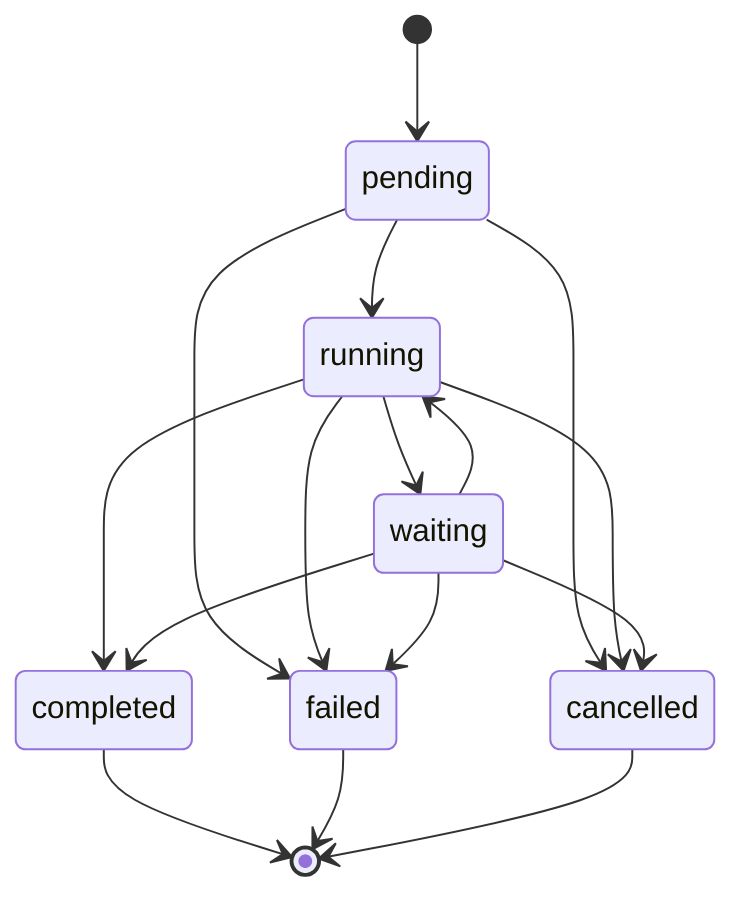

# fsm_llm_workflows

Path: `src/fsm_llm_workflows`
Purpose: Async, in-memory workflow engine: step graphs (11 step types) with a shared context, events, timers, timeouts, and a Python DSL.

## Scope

Workflow definition, validation, execution, and DSL. No persistence, no JSON loader for workflows (steps carry Python callables). Extra `workflows` installs nothing beyond core `fsm_llm`. Version from `fsm_llm.__version__`. Not wired into `fsm_llm.API`; independent state machine that reuses `fsm_llm.handlers.HandlerSystem`, `fsm_llm.constants.has_internal_prefix`, `fsm_llm.logging.logger`, and (in `ConversationStep`) `fsm_llm.API`.

## Architecture

Execution: `start_workflow` -> `_execute_workflow_step(instance, _depth)` -> `step.execute(context)` -> merge filtered `result.data` into context, add history -> success: `next_state` truthy -> `_transition_to_state` (validates target, clears `_waiting_info`/`_timer_info`, sets RUNNING, recurses with `_depth+1`); `next_state == ""` -> COMPLETED; falsy otherwise -> `_handle_step_without_transition` (event wait -> WAITING + `register_event_listener`; timer -> WAITING + `schedule_timer`; step in `get_terminal_states()` -> COMPLETED; else WARNING, status unchanged). Failure: `next_state` -> transition; else FAILED with `WorkflowStepError`. Exception -> FAILED unless already terminal; `WorkflowTimeoutError` re-raised.

## Key files

| File | Role | Notes |
| --- | --- | --- |
| `engine.py` | `WorkflowEngine`, `Timer` | `MAX_STEP_DEPTH = 20`; per-instance `asyncio.Lock` |
| `steps.py` | `WorkflowStep` ABC + 11 subclasses | Pydantic models with `arbitrary_types_allowed` |
| `dsl.py` | factories, `WorkflowBuilder`, pattern helpers | |
| `definitions.py` | `WorkflowDefinition`, `WorkflowValidator` | `validate()` raises `WorkflowValidationError` |
| `models.py` | `WorkflowStatus`, `WorkflowEvent`, `WorkflowStepResult`, `WorkflowHistoryEntry`, `WorkflowInstance`, `EventListener`, `WaitEventConfig` | `_VALID_STATUS_TRANSITIONS` |
| `dependency_resolver.py` | `DependencyResolver` | Kahn's algorithm; NOT used by engine or `ParallelStep` |
| `exceptions.py` | `WorkflowError` tree | |

## Public interface

- `WorkflowEngine(handler_system=None, max_concurrent_workflows=100, max_completed_instances=None)`:
  - `register_workflow(defn)` (validates), async `start_workflow(workflow_id, initial_context=None, instance_id=None, workflow_timeout=None) -> instance_id` (raises `WorkflowResourceError` over the concurrency limit), async `advance_workflow(id, user_input="") -> bool` (sets `_user_input`, re-runs current step; False if unknown/inactive), async `cancel_workflow(id, reason) -> bool` (False if unknown or already terminal), async `process_event(WorkflowEvent) -> list[instance_id]`, async `register_event_listener(instance_id, event_type, success_state, timeout_seconds, timeout_state, event_mapping)`, async `schedule_timer(instance_id, delay_seconds, next_state)`, async `shutdown()`, `remove_instance(id) -> bool` (terminal only).
  - Queries: `get_workflow_instance`, `get_workflow_definition`, `get_workflow_status -> WorkflowStatus | None`, `get_workflow_context -> dict | None`, `get_active_workflows`, `get_statistics`.
- `WorkflowDefinition{workflow_id, name, description, steps: dict[str, WorkflowStep], initial_step_id, metadata}`: `with_step(step, is_initial=False)`, `with_initial_step(step)`, `validate()`, `get_terminal_states()`, `has_cycles()`, `serialize()` (callables excluded). `WorkflowValidator.validate_workflow(defn) -> list[str]`, `validate_workflow_collection`.
- `WorkflowStep{step_id, name, description, timeout: float | None}`; async `execute(context) -> WorkflowStepResult`; `_with_timeout(coro)` raises `WorkflowStepError` on timeout.
- Steps: `AutoTransitionStep(next_state, action)`, `APICallStep(api_function, success_state, failure_state, input_mapping, output_mapping)`, `ConditionStep(condition, true_state, false_state)`, `SwitchStep(key, cases, default_state)`, `LLMProcessingStep(llm_interface, prompt_template, context_mapping, output_mapping, next_state, error_state)`, `WaitForEventStep(config: WaitEventConfig)`, `TimerStep(delay_seconds, next_state)`, `ConversationStep(fsm_file | fsm_definition, model, initial_context, context_mapping, success_state="", error_state, max_turns=20, conversation_timeout, auto_messages)`, `AgentStep(agent, task_template="{task}", context_mapping, success_state="", error_state)` (runs `agent.run` in executor), `ParallelStep(steps, next_state, error_state, aggregation_function)` (`asyncio.gather(return_exceptions=True)`), `RetryStep(step, max_retries, backoff_factor)`.
- DSL: `create_workflow(id, name, desc="") -> WorkflowDefinition`, `workflow_builder(...) -> WorkflowBuilder` (`add_step`, `set_initial_step`, `add_metadata`, `build`), `auto_step`, `api_step`, `condition_step`, `switch_step`, `llm_step`, `wait_event_step`, `timer_step`, `parallel_step`, `conversation_step`, `agent_step`, `retry_step`, patterns `linear_workflow`, `conditional_workflow`, `event_driven_workflow`.
- `DependencyResolver()`: `add_step(id, depends_on=[])`, `add_dependency`, `resolve() -> list[list[str]]` (raises `WorkflowValidationError` on cycle), `has_cycles`, `get_dependencies`, `get_dependents`, `get_all_steps`, `step_count`, `dependency_count`, `clear`, `from_dict({...})`.

## Data shapes

- `WorkflowStepResult{success, data, next_state, message, error (exception coerced to str), timestamp}`; `success_result(...)`, `failure_result(...)`.
- `WorkflowInstance{instance_id, workflow_id, current_step_id, context, status, created_at, updated_at, completed_at, deadline, workflow_timeout, history: list[WorkflowHistoryEntry]}`; `update_status(status, error=None)` validates against `_VALID_STATUS_TRANSITIONS` (raises `WorkflowStateError`), `is_active()` = RUNNING|WAITING, `is_terminal()`.
- `WorkflowEvent{event_type, payload, timestamp, event_id}`; `EventListener{..., event_mapping: {context_key: payload_key}, success_state, timeout_at}`.
- Engine-owned context keys: `_waiting_info`, `_timer_info` (whitelisted through the internal-key filter), `_workflow_info`, `_timeout`, `_timer_expired`, `_last_event`, `_user_input`, `_cancellation_reason`. Timer keys in `self.timers` are `f"{instance_id}_..."`.

## Invariants and constraints

- Locks: acquire the per-instance lock ONLY at outermost entry points (`start_workflow`, `advance_workflow`, `cancel_workflow`, the per-instance loop in `process_event`, timer expiry, event timeout). Never inside `_execute_workflow_step`/`_transition_to_state` (`asyncio.Lock` is not reentrant). Order is instance lock then `_listener_lock`, never reversed.
- `_depth >= 20` raises `WorkflowError`; timer- and event-mediated cycles are not caught by it.
- Result data keys with an internal prefix (`has_internal_prefix`) are dropped except `_STEP_INTERNAL_WHITELIST = {_waiting_info, _timer_info}`; do not drop the whitelist.
- `next_state == ""` on ANY successful result means terminal for that route (no isinstance narrowing).
- `_handle_step_exception` must not overwrite an already-terminal status.
- Workflow deadline: checked at each step boundary and enforced inside a step via `asyncio.wait_for(remaining)`; reported timeout is the configured float, not truncated.
- `_purge_oldest_terminal_instances` runs after completion/cancel when `max_completed_instances` is set; it also drops instance locks.

## Dependencies

- `fsm_llm`: `handlers.HandlerSystem`, `constants.has_internal_prefix`, `logging.logger`, `API` (lazy import in `ConversationStep`), `LLMInterface` (in `LLMProcessingStep`).
- Optional runtime: any object with `.run(task)` for `AgentStep` (typically `fsm_llm_agents`).
- pydantic v2, asyncio.

## Failure modes

- `WorkflowError(message, details)` -> `WorkflowDefinitionError(workflow_id, message)`, `WorkflowStepError(step_id, message, cause)`, `WorkflowInstanceError(instance_id, message)`, `WorkflowTimeoutError(operation, timeout_seconds)`, `WorkflowValidationError(validation_errors)`, `WorkflowStateError(current_state, operation, message)`, `WorkflowEventError(event_type, message)`, `WorkflowResourceError(resource_type, resource_id, message)`. Base inherits `FSMError`.
- Step exceptions do not propagate from `start_workflow`/`advance_workflow` (instance goes FAILED) except `WorkflowTimeoutError`.
- A non-terminal step with no transition and no wait marker leaves the instance RUNNING with a warning.
- `process_event` skips expired listeners and warns on missing payload keys.

## Working here

- New step type: subclass `WorkflowStep` in `steps.py`, implement async `execute`, return `WorkflowStepResult`; add a DSL factory in `dsl.py`; make `WorkflowDefinition._get_referenced_states` see its target fields so validation and reachability work; export in `__init__.__all__`.
- Wrap sync user callables with `loop.run_in_executor` (detect async with `inspect.iscoroutinefunction`).
- Tests: `pytest tests/test_fsm_llm_workflows/` (files `test_audit_fixes.py`, `test_dsl.py`, `test_new_steps.py`, `test_steps.py`, `test_step_timeouts.py`, `test_workflows.py`; auto-skip if not installed). Examples in `examples/workflows/`.
