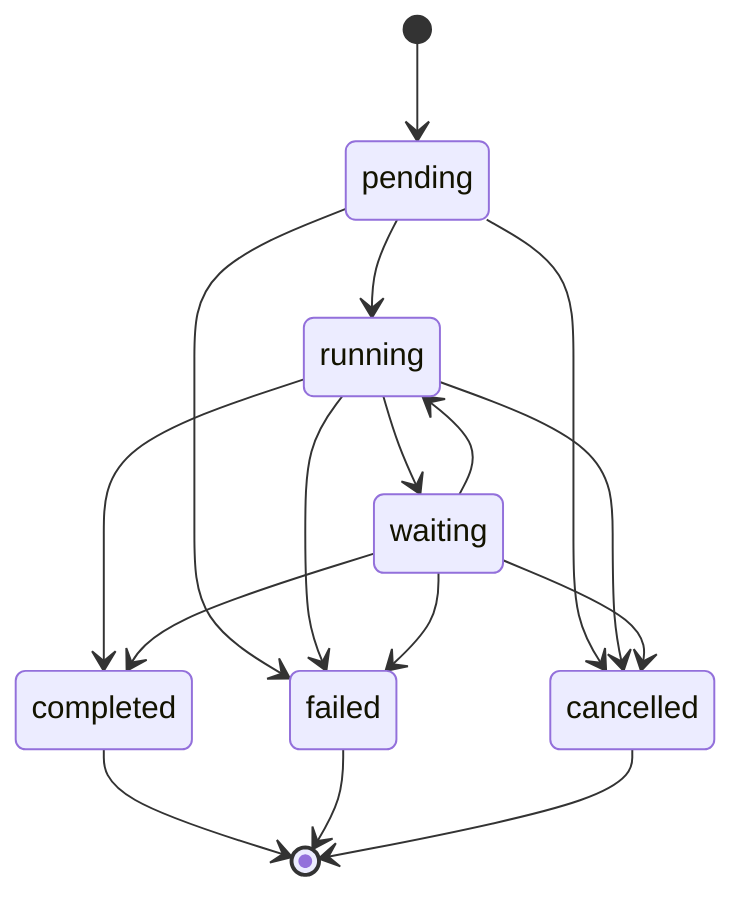

# fsm_llm_workflows

Path: `src/fsm_llm_workflows`
Purpose: Async, in-memory workflow engine: step graphs (11 step types) with a shared context, events, timers, timeouts, lifecycle hooks, and a Python DSL.

## Scope

Workflow definition, validation, execution, and DSL. No persistence, no JSON loader for workflows (steps carry Python callables). Extra `workflows` installs nothing beyond core `fsm_llm`. Version from `fsm_llm.__version__`. Not wired into `fsm_llm.API`; independent state machine that reuses `fsm_llm.constants.has_internal_prefix`, `fsm_llm.logging.logger`, and (in `ConversationStep`) `fsm_llm.API`. `WorkflowEngine(handler_system=...)` is accepted and stored for compatibility but never called; use `add_hook`.

## Architecture

```mermaid
stateDiagram-v2
    [*] --> pending
    pending --> running
    pending --> failed
    pending --> cancelled
    running --> waiting
    running --> completed
    running --> failed
    running --> cancelled
    waiting --> running
    waiting --> completed
    waiting --> failed
    waiting --> cancelled
    completed --> [*]
    failed --> [*]
    cancelled --> [*]
```

Execution: every entry point takes the instance lock and calls `_execute_workflow_step(instance)`, a LOOP (not recursion) that runs `_run_current_step` until it returns `None`, with at most `max_steps_per_run` steps (default `MAX_STEPS_PER_RUN = 1000`; over budget -> FAILED). `_run_current_step`: deadline check -> `step.execute(context)` (inside `wait_for(remaining)` when a deadline is set, with the engine executor bound in `steps._STEP_EXECUTOR`) -> merge filtered `result.data`, history entry (with `result.error`), hooks -> success: `next_state` truthy -> returned, the loop calls `_prepare_transition` (validates target, clears `_waiting_info`/`_timer_info`, RUNNING); `next_state == ""` -> COMPLETED; falsy otherwise -> `_handle_step_without_transition` (event wait: consume a buffered targeted event and continue, else WAITING + `register_event_listener`; timer -> WAITING + `schedule_timer`; step in `get_terminal_states()` -> COMPLETED; else WARNING, stays RUNNING). Failure: `next_state` -> transition; else FAILED with `WorkflowStepError`. Exception -> FAILED unless already terminal; `WorkflowTimeoutError` re-raised (it carries `instance_id`).

Status changes made by the engine go through `_set_status`, which fires the `status_changed` hook and, on any terminal status, releases the instance's timers, listeners and buffered events and purges old terminal instances.

## Key files

| File | Role | Notes |
| --- | --- | --- |
| `engine.py` | `WorkflowEngine`, `Timer` | loop driver, per-instance `asyncio.Lock`, events, timers, deadline watchdog, hooks |
| `steps.py` | `WorkflowStep` ABC + 11 subclasses, `_call_user_callable` | Pydantic models with `arbitrary_types_allowed` |
| `dsl.py` | factories, `WorkflowBuilder`, pattern helpers | pattern helpers register steps, they do not wire them |
| `definitions.py` | `WorkflowDefinition`, `WorkflowValidator` | `validate()` raises `WorkflowValidationError` |
| `models.py` | `WorkflowStatus`, `WorkflowEvent`, `WorkflowStepResult`, `WorkflowHistoryEntry`, `WorkflowInstance`, `EventListener`, `WaitEventConfig` | `_VALID_STATUS_TRANSITIONS` |
| `constants.py` | engine context keys, limits, defaults | `MAX_STEPS_PER_RUN`, `DEFAULT_MAX_COMPLETED_INSTANCES`, `PAUSING_STEP_TYPES` |
| `dependency_resolver.py` | `DependencyResolver` | Kahn's algorithm; NOT used by engine or `ParallelStep` |
| `exceptions.py` | `WorkflowError` tree | |

## Public interface

- `WorkflowEngine(handler_system=None, max_concurrent_workflows=100, max_completed_instances=1000, max_steps_per_run=1000, executor=None)`:
  - `register_workflow(defn)` (validates, stores a copy; re-registering an id affects new instances only), async `start_workflow(workflow_id, initial_context=None, instance_id=None, workflow_timeout=None, wait=True) -> instance_id` (raises `WorkflowResourceError` over the concurrency limit or after `shutdown`, `WorkflowInstanceError` for an id still held; `wait=False` runs in a background task), async `advance_workflow(id, user_input="") -> bool` (sets `_user_input` for that run only, re-runs current step; False if unknown/inactive), async `cancel_workflow(id, reason) -> bool` (False if unknown or already terminal), async `process_event(WorkflowEvent) -> list[instance_id]`, async `register_event_listener(instance_id, event_type, success_state, timeout_seconds, timeout_state, event_mapping, correlation_key)`, async `schedule_timer(instance_id, delay_seconds, next_state)`, async `shutdown()`, `remove_instance(id) -> bool` (terminal only), `add_hook(fn)` / `remove_hook(fn)`.
  - Queries: `get_workflow_instance`, `get_workflow_definition`, `get_workflow_status -> WorkflowStatus | None`, `get_workflow_context -> dict | None` (shallow copy), `get_active_workflows`, `get_statistics`.
  - Hooks: `fn(event_name, instance, data)` for `step_started`, `step_completed`, `status_changed`; exceptions are logged, awaitables scheduled.
- `WorkflowDefinition{workflow_id, name, description, steps: dict[str, WorkflowStep], initial_step_id, metadata}`: `with_step(step, is_initial=False)` (a different step with the same id raises `WorkflowDefinitionError`), `with_initial_step(step)`, `validate()`, `get_terminal_states()`, `has_cycles()` (any cycle), `has_synchronous_cycles()` (a cycle with no wait/timer step; the only kind `validate()` rejects), `serialize()` (callables excluded). `WorkflowValidator.validate_workflow(defn) -> list[str]`, `validate_workflow_collection`.
- `WorkflowStep{step_id, name, description, timeout: float | None}`; async `execute(context) -> WorkflowStepResult`; `_with_timeout(coro)` raises `WorkflowStepError` on timeout.
- Steps (every failure without an error route FAILS the instance):
  - `AutoTransitionStep(next_state, action, error_state=None)`, `ConditionStep(condition, true_state, false_state, error_state=None)`: raise `WorkflowStepError` on failure unless `error_state` is set. `action` must return a dict or None.
  - `APICallStep(api_function, success_state, failure_state, input_mapping{api_param: ctx_key}, output_mapping{ctx_key: result_key})`: `result_key` may be dotted or `""` (whole result).
  - `SwitchStep(key, cases, default_state=None)`: `None` FAILS on no match, `""` completes; outputs `switch_<id>_matched`/`_target`.
  - `LLMProcessingStep(llm_interface, prompt_template, context_mapping{prompt_var: ctx_key}, output_mapping{ctx_key: regex}, next_state, error_state, system_prompt)`: calls `generate(prompt)` (sync or async) or a core `LLMInterface.generate_response`; a regex miss leaves the key unset; regexes compiled at construction.
  - `WaitForEventStep(config: WaitEventConfig{event_type, success_state, timeout_seconds: float, timeout_state, event_mapping, correlation_key})`: `success_state=""` completes on the event; a timeout without `timeout_state` FAILS; `timeout_state` needs `timeout_seconds`.
  - `TimerStep(delay_seconds: float, next_state)`.
  - `ConversationStep(fsm_file | fsm_definition (dict or FSMDefinition, exactly one), model, initial_context{conv_key: wf_key}, context_mapping{wf_key: conv_key}, success_state="", error_state, max_turns=20, conversation_timeout, require_completion=False, use_user_input=False, auto_messages)`: limit is the smaller of `timeout` and `conversation_timeout`; outputs `conversation_<id>_data` and `conversation_<id>_ended`.
  - `AgentStep(agent, task_template="{task}", context_mapping{wf_key: agent_key}, input_mapping{agent_ctx_key: wf_key}, success_state="", error_state)`: `agent.run` result may be an `AgentResult` or a string; `success=False` fails the step; outputs `agent_answer`/`agent_success` and `agent_<id>_answer`/`_success`.
  - `ParallelStep(steps, next_state, error_state, aggregation_function)`: no wait/timer children; internal keys dropped before the `step_<i>_` prefix; on failure keeps the successful children's data.
  - `RetryStep(step, max_retries, backoff_factor)`: `step` is a `WorkflowStep` or any object with `execute`; linear backoff.
- DSL: `create_workflow(id, name, desc="") -> WorkflowDefinition`, `workflow_builder(...) -> WorkflowBuilder` (`add_step`, `set_initial_step`, `add_metadata`, `build(validate=False)`), `auto_step`, `api_step`, `condition_step`, `switch_step`, `llm_step`, `wait_event_step`, `timer_step`, `parallel_step`, `conversation_step`, `agent_step`, `retry_step` (factories expose `timeout` and the step options above), patterns `linear_workflow`, `conditional_workflow`, `event_driven_workflow` (register steps and set the initial one; they do NOT wire next states).
- `DependencyResolver()`: `add_step(id, depends_on=[])` (does not register the dependencies), `add_dependency` (registers both), `resolve() -> list[list[str]]` (raises `WorkflowValidationError` on cycle or unknown dependency), `has_cycles` (cycles only), `get_dependencies`, `get_dependents`, `get_all_steps`, `step_count`, `dependency_count`, `clear`, `from_dict({...})`.

## Data shapes

- `WorkflowStepResult{success, data, next_state, message, error (exception coerced to str), timestamp}`; `success_result(...)`, `failure_result(...)`.
- `WorkflowInstance{instance_id, workflow_id, current_step_id, context, status, created_at, updated_at, completed_at, deadline, workflow_timeout, error, history: list[WorkflowHistoryEntry], max_history_entries=1000}`; `update_status(status, error=None)` validates against `_VALID_STATUS_TRANSITIONS` (raises `WorkflowStateError`; same-status updates add a history entry only with an error), `is_active()` = RUNNING|WAITING, `is_terminal()`.
- `WorkflowEvent{event_type, payload, timestamp, event_id, instance_id=None}` (`instance_id` targets one instance; unmatched targeted events are buffered per instance, max 100); `EventListener{..., event_mapping: {context_key: payload_key}, success_state, timeout_at, correlation_key, correlation_value, timeout_state}`.
- Engine-owned context keys (`constants.py`): `_waiting_info`, `_timer_info` (whitelisted through the internal-key filter), `_workflow_info` (`{workflow_id, instance_id}`), `_timeout`, `_timer_expired`, `_last_event`, `_user_input` (only during an `advance_workflow` run), `_cancellation_reason`. Timer keys in `self.timers` are `{id}_timer`, `{id}_{event}_timeout`, `{id}_deadline`; cleanup matches `Timer.instance_id`, never the key prefix.

## Invariants and constraints

- Locks: acquire the per-instance lock ONLY at outermost entry points (`start_workflow`, `advance_workflow`, `cancel_workflow`, the per-instance delivery loop in `process_event`, timer expiry, event timeout, deadline watchdog, background start). Never inside `_execute_workflow_step`/`_transition_to_state` (`asyncio.Lock` is not reentrant). Order is instance lock then `_listener_lock`, never reversed.
- `process_event` collects and consumes listeners under `_listener_lock` without touching instances, then delivers per instance under its lock only if the instance is still WAITING at the listener's `step_id`, cancels the wait's timeout BEFORE transitioning, isolates each instance's exceptions, and on cancellation restores the listeners it had not delivered yet (D-001). `_prepare_transition` drops the instance's listeners and wait timers (not the deadline watchdog).
- `start_workflow(wait=False)`: the background run does nothing if another entry point already drove or cancelled the instance.
- Only synchronous cycles are rejected; loops through a wait/timer step are allowed and bounded per call by `max_steps_per_run` (D-002).
- Result data keys with an internal prefix (`has_internal_prefix`) are dropped except `_STEP_INTERNAL_WHITELIST = {_waiting_info, _timer_info}`; do not drop the whitelist.
- `next_state == ""` on ANY successful result means terminal for that route (no isinstance narrowing).
- A failure result with no `next_state` FAILS the instance; steps never fall back to their success route (D-003).
- User callables go through `steps._call_user_callable` (awaits returned awaitables; sync ones in the engine executor) (D-004).
- `_handle_step_exception` and `cancel_workflow` must not overwrite an already-terminal status.
- Workflow deadline: checked at each step boundary, enforced inside a step via `asyncio.wait_for(remaining)`, and while WAITING by a watchdog timer; reported timeout is the configured float, not truncated.
- A custom `instance_id` still held by the engine is rejected (D-005). Instances run on the definition they started with.
- `Timer.cancel()` never cancels the task that is running it.

## Dependencies

- `fsm_llm`: `constants.has_internal_prefix`, `logging.logger` (and `is_library_logging_enabled`), `handlers.HandlerSystem` (type only), `API` (lazy import in `ConversationStep`), `definitions.ResponseGenerationRequest` (lazy, in `LLMProcessingStep`).
- Optional runtime: any object with `.run(task)` for `AgentStep` (typically `fsm_llm_agents`).
- pydantic v2, asyncio.

## Failure modes

- `WorkflowError(message, details)` -> `WorkflowDefinitionError(workflow_id, message)`, `WorkflowStepError(step_id, message, cause)`, `WorkflowInstanceError(instance_id, message)`, `WorkflowTimeoutError(operation, timeout_seconds, instance_id=None)`, `WorkflowValidationError(validation_errors)`, `WorkflowStateError(current_state, operation, message)`, `WorkflowEventError(event_type, message)`, `WorkflowResourceError(resource_type, resource_id, message)`. Base inherits `FSMError`. Constructors copy `details`.
- Step exceptions do not propagate from `start_workflow`/`advance_workflow` (instance goes FAILED) except `WorkflowTimeoutError`. `process_event` never raises for one instance's failure.
- A non-terminal step with no transition and no wait marker leaves the instance RUNNING with a warning.
- A timeout cannot stop a synchronous callable already running in a worker thread.
- Logging is off until `fsm_llm.setup_logging()` / `enable_debug_logging()` (package `__init__` disables `fsm_llm_workflows` unless library logging is already on).

## Working here

- New step type: subclass `WorkflowStep` in `steps.py`, implement async `execute`, return `WorkflowStepResult`; call user code through `_call_user_callable`; route failures to an `error_state` (never to the success state); add a DSL factory in `dsl.py`; make `WorkflowDefinition._get_referenced_states` see its target fields so validation and reachability work; export in `__init__.__all__`.
- Tests: `pytest tests/test_fsm_llm_workflows/` (files `test_audit_2026_09_27.py`, `test_audit_fixes.py`, `test_dsl.py`, `test_new_steps.py`, `test_steps.py`, `test_step_timeouts.py`, `test_workflows.py`; auto-skip if not installed). Examples in `examples/workflows/`.
