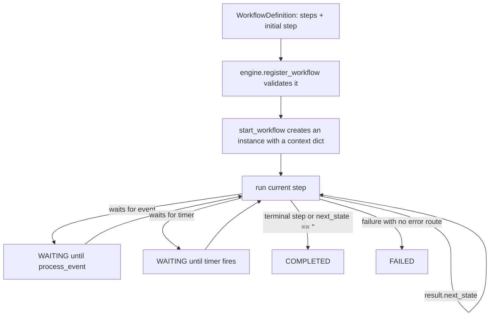

# fsm_llm_workflows

An async workflow engine for FSM-LLM. It runs multi-step processes where each step can be plain Python, an API call, an LLM prompt, a full FSM chat, an agent, a timer, or a wait for an outside event.

## What it is for

Some jobs are not a single conversation but a pipeline: take an order, check stock, ask a payment service, wait for confirmation, then send an email. This package lets you describe such a pipeline as named steps in Python, each step saying which step comes next. The engine runs the steps, keeps a shared context dictionary between them, pauses when a step waits for a timer or event, and records a history of every step. Steps can wrap FSM-LLM conversations (the core `fsm_llm` package, which runs chatbots as finite state machines) and agents from `fsm_llm_agents`.

## How it works



Each step returns a result with `success`, some `data` (merged into the context), and `next_state`. The engine follows `next_state` until a step has nowhere to go. An instance moves through the statuses `pending`, `running`, `waiting`, and ends as `completed`, `failed`, or `cancelled`.

Step types: automatic (run a function, move on), API call, condition (yes/no branch), switch (branch on a context value), LLM processing, wait for event, timer, FSM conversation, agent, parallel (run several steps at once), and retry (re-run a step with backoff).

## Files

- `engine.py` - `WorkflowEngine`: runs instances, handles events and timers, cancels, cleans up.
- `steps.py` - the 11 step classes.
- `dsl.py` - short builder functions (`create_workflow`, `auto_step`, `condition_step`, ...) and three ready-made patterns.
- `definitions.py` - `WorkflowDefinition` with validation (targets exist, all steps reachable), and `WorkflowValidator`.
- `models.py` - statuses, events, step results, instances, event listeners, wait settings.
- `dependency_resolver.py` - `DependencyResolver`: orders steps into "waves" that can run in parallel. It is a standalone helper; the engine does not use it.
- `exceptions.py` - error classes.
- `__init__.py`, `__version__.py`, `py.typed` - public exports, version, type marker.

## How to use it

```python
import asyncio
from fsm_llm_workflows import WorkflowEngine, auto_step, condition_step, create_workflow

wf = create_workflow("orders", "Order check")
wf.with_initial_step(auto_step("load", "Load order", next_state="route",
                               action=lambda ctx: {"amount": 1500}))
wf.with_step(condition_step("route", "Big order?",
                            condition=lambda ctx: ctx["amount"] >= 1000,
                            true_state="review", false_state="done"))
wf.with_step(auto_step("review", "Manual review", next_state="done",
                       action=lambda ctx: {"reviewed": True}))
wf.with_step(auto_step("done", "Finish", next_state=""))

async def main():
    engine = WorkflowEngine()
    engine.register_workflow(wf)
    instance_id = await engine.start_workflow("orders")
    print(engine.get_workflow_status(instance_id), engine.get_workflow_context(instance_id))

asyncio.run(main())
```

## Things to know

- Everything is `async`. Plain functions (actions, conditions, agents) are run in a thread pool.
- A step returning `next_state=""` ends the workflow there.
- One chain of steps may be at most 20 steps deep in a single call. Longer runs, or loops, fail with an error; loops through timers or events are not caught by this limit.
- Keys a step returns that look internal (starting with `_`, `system_`, `internal_`, `__`) are dropped from the context, except the engine's own wait and timer markers.
- Nothing is saved to disk. Instances live in memory; set `max_completed_instances` to cap how many finished ones are kept.
- `workflow_timeout` on `start_workflow` limits the whole run, including a single long step.
- Unlike the core package, this package's log lines are not switched off by default: running a workflow prints INFO lines to stderr.
