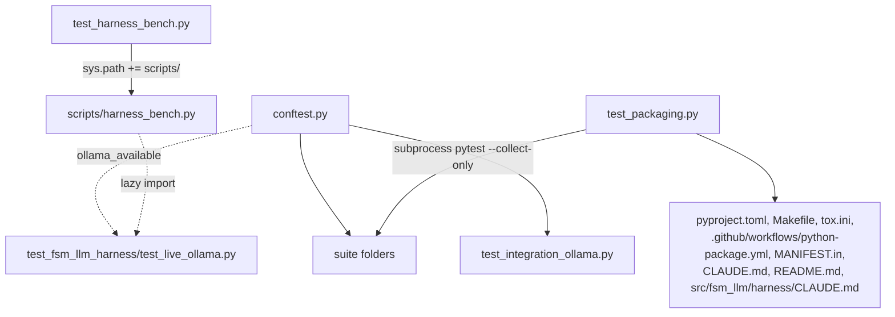

# tests

Path: `tests`
Purpose: The full pytest tree of FSM-LLM (9,978 collected tests): ten suite folders for the `fsm_llm` package and its six subpackages, four repo-wide root test files, and the shared `conftest.py`.

## Scope

- In: `conftest.py`, `__init__.py` (empty), `test_packaging.py`, `test_harness_bench.py`, `test_agents_bench.py`, `test_integration_ollama.py`, `fixtures/test_fsm_definitions/minimal_fsm.json`, `test_examples/`, and the nine `test_fsm_llm*` suite folders.
- Package under test: one top-level package `fsm_llm` (`src/fsm_llm/`) with subpackages `agents`, `reasoning`, `workflows`, `monitor`, `harness`, `eval`. The old top-level names (`fsm_llm_agents`, ...) no longer exist (no test checks for a leftover directory any more).
- Out: the bench data under `scripts/bench_data/`, the examples themselves (`examples/`, evaluation baselines, never edit unless asked).

## Architecture



Test styles used across suites: unit (call one module), seam (drive a public entry point such as `API.converse` with `fsm_llm.llm.completion` patched), loop (run an agent or harness end to end with a scripted fake LLM), structure (build an FSM dict and check states, edges, priorities, JsonLogic gates), source-text checks (`inspect.getsource`, `ast`, file reads), and audit regressions (one class per finding id, each run failing before its fix).

## Key files

Suite folders (test counts from full collection) and root files at this level.

| File | Role | Notes |
| --- | --- | --- |
| `conftest.py` | Shared fixtures, fakes and marker registration (see Public interface) | 0 tests |
| `test_packaging.py` | Repo-wide wiring and doc-count pins | 33 tests; classes listed below |
| `test_harness_bench.py` | Offline checks of `scripts/harness_bench.py` | 59 tests |
| `test_integration_ollama.py` | Live end-to-end on `ollama_chat/qwen3.5:9b-q8_0`, plus 4 model-free workflow checks | 12 tests |
| `fixtures/test_fsm_definitions/minimal_fsm.json` | v3.0 one-state FSM behind the `sample_fsm_definition` fixture | Written by `conftest.py` if missing |
| `test_fsm_llm/` | Core: `API`, `FSMManager`, `MessagePipeline`, `TransitionEvaluator`, `expressions`, classification (on the conversation interface), context, prompts, `LiteLLMInterface` (`complete`, usage counters), `LiteLLMEmbedder`, the `completion` state, `ollama`, handlers, `WorkingMemory`, session, validator, visualizer, runner, logging | 3,477 tests. Local `conftest.py` (`minimal_fsm_dict`); `fixtures/` holds labelled secret-filter corpora for `test_context_unit.py`; seam files import `_` helpers from each other; `test_docs_snippets.py` loads FSM JSON from root docs; 14 `slow` |
| `test_fsm_llm_agents/` | All agent patterns (`native_fc` as an FSM on core, pinned by a golden request fixture), `ToolRegistry` and ToolSpec, HITL grant security, memory, MCP (real stdio fixture server), `AgentServer`, `fsm-llm-meta` and `python -m fsm_llm.agents` CLIs | 2,360 tests. Local `conftest.py` autouses `block_network`; most files define their own fake `LLMInterface`, pattern loops use `PromptGroundedLLM` (`test_grounded_patterns.py`); skips without `mcp`, `fastapi`/`httpx`, OTEL SDK |
| `test_fsm_llm_meta/` | Meta-builder in `fsm_llm.agents`: `FSMArtifactBuilder`, `WorkflowArtifactBuilder`, `AgentArtifactBuilder`, `create_*_tools`, `meta_prompts`, the meta FSM and `MetaBuilderAgent` on core | 426 tests. Autouse `block_network`; `ScriptedMetaLLM` (local conftest) answers classifier, build and collect calls from queues; `offline_llm` makes core's send binding raise so fallback paths run without a network call |
| `test_fsm_llm_reasoning/` | `fsm_llm.reasoning` constants, models, exceptions, handlers, ANALYTICAL-only fallback, whole solves through core with a scripted `LLMInterface` (`test_engine_scripted.py`), CLI `--verbose` and JSON output | 191 tests. Engine built with `object.__new__` or on a scripted interface; source-string pins (no `converse(`, no "Continue reasoning") |
| `test_fsm_llm_workflows/` | `fsm_llm.workflows` steps, DSL, `WorkflowEngine`, timeouts, audit fixes | 269 tests. Real short sleeps; 8 `slow` |
| `test_fsm_llm_monitor/` | `fsm_llm.monitor` server via `TestClient`, security, `InstanceManager`, `EventCollector`, `OTELExporter` | 391 tests. Local autouse fixture deletes `FSM_LLM_MONITOR_API_KEY`; audit file skips whole when workflows missing |
| `test_fsm_llm_harness/` | `fsm_llm.harness`: artifacts, hardening, 6-state FSM gates, `HarnessAgent`, plan validator, roles and tools, storage, CLI | 2,028 tests. Local `conftest.py` (`make_harness`, `RecordingWorker`, `ApprovalRecorder`, `captured_logs`); 17 live tests gated on `FSM_LLM_HARNESS_LIVE=1` then Ollama |
| `test_fsm_llm_eval/` | `fsm_llm.eval` and `fsm-llm-eval`: config, records, stats, scoring golden table, examples mode, cases mode, exit codes; parity with `scripts/harness_bench.py` | 261 tests. Reads `evaluation/` files and needs a git checkout |
| `test_fsm_llm_regression/` | One class per fixed bug id across core, reasoning, workflows, CLI, packaging text | 264 tests. Many private-method and source-text pins |
| `test_examples/` | Every `examples/**/*.json` loads as JSON with `name`/`initial_state`/`states`, parses as `FSMDefinition`, passes `FSMValidator.validate()`; at least 5 files exist | 67 tests. Marker `examples`; 14 JSON files today |

`test_packaging.py` classes:

- `TestEveryPackageIsWired`: `src/*/__init__.py` must be exactly `{"fsm_llm"}`; `src/fsm_llm/*/__init__.py` exactly the six subpackages; each of 8 slots names `fsm_llm` (`pyproject:package-data`, `pyproject:ruff-isort-known-first-party`, `makefile:type-check`, `makefile:coverage`, `tox:testenv-coverage`, `tox:testenv-type`, `ci:mypy`, `manifest.in:recursive-include`); `src/fsm_llm/py.typed` exists; `[tool.setuptools.packages.find]` has no `include`/`exclude`.
- `TestSubpackagesImport`: `fsm_llm.<sub>` importable (monitor needs `fastapi`).
- `TestMonitorPackageData`: `"fsm_llm.monitor"` package-data globs cover every file under `static/` and `templates/`.
- `TestPackageBackedExtrasAreInstalled`: each subpackage name is an extra, requested by `pyproject` `all`, `make install-dev`, tox `extras = dev,...` and the CI install line.
- `TestModuleDocstringsAreReal`: no module under `src/` puts its docstring after `from __future__ import annotations`; at least 50 modules scanned.
- `TestDocumentedTestCountsMatchCollection` (`slow`): one `pytest --collect-only -q -o addopts= -p no:cacheprovider tests/` subprocess (env drops `PYTEST_ADDOPTS`, `FSM_LLM_HARNESS_LIVE`, `SKIP_SLOW_TESTS`, `TEST_REAL_LLM`), then pins: root `CLAUDE.md` `pytest -v (N tests)` and `Run all tests (N collected)`; root `README.md` `Run full test suite (N tests)`; the root `CLAUDE.md` per-suite lines `pytest tests/<suite>/  # ... (N tests)` (dict equality both ways); the sentence `The N suites above sum to S. The remaining R ...`; the `tests/<file>.py (N)` root-file list; every `N tests` and `N test files` token in `src/fsm_llm/harness/CLAUDE.md`. `CHANGELOG.md` is deliberately not pinned (D-015).

`test_harness_bench.py` loads `scripts/harness_bench.py` as `hb` and checks: import opens no socket even with `FSM_LLM_HARNESS_LIVE=1`; top-level imports are stdlib only; `wilson_ci` reference values and edge cases; `fisher_exact_two_sided` reference values and symmetry; `write_summary` refuses without a 6-field manifest (`MANIFEST_FIELDS`); `append_row`/`read_rows` round-trip; `report` recounts raw rows, flags tampered summaries (`MISMATCH`), refuses cross-digest comparisons (`REFUSING`); `run_block` refuses a block whose rows file exists (`run ONCE`) or an unknown arm; `main` maps `BenchDataError` to exit 1.

`test_integration_ollama.py`: module `pytestmark` is `integration`, `real_llm`, `slow`; classes needing Ollama carry `requires_ollama` (`ollama_available("qwen3.5:9b-q8_0")`) and retry up to 3 times. It uses `examples/basic/simple_greeting/fsm.json`. `TestWorkflowUTCConsistency` and `TestParallelStepIsolation` need no model but are still `slow`.

## Public interface

From `tests/conftest.py` (import as `from tests.conftest import ...` or use as fixtures):

| Name | Kind | Use |
| --- | --- | --- |
| `MockLLM2Interface(extraction_data=None, response_text="Hello! How can I help you?", transition_target=None)` | `LLMInterface` subclass | `extract_field` returns `extraction_data.get(field_name)` (confidence 1.0, or 0.0 and `is_valid=False` when missing); `generate_response` returns `response_text`; calls appended to `call_history` as `(name, request)` |
| `PromptGroundedLLM(facts=None, responses=None, default_response="ok")` | `LLMInterface` subclass | A fact `{field_name: (value, evidence)}` comes back only when `evidence` is in the request text (`extract_field`: system prompt, user message, JSON context; `extract_bulk_data`: only fields the prompt names, evidence in prompt or message, so a prompt without the evidence yields `{}`); `generate_response` returns `responses[state]` for the prompt's `<current_state>`, else `default_response`; `requests` records `(kind, request)`, `calls(kind)` filters. Used by the agents Phase-1 loop tests |
| `block_network(monkeypatch, node)`, `network_exempt(node)` | functions | Patch `socket.socket.connect`/`connect_ex` to raise `ConnectionRefusedError` for IPv4/IPv6 (loopback included, Unix sockets untouched) unless the test is marked `real_llm` or `integration`; autoused by the agents and meta conftests only |
| `configure_mock_extract_field(mock_llm, mock_data=None)` | function | Gives a `Mock(spec=LLMInterface)` a working `extract_field`; default data `{"name": "TestUser", "email": "test@test.com", "age": "25"}` |
| `mock_llm_interface` | fixture | `Mock(spec=LLMInterface)` with that default data and a fixed reply |
| `mock_llm2_interface` | fixture | `MockLLM2Interface()` |
| `sample_fsm_definition` | fixture | v3.0 one-state FSM from `fixtures/test_fsm_definitions/minimal_fsm.json` (written if missing) |
| `sample_fsm_definition_v2` | fixture | v4.1 `greeting -> farewell`, gated on `requires_context_keys: ["user_name"]` |
| `ollama_available(model_tag=OLLAMA_MODEL_TAG) -> bool` | function | One bounded GET to `http://localhost:11434/api/tags`; True only if a pulled model name contains the tag; never raises. `OLLAMA_MODEL_TAG` is `DEFAULT_LLM_MODEL` minus its `ollama_chat/` prefix |
| `test_fixtures_root` | fixture (session) | `tests/fixtures/`, created if missing; requested by `sample_fsm_definition` |

Hooks: `pytest_configure` registers markers `slow`, `integration`, `examples`, `real_llm` (also declared in `pyproject.toml`). There is no collection hook: `fsm_llm.workflows` has no extra dependencies, so nothing is skipped for it.

## Data shapes

- Env knobs: `FSM_LLM_HARNESS_LIVE` (arms harness live tests), `FSM_LLM_MONITOR_API_KEY` (cleared for monitor tests). No test reads `SKIP_SLOW_TESTS`, `TEST_REAL_LLM` or `TEST_LLM_MODEL`; `test_packaging.py` drops the first two from its collection child env.
- pytest config in `pyproject.toml`: `testpaths = ["tests"]`, `addopts = "-v --tb=short"`, `asyncio_mode = "auto"`, `asyncio_default_fixture_loop_scope = "function"`.
- Marker counts (full collection): `slow` 135, `integration` 113, `real_llm` 113, `examples` 67; `-m "not slow"` collects 9,715.

## Invariants and constraints

- Run from the repo root: `tests` is a package and files import `tests.conftest`, `tests.test_fsm_llm.<file>`, `tests.test_fsm_llm_harness...`.
- Default runs make no network call and no real LLM call; the agents and meta suites enforce it with `block_network`. Live tests self-skip: core `test_live_classification_memory.py` and `test_integration_ollama.py` on Ollama availability; harness live tests check `FSM_LLM_HARNESS_LIVE` first so a default run never opens a socket.
- Never use `caplog` for library logs; `fsm_llm` logs through loguru and is disabled at import. Enable with `logger.enable("fsm_llm")`, add a sink, then remove it and disable again (harness suite: `captured_logs` fixture).
- Tests that change process globals (cwd, env vars, `server.py` API key, `sys.modules`, logging) restore them.
- Audit and `DECISION plan-.../D-NNN` pins record deliberate fixes. Treat a failure as a regression in `src/` unless the cited decision was reversed; do not weaken, delete or regenerate them (secret-filter corpora, eval scoring golden table, harness anti-vacuity controls).
- Every documented test count in root `CLAUDE.md`, root `README.md` and `src/fsm_llm/harness/CLAUDE.md` must equal the measured collection.

## Dependencies

- Internal: every module of `src/fsm_llm/`; `scripts/harness_bench.py`; repo files `pyproject.toml`, `Makefile`, `tox.ini`, `MANIFEST.in`, `.github/workflows/python-package.yml`, root docs, `docs/*.md`, `examples/`, `evaluation/`, `scripts/bench_data/`.
- External: pytest, pytest-asyncio, `unittest.mock`, loguru, pydantic, litellm (patched, never called in offline tests). Optional: httpx (Ollama probe, remote tests), fastapi, mcp, opentelemetry, a local Ollama.

## Failure modes

- `ModuleNotFoundError: tests...`: pytest run from outside the repo root.
- `test_packaging.py` count failures: a test was added or removed without updating the pinned doc literals.
- Version failures after a release: `"0.11.0"` literals in `test_fsm_llm_monitor/test_app.py` and `test_fsm_llm_regression/test_regression_review.py`.
- Armed live harness blocks `pytest.fail` when their rows file already exists; running them also writes into tracked `scripts/bench_data/`.
- Timing-sensitive workflow and harness tests can flake on a loaded machine; live Ollama tests time out under GPU load.
- An OpenTelemetry "I/O operation on closed file" traceback after an agents run is shutdown noise, not a failure.

## Working here

- Put a test in the suite folder that matches the source subpackage; repo-wide checks go at this level.
- Conventions: files `test_<module>.py` / `test_<module>_elaborate.py`, classes `Test<Feature>`, helpers prefixed `_`; regressions named after the bug or audit id with a docstring stating the fixed behaviour.
- Use `MockLLM2Interface` or `configure_mock_extract_field` instead of a real model; patch `fsm_llm.llm.completion` (core's one send binding; nothing else calls litellm) for seam tests, or inject a scripted `LLMInterface` with `llm_interface=` (implement `complete` when the FSM classifies or has a completion state).
- Mark anything sleeping about a second or more, or needing a model, `slow`; live tests also get `integration` and `real_llm`.
- A new suite folder or root test file must be added to the root `CLAUDE.md` Testing block (per-suite line or root-file list) or `test_per_suite_table` / `test_root_file_breakdown` fail.
- A new subpackage under `src/fsm_llm/` must be added to `_EXPECTED_SUBPACKAGES` in `test_packaging.py`, given an extra, and requested by every install list.
- Commands:

```bash
.venv/bin/python -m pytest tests/ -q
.venv/bin/python -m pytest tests/ -q -m "not slow"
.venv/bin/python -m pytest --collect-only -q | tail -1
.venv/bin/python -m pytest tests/test_packaging.py -q
make test
make lint
```
