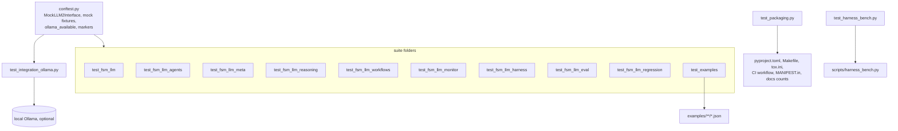

# tests

The whole pytest test tree of the FSM-LLM repository, at `tests/`. It holds 7,990 collected tests: ten suite folders, one per part of the `fsm_llm` package, plus three test files at this level and the shared `conftest.py`.

## What it is for

FSM-LLM is a Python framework that runs conversations as JSON-defined finite state machines (FSMs) driven by an LLM. The code ships as one package, `fsm_llm`, with six subpackages: `agents`, `reasoning`, `workflows`, `monitor`, `harness` and `eval`. This tree checks all of it.

Almost every test replaces the LLM with a scripted fake, so the default run needs no network, no API key and no running model. A small number of live tests talk to a local Ollama server and skip themselves when it is not there. Many tests pin bugs found in past audits; their names and docstrings cite the audit id or a `DECISION plan-.../D-NNN` note that explains why the behaviour is the way it is.

## How it works



- `conftest.py` puts `src/` on `sys.path`, registers the four markers, and provides the fake LLMs most suites use. The main one is `MockLLM2Interface`, a fake of the 2-pass pipeline (Pass 1 extracts data from the user message, Pass 2 writes the reply): it returns fixed field values and a fixed reply and records every call.
- Each suite folder tests one area and sits next to its source in `src/fsm_llm/`.
- The three root files check things that span the repo: packaging and doc counts, the harness bench script, and live end-to-end runs.

## Suites

| Folder | Tests | What it checks |
| --- | --- | --- |
| `test_fsm_llm/` | 2,722 | Core framework: `API`, `FSMManager`, the 2-pass `MessagePipeline`, transition rules, JsonLogic, prompts, the LiteLLM wrapper, handlers, working memory, validator, visualizer, logging, and the secret filter measured against labelled corpora in `fixtures/` |
| `test_fsm_llm_agents/` | 1,664 | Every agent pattern (ReAct, Reflexion, Plan-Execute, Debate and others), tools, human approval (HITL) security, memory, MCP, remote serving, the agents CLI |
| `test_fsm_llm_meta/` | 220 | The meta-builder in `fsm_llm.agents`: FSM, workflow and agent builders, builder tools, prompts, `MetaBuilderAgent` |
| `test_fsm_llm_reasoning/` | 126 | Reasoning engine constants, models, exceptions, handlers, strategy fallback, CLI logging and JSON output |
| `test_fsm_llm_workflows/` | 231 | Async workflow engine: step types, DSL, engine lifecycle, timeouts, audit fixes |
| `test_fsm_llm_monitor/` | 388 | FastAPI dashboard: routes, security checks, instance manager, event collector, bridge, OpenTelemetry exporter |
| `test_fsm_llm_harness/` | 1,986 | Iterative-planner harness: disk-derived gates, the 6-state FSM, artifacts, roles and tools, storage, CLI; 17 live tests off by default |
| `test_fsm_llm_eval/` | 261 | `fsm_llm.eval` and the `fsm-llm-eval` CLI: example scoring, case datasets, config, statistics, result files |
| `test_fsm_llm_regression/` | 264 | One class per fixed bug across core, reasoning, workflows, CLI and packaging text |
| `test_examples/` | 43 | Every JSON file under `examples/` loads, parses as an `FSMDefinition` and passes `FSMValidator` (3 tests per file, plus one check that at least 5 exist) |

## Files at this level

- `conftest.py` - shared fixtures, fake LLMs (`MockLLM2Interface`, and `PromptGroundedLLM`, which answers a field only when its evidence is in the prompt), the `block_network` guard the agents and meta suites use, the `ollama_available()` probe and marker registration.
- `__init__.py` - empty; makes `tests` a package so files can import `tests.conftest`.
- `test_packaging.py` - 39 tests: the single `fsm_llm` package and its six subpackages are named in every build and CI file, the monitor's static files ship, every subpackage has an install extra, module docstrings are real, and every test count written in the root `CLAUDE.md`, `README.md` and `src/fsm_llm/harness/CLAUDE.md` matches a fresh collection.
- `test_harness_bench.py` - 34 offline tests for `scripts/harness_bench.py`: no socket at import, Wilson interval, Fisher exact test, manifest checks, row files, report recount, run-once refusal, CLI.
- `test_integration_ollama.py` - 12 tests. Most run a real conversation on `ollama_chat/qwen3.5:9b-q8_0` and skip without it; two small classes check workflow timestamps and parallel-step context isolation with no model.
- `fixtures/test_fsm_definitions/minimal_fsm.json` - a one-state FSM loaded by the `sample_fsm_definition` fixture (the fixture writes it if missing).

## How to use it

From the repository root, with the project virtualenv:

```bash
.venv/bin/python -m pytest tests/ -q
.venv/bin/python -m pytest tests/ -q -m "not slow"
.venv/bin/python -m pytest tests/test_fsm_llm_workflows/ -q
make test
make coverage
```

Arm the live harness tests (needs Ollama with `qwen3.5:4b` pulled):

```bash
FSM_LLM_HARNESS_LIVE=1 .venv/bin/python -m pytest tests/test_fsm_llm_harness/test_live_ollama.py -s
```

## Things to know

- Always run from the repository root. Many files import `tests.conftest` or each other as `tests.<folder>.<file>`.
- Markers: `slow` (135 tests), `integration` and `real_llm` (113 each), `examples` (43). `-m "not slow"` runs 7,855 tests.
- `pyproject.toml` sets `asyncio_mode = "auto"`, so async tests need no decorator, and `addopts = "-v --tb=short"`.
- Library logging is off by default. Tests that check a log line enable `fsm_llm` logging with a temporary loguru sink; pytest's `caplog` cannot see loguru output.
- Some tests skip when an optional package is missing: `mcp`, `fastapi`/`httpx`, the OpenTelemetry SDK, or a subpackage that fails to import.
- `tests/test_packaging.py` fails if the test counts in the root `CLAUDE.md` and `README.md` drift from the real collection. After adding or removing tests, re-measure with `.venv/bin/python -m pytest --collect-only -q | tail -1` and update those numbers.
- Version literals `"0.11.0"` are pinned in `test_fsm_llm_monitor/test_app.py` and `test_fsm_llm_regression/test_regression_review.py`; update them on a release.
- Do not edit files under `examples/`: `test_examples/`, the eval suite and monitor preset tests read them.
- The live harness blocks write rows into `scripts/bench_data/` and refuse to rerun a block that already has rows.
