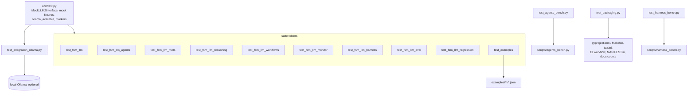

# tests

The whole pytest test tree of the FSM-LLM repository, at `tests/`. It holds 9,986 collected tests: ten suite folders, one per part of the `fsm_llm` package, plus four test files at this level and the shared `conftest.py`.

## What it is for

FSM-LLM is a Python framework that runs conversations as JSON-defined finite state machines (FSMs) driven by an LLM. The code ships as one package, `fsm_llm`, with six subpackages: `agents`, `reasoning`, `workflows`, `monitor`, `harness` and `eval`. This tree checks all of it.

Almost every test replaces the LLM with a scripted fake, so the default run needs no network, no API key and no running model. A small number of live tests talk to a local Ollama server and skip themselves when it is not there. Many tests pin bugs found in past audits; their names and docstrings cite the audit id or a `DECISION plan-.../D-NNN` note that explains why the behaviour is the way it is.

## How it works



- `conftest.py` puts `src/` on `sys.path`, registers the four markers (`pyproject.toml` declares them too), and provides the fake LLMs most suites use. The main one is `MockLLM2Interface`, a fake of the 2-pass pipeline (Pass 1 extracts data from the user message, Pass 2 writes the reply): it returns fixed field values and a fixed reply and records every call.
- Each suite folder tests one area and sits next to its source in `src/fsm_llm/`.
- The four root files check things that span the repo: packaging and doc counts, the two bench scripts, and live end-to-end runs.

## Suites

| Folder | Tests | What it checks |
| --- | --- | --- |
| `test_fsm_llm/` | 3,480 | Core framework: `API`, `FSMManager`, the 2-pass `MessagePipeline`, transition rules, JsonLogic, prompts, the LiteLLM wrapper, handlers, working memory, validator, visualizer, logging, and the secret filter measured against labelled corpora in `fixtures/`, the message-free `advance` and `run_until_terminal` loops, the `complete` LLM primitive and the core builders |
| `test_fsm_llm_agents/` | 2,361 | Every agent pattern (ReAct, Reflexion, Plan-Execute, Debate and others), tools, human approval (HITL) security, memory, MCP, remote serving, the agents CLI, the agents run loops and `ConfiguredAgentBuilder` |
| `test_fsm_llm_meta/` | 437 | The meta-builder in `fsm_llm.agents`: FSM, workflow and agent artifact builders, builder tools (golden reply text, concurrency isolation), prompts, `MetaBuilderAgent` |
| `test_fsm_llm_reasoning/` | 191 | Reasoning engine constants, models, exceptions, handlers, strategy fallback, CLI logging and JSON output, and whole scripted solves on the core step loop |
| `test_fsm_llm_workflows/` | 269 | Async workflow engine: step types, DSL and `WorkflowBuilder`, engine lifecycle, timeouts, audit fixes |
| `test_fsm_llm_monitor/` | 391 | FastAPI dashboard: routes, security checks, instance manager, event collector, data models, OpenTelemetry exporter |
| `test_fsm_llm_harness/` | 2,028 | Iterative-planner harness: disk-derived gates, the 6-state FSM, artifacts, roles and tools, storage, CLI; 17 live tests off by default, `HarnessAgentBuilder` |
| `test_fsm_llm_eval/` | 261 | `fsm_llm.eval` and the `fsm-llm-eval` CLI: example scoring, case datasets, config, statistics, result files |
| `test_fsm_llm_regression/` | 264 | One class per fixed bug across core, reasoning, workflows, CLI and packaging text |
| `test_examples/` | 67 | Every JSON file under `examples/` (14 today) loads, parses as an `FSMDefinition` and passes `FSMValidator` (43 tests), and every call into `fsm_llm` in the `examples/**/*.py` scripts still binds to the live signature, checked with `ast` and `inspect.signature` without running an example (24 tests) |

## Files at this level

- `conftest.py` - shared fixtures (`mock_llm2_interface`, `mock_llm_interface`, `sample_fsm_definition`, `sample_fsm_definition_v2`, `test_fixtures_root`), fake LLMs (`MockLLM2Interface`, with `configure_mock_extract_field` to script its field answers, and `PromptGroundedLLM`, which answers a field only when its evidence is in the prompt and raises `LLMResponseError` from `complete`), the `block_network` function that the agents and meta suites call from their own autouse fixtures (it refuses every IPv4/IPv6 connect, loopback included, unless the test is marked `real_llm` or `integration`), the `ollama_available(model_tag)` probe (one 3 second GET to `localhost:11434/api/tags`, never raises) and marker registration.
- `__init__.py` - empty; makes `tests` a package so files can import `tests.conftest`.
- `test_packaging.py` - 34 tests (7 of them `slow`): the single `fsm_llm` package and its six subpackages are named in every build and CI file, the monitor's static files ship, every subpackage has an install extra, module docstrings are real, and every test count written in the root `CLAUDE.md`, `README.md` and `src/fsm_llm/harness/CLAUDE.md` matches a fresh collection.
- `test_harness_bench.py` - 59 offline tests for `scripts/harness_bench.py`: no socket at import, Wilson interval, Fisher exact test, manifest checks, row files, report recount, run-once refusal, CLI, the seed probe on core, wire disclosure, arm pairing, native-FSM registration, commit recording.
- `test_agents_bench.py` - 132 offline tests for `scripts/agents_bench.py`: inert import, task set and its SHA-256, grader, metric math, manifest and pair disclosure, report, call meter, end-to-end run with fake results, arms, CLI.
- `test_integration_ollama.py` - 12 tests, all marked `integration`, `real_llm` and `slow`. Most run a real conversation on `ollama_chat/qwen3.5:9b-q8_0` and skip without it; two small classes (`TestWorkflowUTCConsistency`, `TestParallelStepIsolation`) check workflow timestamps and parallel-step context isolation with no model.
- `fixtures/test_fsm_definitions/minimal_fsm.json` - a one-state FSM loaded by the `sample_fsm_definition` fixture (the fixture writes it if missing).

## How to use it

From the repository root, with the project virtualenv:

```bash
.venv/bin/python -m pytest tests/ -q
.venv/bin/python -m pytest tests/ -q -m "not slow"
.venv/bin/python -m pytest tests/test_fsm_llm_workflows/ -q
.venv/bin/python -m pytest --collect-only -q | tail -1   # re-measure the count
make test        # python -m pytest tests/ -v
make coverage    # same run with --cov=fsm_llm
```

`make` uses `python` from the active environment, so activate `.venv` first. The pre-push hook and CI use narrower runs, see `.pre-commit-config.yaml` and `.github/workflows/python-package.yml` (CI skips the `slow`, `real_llm` and `integration` tests).

Arm the live harness tests (needs Ollama with `qwen3.5:4b` pulled):

```bash
FSM_LLM_HARNESS_LIVE=1 .venv/bin/python -m pytest tests/test_fsm_llm_harness/test_live_ollama.py -s
```

## Things to know

- Always run from the repository root. Many files import `tests.conftest` or each other as `tests.<folder>.<file>`.
- Markers: `slow` (135 tests), `integration` and `real_llm` (113 each, the same tests), `examples` (67). `-m "not slow"` runs 9,851 tests. The 135 slow tests are the live files (`test_integration_ollama.py` 12, `test_live_classification_memory.py` 7, `test_live_ollama.py` 94, marked as whole modules, so most of the harness file is offline code that `-m "not slow"` also drops), `test_handler_timeout.py` 7, `test_step_timeouts.py` 8 and the 7 count-pinning tests in `test_packaging.py`.
- `pyproject.toml` sets `asyncio_mode = "auto"`, so async tests need no decorator, and `addopts = "-v --tb=short"`.
- Library logging is off by default. Tests that check a log line enable `fsm_llm` logging with a temporary loguru sink; pytest's `caplog` cannot see loguru output.
- Some tests skip when an optional package is missing: `mcp` (all of `test_mcp_stdio.py`), `fastapi` and `httpx` in the agents suite, the OpenTelemetry SDK, or a subpackage that fails to import. The monitor suite imports `fastapi.testclient` at module level, so without the monitor extra it errors at collection instead of skipping.
- The agents and meta suites run behind `block_network`: a new offline test that opens a real socket fails with `ConnectionRefusedError`. Mark a test that must reach Ollama `real_llm` or `integration`.
- `tests/test_packaging.py` (slow class `TestDocumentedTestCountsMatchCollection`) fails if the test counts in the root `CLAUDE.md` (`make test` line, `Run all tests` line, per-suite lines, the "suites above sum to" sentence, root-file list), the root `README.md` (`Run full test suite` line) and `src/fsm_llm/harness/CLAUDE.md` drift from the real collection. After adding or removing tests, re-measure with `.venv/bin/python -m pytest --collect-only -q | tail -1` and update those numbers. The READMEs in `tests/` are not pinned, so update their counts by hand.
- Version literals `"0.12.0"` are pinned in `test_fsm_llm_monitor/test_app.py` and `test_fsm_llm_regression/test_regression_review.py`; update them on a release.
- Do not edit files under `examples/`: `test_examples/`, the eval suite and monitor preset tests read them.
- `test_docs_snippets.py` (core suite) loads every fenced `json` or `python` block containing `"initial_state"` in the root `CLAUDE.md`, `README.md`, `docs/quickstart.md`, `src/fsm_llm/README.md` and four `docs/` guides, so keep those FSM examples valid.
- The live harness blocks write rows into `scripts/bench_data/` and refuse to rerun a block that already has rows.
