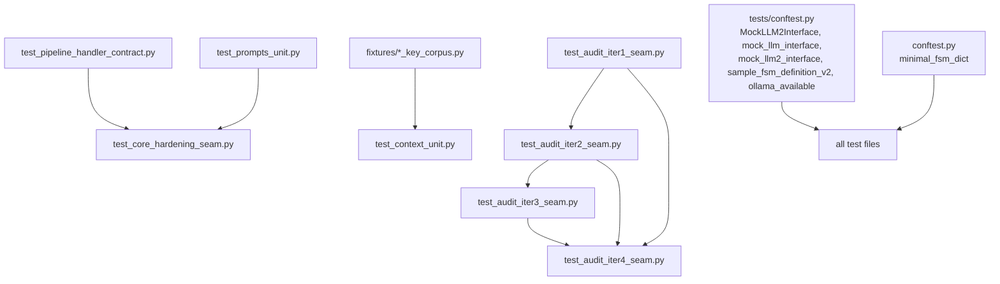

# test_fsm_llm

Path: `tests/test_fsm_llm`
Purpose: pytest suite for the core `fsm_llm` framework (API, FSMManager, 2-pass MessagePipeline, transitions, prompts, LLM wrapper, handlers, memory, validator, visualizer, logging), 41 test files, 2,714 collected tests.

## Scope

In: tests of the core modules in `src/fsm_llm/` (`api.py`, `fsm.py`, `pipeline.py`, `transition_evaluator.py`, `expressions.py`, `classification.py`, `context.py`, `prompts.py`, `llm.py`, `ollama.py`, `handlers.py`, `memory.py`, `session.py`, `validator.py`, `visualizer.py`, `runner.py`, `utilities.py`, `logging.py`, `constants.py`), plus `fixtures/` (labelled secret-filter corpora).

Out: the subpackages `fsm_llm.agents`, `.reasoning`, `.workflows`, `.monitor`, `.harness`, `.eval` have their own suites under `tests/test_fsm_llm_<name>/`. A few tests here still import from them (see Dependencies).

Core flow under test, for reference:

```
User Input -> Pass 1: extraction (LLM) -> context update -> classification extractions
           -> transition evaluation (JsonLogic rules) -> if AMBIGUOUS: classifier
           -> state transition -> Pass 2: response generation (LLM) -> output
```

Outcomes: one passing transition is DETERMINISTIC, a tie at the lowest priority is AMBIGUOUS, none is BLOCKED (stay).

## Architecture

Three test styles:

| Style | Files | How they drive code |
| --- | --- | --- |
| Unit | `*_unit.py`, `test_pipeline.py`, `test_fsm.py`, `test_expressions.py`, `test_memory.py`, ... | call one module directly |
| Seam | `*_seam.py`, `test_pipeline_handler_contract.py`, `test_turn_guard_deterministic.py` | go through `API.converse` / `converse_stream` / `push_fsm` / `pop_fsm`, or `LiteLLMInterface` with `patch("fsm_llm.llm.completion")` |
| Audit regression | `test_audit_2026_09_21.py`, `test_audit_2026_09_22.py`, `test_audit_iter1_seam.py`..`test_audit_iter4_seam.py`, `test_audit_sweeps.py` | one class per plan step, tests named after the audit id (`test_a1_*`, `test_p0_1_*`), each run RED before its fix |



Arrows between test files mean helper imports (`_Prov`, `_PromptSpy`, `_ClassBulkProv`, `_ConnectionHarness`, `_ExplodingHandler`, ...). Renaming a `_` helper in an earlier file breaks later ones.

### fixtures/ (child package)

Pure data, no logic besides `arm_of()`. Three corpora of `(name, value, ground_truth)` rows labelled `credential` or `safe`, consumed only by `test_context_unit.py`, which runs them through `is_forbidden_context_entry` (`fsm_llm.constants`) and `clean_context_keys(..., strip_forbidden_keys=True)` (`fsm_llm.context`).

Terms: fail open = a credential reaches the prompt; over-strip = a safe value is removed; arm = `key` or `token` (by name); two-sided pin = a frozenset of known-wrong entries that must match the measurement exactly, so a fix and a regression both fail a test.

| File | Role |
| --- | --- |
| `context_key_corpus.py` | regression and shape-coverage corpus: past leaks and over-strips, every value-shape carve-out has one credential and one safe instance; pinned sets such as `KNOWN_OVER_STRIPPED` |
| `holdout_key_corpus.py` | burned holdout, 181 rows, measured once, now regression only; exports `arm_of()`; pinned sets such as `HOLDOUT_KNOWN_FAIL_OPEN` |
| `census_key_corpus.py` | current independence corpus, 341 rows, 196 distinct values, 124 values in both arms; imports only `arm_of` from the holdout |

Consuming classes in `test_context_unit.py`: `TestIndependentVocabularyKeyCorpus`, `TestCryptoKeyAndTokenTriggers`, `TestValueShapeLayer`, `TestBurnedHoldoutCorpus`, `TestShippedCorpusBounds`, `TestCensusCorpusAdequacy`.

## Key files

| File | Role | Notes |
| --- | --- | --- |
| `conftest.py` | `minimal_fsm_dict` fixture | one state `only_state`, no transitions |
| `test_api.py`, `test_api_elaborate.py` | `API` loading, conversations, stacking | `test_api_elaborate.py` holds `TestBaseExceptionRollsBackUserMessage` |
| `test_fsm.py`, `test_fsm_elaborate.py` | `FSMManager` data filtering, stacking | nested filtering of `get_conversation_data` |
| `test_pipeline.py` | `MessagePipeline` 2-pass `process()` | Pass 2 failure is atomic (sync and stream) |
| `test_multipass_extraction.py` | field-level retry and merge | `_build_field_configs_from_state` |
| `test_transition_evaluator.py` | `TransitionEvaluator` outcomes, priority | |
| `test_classification_extractions.py`, `test_classification_transitions.py` | classification extraction, AMBIGUOUS resolution via `Classifier` | classifier cache, NaN confidence |
| `test_expressions.py` | JsonLogic evaluator | short-circuit, arity, soft equality |
| `test_context_unit.py` | context cleaning/compaction/search, secret filter | largest file; holds the strict xfail |
| `test_prompts_unit.py` | prompt builders, `sanitize`, CDATA escape, token estimate | helpers reused by `test_core_hardening_seam.py` |
| `test_llm_unit.py`, `test_ollama.py` | `LiteLLMInterface`, `fsm_llm.ollama` | stream guards, reasoning-content recovery |
| `test_llm_parse_fallback_seam.py` | parse ladder JSON -> embedded JSON -> raw text never raises | |
| `test_handlers_unit.py`, `test_handler_timeout.py` | `HandlerSystem`, `HandlerBuilder`, `LambdaHandler`, timeouts | 7 timeout tests are `slow` |
| `test_pipeline_handler_contract.py` | handler failures through `API.converse` | critical propagation, rollback |
| `test_memory.py` | `WorkingMemory` | serialization, copy under concurrency |
| `test_strands_features.py` | schema output, invocation state, streaming, `save_session`/`restore_session` | imports `fsm_llm.agents.base` |
| `test_streaming_history_seam.py` | history after mid-stream error or abandonment | |
| `test_stack_lifecycle_seam.py` | `push_fsm`/`pop_fsm` races, stale cleanup | uses a fake clock |
| `test_turn_guard_deterministic.py` | concurrent `converse` on one conversation raises `FSMError` | event-synchronised, no sleeps |
| `test_prompt_injection_seam.py` | extraction prompt sanitising at `LLMInterface.extract_field` | |
| `test_intent_entities_seam.py` | `IntentScore` keeps `None` entities | |
| `test_core_hardening_seam.py` | `FileSessionStore.save`, `setup_logging`, bounded context, locks | |
| `test_audit_sweeps.py` | operator table, context-filter, config, sanitizer agreement | |
| `test_validator_unit.py` | `FSMValidator`, agrees with the loader, `fsm-llm-validate` output | |
| `test_visualizer_unit.py` | ASCII visualizer, box alignment, truncation, CLI output | |
| `test_runner_unit.py`, `test_utilities_unit.py` | runner redaction, `extract_json_from_text`, FSM loading | |
| `test_logging_unit.py`, `test_logging_structured.py` | logging helpers, `setup_logging`, JSON formatter | |
| `test_docs_snippets.py` | loads doc FSM snippets through `FSMDefinition` | see Invariants |
| `test_live_classification_memory.py` | live classifier and memory agent on `ollama_chat/qwen3.5:9b-q8_0` | markers `integration`, `real_llm`, `slow` |

## Public interface

A test suite exports no product API. What other files consume:

Fixtures and helpers from `tests/conftest.py` (shared by all suites):

| Name | Kind | Use |
| --- | --- | --- |
| `MockLLM2Interface(extraction_data=None, response_text="Hello! How can I help you?", transition_target=None)` | `LLMInterface` subclass | 2-pass mock; `extract_field` returns `extraction_data[field_name]`, records calls in `call_history` |
| `configure_mock_extract_field(mock_llm, mock_data=None)` | function | gives a `Mock(spec=LLMInterface)` a working `extract_field` side effect |
| `mock_llm_interface`, `mock_llm2_interface` | fixtures | the two mock styles above |
| `sample_fsm_definition`, `sample_fsm_definition_v2` | fixtures | v3.0 and v4.1 FSM definitions |
| `ollama_available(model_tag: str) -> bool` | function | skip guard for live tests |

Markers registered there: `slow`, `integration`, `examples`, `real_llm`.

Local `conftest.py`: fixture `minimal_fsm_dict`.

Helpers imported across files in this directory (module path `tests.test_fsm_llm.<file>`):

| Defined in | Helpers | Imported by |
| --- | --- | --- |
| `test_audit_iter1_seam.py` | `_fake_response(content: str) -> MagicMock`, `_correction_fsm` | iter2, iter3, iter4 (iter4 imports `_correction_fsm` both directly and through iter3) |
| `test_audit_iter1_seam.py` | `_stream_chunk` | iter3 (iter4 takes it only through iter3's re-export) |
| `test_audit_iter1_seam.py` | `_ConnectionHarness`, `_ambiguous_fsm`, `_classified_fsm` | iter2 only |
| `test_audit_iter2_seam.py` | `_Prov` | iter3, iter4 |
| `test_audit_iter2_seam.py` | `_ClassBulkProv`, `_classified_bulk_fsm` | iter3 |
| `test_audit_iter2_seam.py` | `_PromptSpy` | iter4 |
| `test_audit_iter3_seam.py` | `_PassTwoSpy`, `_EdgeProv` (both subclass `_Prov`) | iter4 |
| `test_pipeline_handler_contract.py` | `_ExplodingHandler`, `_fsm_definition`, `_make_api` | `test_core_hardening_seam.py` |
| `test_prompts_unit.py` | `_make_state`, `_make_instance`, `_make_fsm_definition` | `test_core_hardening_seam.py` (imported under `_make_prompt_*` aliases) |
| `fixtures/context_key_corpus.py`, `fixtures/holdout_key_corpus.py` | name tuples, value maps, known-wrong frozensets; `arm_of(name: str) -> str` only in `holdout_key_corpus.py` | `test_context_unit.py` |

iter3 re-exports iter1's `_correction_fsm` and `_stream_chunk`. iter4 imports `_stream_chunk` only from `test_audit_iter3_seam`, so moving or dropping iter3's import of it breaks iter4; `_correction_fsm` is also imported directly from iter1.

Seam files fake the backend with `patch("fsm_llm.llm.completion", ...)` returning `MagicMock` responses built by `_fake_response`.

`test_docs_snippets.py` scans ```` ```json ```` and ```` ```python ```` fences naming `"initial_state"` in `README.md`, `docs/quickstart.md`, `src/fsm_llm/README.md`, `CLAUDE.md` (repo root; must each contribute a snippet) and `docs/api_reference.md`, `docs/architecture.md`, `docs/fsm_design.md`, `docs/handlers.md` (must exist). Python blocks are parsed with `ast`, never executed. Test ids look like `test_doc_fsm_snippet_loads[<file>#block<n>]`.

## Data shapes

- `minimal_fsm_dict`: `{"name", "description", "initial_state": "only_state", "states": {"only_state": {"id", "description", "purpose", "transitions": []}}}`; exercises Pydantic defaults.
- Holdout and census corpus rows: `(name, value, ground_truth)` with `ground_truth` in `{"credential", "safe"}`; census totals 341 rows, 196 distinct values, 124 values in both arms.
- Regression corpus (`context_key_corpus.py`): name tuples (`SECRET_KEYS`, `SAFE_KEYS`, `CRYPTO_KEY_*_KEYS`, `TOKEN_*_KEYS`), value maps `dict[str, object]` (`TOKEN_SECRET_VALUES`, `CRYPTO_KEY_SAFE_VALUES`, ...), carve-out entries `(entry_id, name, value)` with `entry_id` like `"<shape>/credential"` or `"<shape>/safe"`, and known-wrong `frozenset[str]` pins (`KNOWN_OVER_STRIPPED`, `CARVE_OUT_KNOWN_FAIL_OPEN`, ...).
- `MockLLM2Interface.call_history`: list of `("extract_field" | "generate_response", request)` tuples.

## Invariants and constraints

- Run from the repo root: files import `tests.conftest` and `tests.test_fsm_llm.<module>`.
- No network in the default run. Only `test_live_classification_memory.py` reaches a model, and its tests skip via `ollama_available(MODEL_TAG)` when Ollama or the model is missing.
- `-m "not slow"` deselects 14 tests (7 handler timeout, 7 live).
- `test_context_unit.py` holds an `xfail(strict=True)` bound test: the key arm fails open above the 5% bound. An XPASS after a reporting-only change means the measurement changed; revert, do not celebrate. Do not change bound denominators in the same edit as a disclosure change.
- fixtures invariants (enforced by `test_context_unit.py`): corpora must not import `fsm_llm.constants`; holdout and regression corpora share no names and exactly one value (`True`); census names appear in neither sibling; census numbers (341 rows, 196 distinct values, 124 in both arms) and banner strings are asserted verbatim; known-wrong sets are two-sided pins; credential values are synthetic (real vendor prefixes keep `NOTAREALTOKEN`-style bodies; census uses invented prefixes like `xk_live_`).
- `test_audit_iter2_seam.py::TestDecisionAnchorsArePlacedAndQualified` asserts `# DECISION plan-2026-09-19T175721-21cd7f8e/D-016` in `fsm_llm.pipeline` and `/D-011` in `fsm_llm.validator`. Moving or rewording those anchors fails it.
- Audit tests pin behaviour that was deliberately fixed. Treat a failure as a regression in `src/`, not a stale test, unless the plan decision it cites was reversed.

## Dependencies

- Core modules of `fsm_llm` listed in Scope.
- Cross-subpackage imports: `fsm_llm.agents` (`test_live_classification_memory.py`, `test_strands_features.py`, `test_audit_iter4_seam.py` via `fsm_llm.agents.fsm_definitions` and `fsm_llm.agents.tools.ToolRegistry`), `fsm_llm.harness.hardening` (`test_audit_iter2_seam.py`, `test_utilities_unit.py`), `fsm_llm.workflows.exceptions` and `.models` (`test_logging_unit.py`), `fsm_llm.workflows` itself (`test_audit_2026_09_21.py`, which also simulates its import failing).
- External: pytest, `unittest.mock`; the live file also uses litellm callbacks and a local Ollama.

## Failure modes

- `ModuleNotFoundError: tests...` when pytest runs from another directory.
- A docs edit that breaks an FSM example fails `test_doc_fsm_snippet_loads[<file>#block<n>]`; moving a fence style makes `test_the_extractor_found_the_first_touch_snippets` fail instead of passing vacuously.
- A secret-filter change in `src/fsm_llm/constants.py` that fixes or breaks a corpus entry fails the matching two-sided pin.
- Live tests failing on timeouts under GPU load is a known pattern, not necessarily a code bug.

## Working here

- Name files `test_<module>.py` / `test_<module>_elaborate.py`, classes `Test<Feature>`, helpers with a `_` prefix.
- New regression for a public-path bug: add a seam test that drives `API.converse` or patched `fsm_llm.llm.completion`, not only a helper-level test.
- Reuse helpers from earlier seam files by import rather than copying, and keep their names stable.
- Do not relabel, delete or regenerate corpus rows to improve a rate; do not add filter words to catch one corpus entry. Add names from real vocabulary without reading `constants.py` first.
- After adding or removing tests, re-measure with the first command below. The suite count (2,714) is pinned by `tests/test_packaging.py::test_per_suite_table` (marked slow), which compares a measured `--collect-only` count per suite against a documented literal of the form `pytest tests/test_fsm_llm/  # ... (N tests)`; run that test after changing the count. The counts stated in this file (41 test files, 2,714 tests, 14 slow) are not pinned by any test and must be updated by hand.

```bash
.venv/bin/python -m pytest tests/test_fsm_llm/ --collect-only -q | tail -1
.venv/bin/python -m pytest tests/test_fsm_llm/ -q -m "not slow"
.venv/bin/python -m pytest tests/test_fsm_llm/test_context_unit.py -q
```
