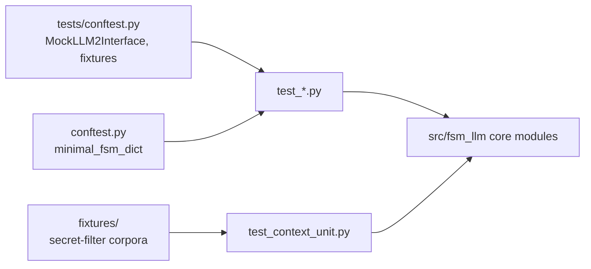

# test_fsm_llm

The pytest suite for the core `fsm_llm` framework, at `tests/test_fsm_llm/`. It holds 41 test files (2,722 collected tests) plus a `fixtures/` package of labelled secret-filter data.

## What it is for

FSM-LLM runs conversations as JSON-defined finite state machines driven by an LLM. Each user turn goes through a 2-pass pipeline: Pass 1 extracts data from the message, rules pick the next state, and Pass 2 writes the reply. This suite checks the core pieces behind that flow: the `API` class, `FSMManager`, `MessagePipeline`, transition rules, prompts, the LLM wrapper, handlers, working memory, the validator, the visualizer and logging.

Almost every test uses a fake LLM, so the suite runs offline and fast. Only one file talks to a real model, and it skips itself when that model is not available.

## How it works

There are three kinds of test files.

- Unit tests (`*_unit.py` and plain module names such as `test_pipeline.py`) call one module directly.
- Seam tests (`*_seam.py`, `test_pipeline_handler_contract.py`) go through a public entry point, usually `API.converse` or `LiteLLMInterface` with `fsm_llm.llm.completion` patched. A "seam" here means the boundary where two parts meet; these tests exist because some bugs were invisible to tests that call helpers directly.
- Audit regression tests (`test_audit_*.py`) pin fixes from past code audits. Each test is named after the audit id it covers and was run failing before its fix landed.



The `fixtures/` package holds three hand-written lists of context key names and values, each labelled "credential" or "safe". `test_context_unit.py` runs every entry through the secret filter (`is_forbidden_context_entry` in `src/fsm_llm/constants.py`) and counts two kinds of error: a credential that reaches the prompt ("fail open") and a harmless value that gets removed ("over-strip"). The three lists have separate jobs: a regression list of past bugs, a holdout that was measured once and is now regression only, and a census that is the current independent measurement.

## Files

- `conftest.py` - the `minimal_fsm_dict` fixture: a one-state FSM with only required fields.
- `fixtures/` - labelled corpora for the secret filter (`context_key_corpus.py`, `holdout_key_corpus.py`, `census_key_corpus.py`).
- `test_api.py`, `test_api_elaborate.py` - the `API` class: loading definitions, starting and running conversations, FSM stacking.
- `test_fsm.py`, `test_fsm_elaborate.py` - `FSMManager`: data filtering in `get_conversation_data`, stacking.
- `test_pipeline.py` - `MessagePipeline`: the 2-pass `process()`, atomic rollback when Pass 2 fails, context scope, bulk extraction.
- `test_multipass_extraction.py` - field-level retry and merge in extraction.
- `test_transition_evaluator.py` - DETERMINISTIC, AMBIGUOUS and BLOCKED outcomes and priority ranking.
- `test_classification_extractions.py`, `test_classification_transitions.py` - classification-based extraction and classifier-resolved ambiguous transitions.
- `test_expressions.py` - the JsonLogic evaluator used in transition conditions.
- `test_context_unit.py` - context cleaning, compaction, search, and the secret filter measured against `fixtures/`.
- `test_prompts_unit.py` - prompt builders, text sanitizing, token estimates, secret filtering in prompts.
- `test_llm_unit.py`, `test_ollama.py` - `LiteLLMInterface` and Ollama-specific parameters.
- `test_llm_parse_fallback_seam.py` - response parsing falls back from JSON to embedded JSON to raw text and never raises.
- `test_handlers_unit.py`, `test_handler_timeout.py` - `HandlerSystem`, `HandlerBuilder`, timing points, priorities, timeouts.
- `test_pipeline_handler_contract.py` - handler failures seen through `API.converse`, including rollback.
- `test_memory.py` - `WorkingMemory` buffers, serialization, copies and concurrency.
- `test_strands_features.py` - schema-enforced output, invocation state, streaming, session save and restore.
- `test_streaming_history_seam.py` - history stays consistent when a stream fails or is abandoned.
- `test_stack_lifecycle_seam.py` - races in `push_fsm`/`pop_fsm` and stale-conversation cleanup.
- `test_turn_guard_deterministic.py` - a second `converse` on a busy conversation raises `FSMError`.
- `test_prompt_injection_seam.py` - hostile user text is sanitized before it reaches the extraction prompt.
- `test_intent_entities_seam.py` - `None` entity values survive intent classification.
- `test_core_hardening_seam.py` - session file writes, logging redaction, bounded context, read concurrency.
- `test_audit_iter1_seam.py` to `test_audit_iter4_seam.py` - four audit-fix loops of one plan; later files reuse helpers from earlier ones.
- `test_audit_2026_09_21.py`, `test_audit_2026_09_22.py`, `test_audit_sweeps.py` - two core audits and cross-module agreement sweeps.
- `test_validator_unit.py`, `test_visualizer_unit.py` - `FSMValidator` and the ASCII visualizer, including their CLIs.
- `test_runner_unit.py`, `test_utilities_unit.py` - the interactive runner's redaction and JSON helpers, FSM file loading.
- `test_logging_unit.py`, `test_logging_structured.py` - logging helpers, `setup_logging()` and JSON output.
- `test_docs_snippets.py` - every full FSM JSON example in `README.md`, `CLAUDE.md`, `docs/quickstart.md` and `src/fsm_llm/README.md` must load.
- `test_live_classification_memory.py` - real-model tests on Ollama `qwen3.5:9b-q8_0`.

## How to use it

From the repository root, with the project virtualenv:

```bash
.venv/bin/python -m pytest tests/test_fsm_llm/ -q
.venv/bin/python -m pytest tests/test_fsm_llm/ -q -m "not slow"
.venv/bin/python -m pytest tests/test_fsm_llm/test_pipeline.py -q
```

## Things to know

- Run pytest from the repository root. Several files import helpers as `tests.conftest` or `tests.test_fsm_llm.<file>`.
- 14 tests are marked `slow`: 7 handler timeout tests that sleep, and the 7 live Ollama tests. `-m "not slow"` skips them.
- The live file needs Ollama running with `qwen3.5:9b-q8_0` pulled. Without it the tests are skipped, not failed.
- One test in `test_context_unit.py` is `xfail(strict=True)` on purpose: the secret filter misses its target rate. If it starts passing, the test fails, so the change gets looked at.
- Do not edit the `fixtures/` corpora to make a failure rate look better. Tests pin exact counts and banner text in those files.
- A few tests import from `fsm_llm.agents`, `fsm_llm.harness.hardening` and `fsm_llm.workflows`, so those subpackages must be importable.
- Editing an FSM example in the listed docs can break `test_docs_snippets.py`.
