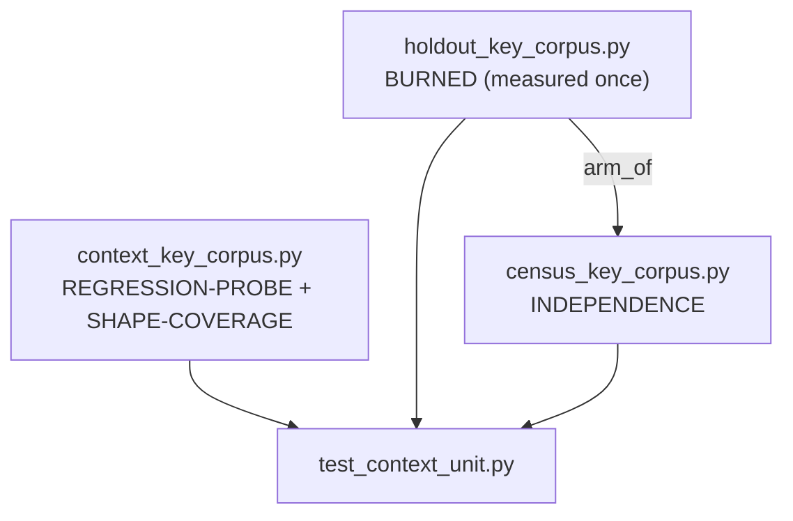

# fixtures

Path: `tests/test_fsm_llm/fixtures`
Purpose: Hand-authored labelled corpora of context key names and values used to measure the prompt-path secret filter in `src/fsm_llm/constants.py`.

## Scope

Pure data modules, no logic beyond list building and `arm_of()`. The only consumer is `tests/test_fsm_llm/test_context_unit.py`, which runs every entry through the filter (`clean_context_keys(..., strip_forbidden_keys=True)` from `fsm_llm.context`, and `is_forbidden_context_entry` in `fsm_llm.constants`) and compares the verdict to the label.

Not here: the filter itself, the measurement code (`distinct_shape_count()`, Wilson intervals, bounds), pytest fixtures (those live in `tests/conftest.py` and `tests/test_fsm_llm/conftest.py`).

Terms used below:
- Fail open: a credential reaches the prompt.
- Over-strip: a safe value is removed from the prompt.
- Arm: the `key` arm covers names containing `key`; the `token` arm covers names containing `token`.
- Layer 1 / layer 2: the filter judges the NAME first (layer 1), then for `*_key` / `*_token` names the VALUE shape (layer 2).
- Two-sided pin: a frozenset of known-wrong entries that must match the measurement exactly; an entry leaving it (a fix) or joining it (a regression) both fail a test.

## Architecture

Three corpora with distinct, non-mergeable roles:



- `context_key_corpus.py` keeps every past leak and over-strip so they cannot silently reopen, and guarantees each value shape the filter carves out has at least one credential and one safe instance. It is NOT an independence statistic.
- `holdout_key_corpus.py` was authored before the filter source was opened, measured once, and is now regression-only. A new independence number needs a freshly authored corpus.
- `census_key_corpus.py` is the current independence corpus. Labels come from a blind 50-shape (S01..S50) value-shape census and from name semantics, never from filter output. The module docstring cites a plan findings file for that census; the file is not present in this repo, so the docstring is the only surviving record of the derivation. It imports `arm_of` from the holdout, nothing else.

## Key files

| File | Role | Notes |
| --- | --- | --- |
| `__init__.py` | Package marker | One-line docstring |
| `context_key_corpus.py` | Regression + shape coverage | Name tuples, value maps, carve-out triples, 5 pinned sets |
| `holdout_key_corpus.py` | Burned holdout | 181 rows, `arm_of()`, 2 pinned sets |
| `census_key_corpus.py` | Independence corpus | 341 rows, explicit `__all__`, contested-row tuples |

## Public interface

`context_key_corpus.py` (sizes measured):

| Name | Type | Size | Meaning |
| --- | --- | --- | --- |
| `SECRET_KEYS` | `tuple[str, ...]` | 82 | password and other credential names, must strip |
| `SAFE_KEYS` | `tuple[str, ...]` | 80 | policy/status/UI names and near misses (`secretary`, `passenger`), should keep |
| `KNOWN_OVER_STRIPPED` | `frozenset[str]` | 11 | subset of `SAFE_KEYS` stripped anyway |
| `CRYPTO_KEY_SECRET_KEYS` | `tuple[str, ...]` | 88 | crypto key material names |
| `CRYPTO_KEY_SAFE_KEYS` | `tuple[str, ...]` | 104 | ordinary `*_key` names (DB, cache, i18n, `monkey_species`) |
| `CRYPTO_KEY_KNOWN_OVER_STRIPPED` | `frozenset[str]` | 1 | `metric_key` |
| `TOKEN_SECRET_KEYS` | `tuple[str, ...]` | 60 | bearer-style token names |
| `TOKEN_SAFE_KEYS` | `tuple[str, ...]` | 90 | metering, tokenizer, pagination names |
| `TOKEN_KNOWN_OVER_STRIPPED` | `frozenset[str]` | 5 | `bookmark_token`, `seek_token`, `max_output_tokens_str`, `trace_token`, `correlation_token` |
| `TOKEN_SECRET_VALUES` | `dict[str, object]` | 60 | one value per secret token name, rotated over 5 shapes |
| `TOKEN_SECRET_SHORT_VALUE_ENTRIES` | `tuple[tuple[str, object], ...]` | 7 | short/low-entropy bearer values only the name layer can catch |
| `TOKEN_SAFE_VALUES` | `dict[str, object]` | 90 | explicit values, else default `1200 + index` |
| `CRYPTO_KEY_SECRET_VALUES` | `dict[str, object]` | 88 | one value per `CRYPTO_KEY_SECRET_KEYS` name |
| `CRYPTO_KEY_SAFE_VALUES` | `dict[str, object]` | 104 | one value per `CRYPTO_KEY_SAFE_KEYS` name |
| `CARVE_OUT_CREDENTIAL_ENTRIES` | `tuple[tuple[str, str, object], ...]` | 29 | `(entry_id, name, value)`, must strip |
| `CARVE_OUT_SAFE_ENTRIES` | same | 24 | must keep |
| `CARVE_OUT_KNOWN_FAIL_OPEN` | `frozenset[str]` of entry ids | 18 | credential carve-out entries that leak |
| `CARVE_OUT_KNOWN_OVER_STRIPPED` | `frozenset[str]` of entry ids | 13 | safe carve-out entries that strip |

Note: inside `TOKEN_SAFE_KEYS`, the comment heading the D-021 metering/tokenizer slice says "Three of them over-strip" (`max_output_tokens_str`, `bookmark_token`, `seek_token`). `trace_token` and `correlation_token` were added later at step 9 under their own comment (accepted gap G8), so `TOKEN_KNOWN_OVER_STRIPPED` holds 5.

`holdout_key_corpus.py`:
- `KEY_ARM_CREDENTIAL` (41), `KEY_ARM_SAFE` (50), `TOKEN_ARM_CREDENTIAL` (40), `TOKEN_ARM_SAFE` (50); `HOLDOUT` is their concatenation (181).
- `arm_of(name: str) -> str`: returns `"token"` if `"token"` is in the name, else `"key"`.
- `HOLDOUT_KNOWN_FAIL_OPEN: frozenset[str]` = `digitalocean_spaces_key`, `harbor_robot_token`, `asana_pat_token`.
- `HOLDOUT_KNOWN_OVER_STRIPPED: frozenset[str]` = `span_link_key`, `focus_ring_token`.

`census_key_corpus.py` (`__all__` is explicit):
- `KEY_ARM_CREDENTIAL` (82), `KEY_ARM_SAFE` (87), `TOKEN_ARM_CREDENTIAL` (81), `TOKEN_ARM_SAFE` (91); `CENSUS` concatenation (341).
- `GROUND_TRUTH_VALUES = frozenset({"credential", "safe"})`.
- `CONTESTED_RESOURCE_NOUN_ROWS: tuple[str, ...]` (11 names, all `credential` rows a reader could call identifiers).
- `CONTESTED_RESOURCE_NOUN_SAFE_ROWS: tuple[str, ...]` (4 names, all `safe` rows a reader could call credentials).
- `arm_of` re-exported from the holdout.
- Private shape constants (`_UUID_LOWER`, `_ULID`, `_HEX32`, `_JWT3`, `_PEM_PRIVATE`, `_PEM_PUBLIC`, `_LONG_OPAQUE_BLOB`, ...) are reused across both arms.

## Data shapes

- Holdout and census rows: `(name, value, ground_truth)`, `ground_truth` in `{"credential", "safe"}`. Holdout values include non-str scalars (`True`, `5`, `0.25`, `False`, `30`) on the token arm.
- Carve-out entries: `(entry_id, name, value)`. `entry_id` is `"<shape>/credential"` or `"<shape>/safe"`, or a gap exhibit id with prefix `g2/`, `g3/`, `g4/`. Shapes covered: `uuid`, `ulid`, `pem`, `vendor_prefix`, `hex_composite`, `id_secret_composite`, `short`, `whitespace`, `percent`, `path_ext`, `many_slash`, `single_class`, `low_entropy`, `numeric`, `non_str`, plus `vendor_prefix_short/credential`, `scheme_*/credential` and `unlisted_noun_*/safe`.
- Census measured totals: 341 rows, 196 distinct values, 124 values in both arms, 202 distinct `(value, ground_truth)` pairs. Six values are labelled both ways (same string is an identifier under one name, a credential under another).

## Invariants and constraints

Enforced by tests in `test_context_unit.py`:
- `context_key_corpus.py` source must contain no line with both `import` and `fsm_llm` (`test_the_corpus_is_independent_of_the_module_under_test`).
- `census_key_corpus.py` must not import `fsm_llm.constants` (`test_the_census_corpus_never_imports_the_thing_it_measures`).
- Holdout vs regression corpus: zero shared names, exactly one shared value, the literal `True` (`test_the_burned_holdout_is_disjoint_from_the_regression_corpus`).
- Census names must not appear in either sibling corpus. Fix collisions by renaming in the census with a qualifier that keeps the semantic root; never relax the guard.
- Census mirror numbers are pinned (`test_the_census_mirror_is_measured_and_pinned`). New census rows must use a value that appears nowhere else in the census and in only one arm (distinct/row ratio must not drop).
- Banner text is asserted verbatim. `test_the_census_corpus_declares_which_kind_of_artifact_it_is` checks census strings such as `ROLE: **INDEPENDENCE**`, `THIS CORPUS IS HALF MIRROR`, `341 rows  /  196 distinct VALUES  /  124 values present in BOTH` (two spaces around `/`), `CONTESTABLE BY CONSTRUCTION`, and the multi-line THE RULE sentence. Another test checks holdout strings `**BURNED**`, `MUST **NOT** BE USED AS AN INDEPENDENCE STATISTIC AGAIN`, `MUST derive a FRESH corpus`, and regression strings `REGRESSION-PROBE + SHAPE-COVERAGE`, `NOT** AN INDEPENDENCE STATISTIC`. Editing a docstring can break these.
- Every name in the crypto and token name tuples must have a value in the matching value map (coverage asserted).
- Every carve-out shape must have at least one credential and one safe instance (shape-coverage guard re-derives shapes by predicate, not by entry id).
- The `g2/`, `g3/`, `g4/` entries are the literal source for the gap-disclosure tests; those tests select them by id prefix.
- All pinned known-wrong sets are two-sided.

## Dependencies

- `census_key_corpus.py` imports `arm_of` from `tests.test_fsm_llm.fixtures.holdout_key_corpus`. No other imports in any file.
- Measured against `src/fsm_llm/constants.py` symbols named in comments: `is_forbidden_context_entry`, `_generic_shape_is_credential`, `_CREDENTIAL_VALUE_PREFIXES`, `_AUTH_SCHEME_WORDS`, `_IDENTIFIER_NOUN_VOCABULARY`, `_SAFE_TOKEN_QUALIFIERS`, `_BEARER_TOKEN_QUALIFIERS`, `_CREDENTIAL_VALUE_CHARSET_RE`.

## Failure modes

- A filter change that fixes or breaks an entry fails the matching two-sided pin. Update the set only if the change is intended, and record why.
- A realistic-looking synthetic credential can trip GitHub push protection. This happened with a `shpat_` body; affected bodies were replaced with `NOTAREALTOKEN`-style text while keeping prefix, length and character-class shape. Some comments state the exact length is load-bearing (for example `vendor_prefix_short/credential` is exactly 20 characters to sit under the 24-character floor).
- Placeholder values: a token-safe name with no explicit value gets `1200 + index`, which the token arm keeps as an int. Names whose verdict depends on a string value (such as `trace_token`) must be spelled out in `_TOKEN_SAFE_NON_COUNT_VALUES`.

## Working here

- Add names from real application vocabulary without reading `constants.py` first. Never generate entries from the filter's word lists.
- Do not delete, relabel or re-derive rows to improve a rate. Do not add a word to a filter list to catch a specific leaking corpus entry; the files record these as refused on purpose.
- Credential values must be synthetic. Census uses only invented prefixes (`xk_live_`, `zc_test_`).
- Keep the three files separate; do not merge corpora or move rows between them.
- After any edit run:

```bash
.venv/bin/python -m pytest tests/test_fsm_llm/test_context_unit.py -q
```

- Relevant test classes: `TestIndependentVocabularyKeyCorpus`, `TestCryptoKeyAndTokenTriggers`, `TestValueShapeLayer`, `TestBurnedHoldoutCorpus`, `TestShippedCorpusBounds`, `TestCensusCorpusAdequacy`.
