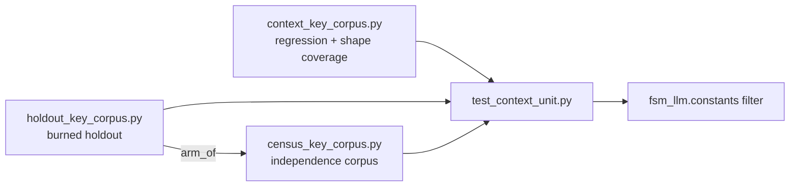

# fixtures

Hand-written test data for the core `fsm_llm` test suite, at `tests/test_fsm_llm/fixtures/`. It holds three corpora of context key names and values that the tests use to measure the secret filter in `src/fsm_llm/constants.py`.

## What it is for

FSM-LLM keeps a context dictionary per conversation and puts parts of it into LLM prompts. Before that happens, a filter (`is_forbidden_context_entry` in `src/fsm_llm/constants.py`) removes entries that look like secrets, such as passwords, API keys and bearer tokens. The filter judges an entry first by its name and, for `*_key` and `*_token` names, also by the shape of its value.

A filter like this can fail in two ways. It can "fail open": a real credential reaches the prompt. Or it can "over-strip": an ordinary value, such as a cache key or a token count, is removed and the model loses useful context. These corpora are lists of realistic names and values, each labelled with the correct answer, so the tests can count both kinds of failure.

The data is kept separate from the filter on purpose. None of these files import `fsm_llm.constants`, and their entries were written from real-world vocabulary, not copied from the filter's own word lists. A corpus copied from the filter would only ever agree with it.

## How it works

Nothing here runs by itself. `tests/test_fsm_llm/test_context_unit.py` imports the lists, runs each entry through the filter, and compares the result with the label.



The three corpora have different jobs and must not be merged:

- The regression corpus keeps every name and value that leaked or was over-stripped in the past, so an old bug cannot come back unnoticed. It also makes sure each special value shape the filter handles has at least one credential example and one safe example.
- The holdout was written without looking at the filter, then measured once. After that one measurement it no longer counts as independent and is only used for regression.
- The census is the current independent corpus. Its labels come from the meaning of each name and from a separate shape study, never from what the filter does.

Where the filter is known to be wrong on an entry and the fix was refused, the entry is listed in a "known" set (for example `KNOWN_OVER_STRIPPED` or `HOLDOUT_KNOWN_FAIL_OPEN`). These sets are pinned both ways: if an entry leaves the set or a new one joins it, a test fails.

## Files

- `__init__.py` - one-line package docstring, so the corpora import as `tests.test_fsm_llm.fixtures.<module>`.
- `context_key_corpus.py` - regression and shape-coverage corpus: name lists for passwords, crypto keys and auth tokens, value maps for the key and token names, carve-out shape entries, and the pinned known-wrong sets.
- `holdout_key_corpus.py` - the burned holdout: 181 `(name, value, ground_truth)` rows for the `*_key` and `*_token` arms, `arm_of()`, and two pinned known-wrong sets.
- `census_key_corpus.py` - the independence corpus: 341 `(name, value, ground_truth)` rows, plus the lists of contested rows.

## How to use it

Run the tests that consume these corpora:

```bash
.venv/bin/python -m pytest tests/test_fsm_llm/test_context_unit.py -q
```

Import a corpus in a test:

```python
from tests.test_fsm_llm.fixtures.census_key_corpus import CENSUS, arm_of

for name, value, ground_truth in CENSUS:
    arm = arm_of(name)  # "key" or "token"
    assert ground_truth in {"credential", "safe"}
```

## Things to know

- All credential-looking values are made up. Some keep a real vendor prefix (`sk_live_`, `ghp_`, `AKIA`, `shpat_`) because the prefix is what is being tested; their bodies were rewritten to obvious fakes like `NOTAREALTOKEN` after GitHub push protection blocked a push. Do not put realistic bodies back.
- The census uses only invented prefixes (`xk_live_`, `zc_test_`).
- Do not delete or relabel rows to make a failure rate look better. The file headers say this repeatedly and the tests guard parts of it.
- Do not add an entry to a filter word list just because a corpus entry leaks. The headers record these gaps as disclosed and refused on purpose.
- Names must not repeat across corpora. Tests check that the holdout and the regression corpus share no names, and that the census shares none with either.
- The tests pin exact numbers from the census (341 rows, 196 distinct values, 124 values present in both arms, 202 distinct value and label pairs). Adding a census row changes these and the pins must be updated.
