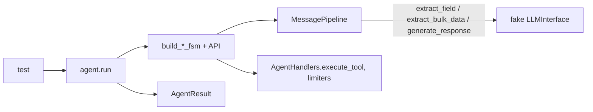

# test_fsm_llm_agents

Path: `tests/test_fsm_llm_agents`
Purpose: Pytest suite for the FSM-LLM agents package (`src/fsm_llm/agents`, imported as `fsm_llm.agents`); pins agent patterns, tools, HITL security, memory, MCP, remote serving and CLI behaviour with scripted fake LLMs.

## Scope

- In: 56 `test_*.py` files, `mcp_fixture_server.py` (a real stdio MCP server, not a test), empty `__init__.py`, and `conftest.py`, whose autouse fixture calls `tests.conftest.block_network`: every IPv4/IPv6 connect (loopback included) raises `ConnectionRefusedError` unless the test is marked `real_llm` or `integration`. Global fixtures and `PromptGroundedLLM` come from `tests/conftest.py` (adds `src` to `sys.path`); most older files build their own mocks.
- Also in (historical placement, not agents code): `test_review_fixes.py` covers core `API.converse_stream` auto-save, `FileSessionStore._path` validation, `FSMManager.seed_restored_conversation`, and `fsm_llm.monitor.otel.OTELExporter` thread safety; `test_strands_phase2.py` covers `fsm_llm.workflows.dependency_resolver.DependencyResolver` and `OTELExporter`.
- Out: live-LLM agent tests (none here; no test calls a real provider, and the network block enforces it), meta-builder internals beyond the CLI.
- Current size: 1,662 collected (all pass; `test_mcp_stdio.py` skips as a whole module with the project `.venv`, which lacks `mcp`). Re-measure with `pytest tests/test_fsm_llm_agents --collect-only -q | tail -1`.

## Architecture

Three test styles:

1. Unit: construct a model, registry, handler or agent and call one method (`_track_revisions`, `_run_evaluation`, `_delegate_to_workers`, `_execute_all_plans`, `_substitute_evidence_refs`, `_make_gate_checker`, `_dispatch_parallel`, `_normalize_calls`, `_extract_answer`, `_completion_is_real`).
2. Structure: call a `build_*_fsm` builder from `fsm_llm.agents.fsm_definitions`, assert states/targets/priorities, validate with `FSMDefinition(**fsm)`, or evaluate a transition's `conditions[*]["logic"]` with `fsm_llm.expressions.evaluate_logic`.
3. Loop: `agent.run(task)` with `llm_interface=<fake>`; real FSM, real `AgentHandlers`, real `MessagePipeline`.



Fake LLM conventions:

- `PromptGroundedLLM` (`tests/conftest.py`): a fact comes back only when its evidence string is in the request, so a test fails when the prompt lacks the context the fix claims to add. `test_grounded_patterns.py` (one class per pattern) and `test_trust_boundary.py` drive `agent.run()` through the real `API` with it; assert on `fake.calls("extract_field")` prompts as well as on the result. It cannot show whether a real model will terminate or fill a field (D-034 of plan 06a5ec0a); extraction changes still need a live probe.
- Older files define their own fake (only one cross-file import):

- Subclass `fsm_llm.llm.LLMInterface`, set `self.model`, implement `extract_field(FieldExtractionRequest) -> FieldExtractionResponse`, `generate_response(...) -> ResponseGenerationResponse`, and optionally `extract_bulk_data(...) -> DataExtractionResponse`.
- Field-name keyed (safe under concurrency): `_DeterministicMockLLM` (`test_react.py`), `_FieldMapLLM`, `_ScriptedBehaviourLLM`, `_NoSelectionLLM`, `_ForgingLLM`.
- Call-order keyed: `SequenceMockLLM` (`test_bug_fixes.py`) advances once per converse cycle; not thread safe.
- Turn detection: `_RespondLLM` counts a new turn when a field name repeats; `_BatchLLM` and `_ToolThenTerminateLLM` count on the `tool_calls` / `tool_name` request.
- Invalid field: return `value=None, is_valid=False, confidence=0.0`.
- Bulk-prompt fakes parse requested keys with `re.findall(r'- "(\w+)"', request.system_prompt)` (`_DecisionLLM` in debate/orchestrator).
- `test_forced_stop_flag.py` imports `_AlwaysRejectLLM` from `.test_maker_checker`; renaming it breaks that file.

Observation hooks used by loop tests:

- `_run_recording_states`: wraps `agent._on_loop_iteration` and records `api.get_current_state(conv_id)` before each turn.
- `_recording_loop`: wraps `agent._run_conversation_loop` and records the returned `iteration`.
- Handler spies: `monkeypatch.setattr(AgentHandlers, "execute_tool" | "approval_refusal", spy)`.
- Logging capture: `logger.enable("fsm_llm")`, `logger.add(sink, level=...)`, then `logger.remove(id)` and `logger.disable("fsm_llm")` in `finally`.

## Key files

| File | Role | Notes |
| --- | --- | --- |
| `test_grounded_patterns.py` | Phase-1 pattern loops on `PromptGroundedLLM` | Classes per pattern (`TestReactLoop`, `TestReflexionLoop`, `TestPlanExecuteLoop`, `TestDebateLoop`, `TestSelfConsistencyVote`, `TestPromptChainLoop`, `TestMakerCheckerLoop`, `TestEvaluatorOptimizerLoop`, `TestREWOOOutcome`, `TestOrchestratorWorkers`, `TestAgentGraphOrder`, `TestSwarmHandoff`) plus the fake's self-tests, `TestOfflineNetworkGuard`, `TestSuccessContract`, `TestTypedFieldExtraction`, `TestGeneratedFieldsAreComposed`, `TestAgentInstructions`; written to fail on the parent commit of each fix |
| `test_trust_boundary.py` | Caller context and constructor boundary | Forged `_approval_granted`/run-output keys via `initial_context`, `AgentServer` `/invoke` and `/stream`, SelfConsistency, AgentGraph; misplaced constructor kwargs; gated-tool refusal in REWOO/PlanExecute/ParallelReact/native_fc; callback-only HITL with flagged tools |
| `test_public_api.py` | `create_agent`, `AgentConfig`, `__all__` | Pattern-first factory and legacy prompt shim, `extra="forbid"`, `LLM_MODEL`, `instructions` reach field prompts, static `__all__` |
| `test_secret_hygiene.py` | Secret redaction | Memory tools skip hidden buffers; secret-shaped tool args absent from observations, trace, logs, `context_summary` |
| `test_hitl_security.py` | Gated tool needs call-bound driver grant | Forged `approval_granted`/`_approval_granted`, swapped call, empty-then-filled input, non-bool approval, forged `approval_required`, internal-key policy; parametrized over React, Reflexion, ReasoningReact |
| `test_react.py` | ReactAgent | `_hitl_active`, policy-only builds `await_approval`, concurrent `run()` isolation (barrier in `build_react_fsm`), single-use approval |
| `test_think_fallback.py` | `think` never BLOCKs | Null/unknown tool for React, Reflexion, ParallelReact, ReasoningReact, PlanExecute; loop bounds `MAX_ITERATIONS + 2` / `+ 3` |
| `test_premature_terminate_guard.py` | ReAct conclude guard | `should_terminate AND (observation_count OR max_iterations_reached)` on think and act |
| `test_forced_stop_flag.py` | Forged `max_iterations_reached` | React, Reflexion, MakerChecker |
| `test_completion_guard.py`, `test_plan_execute_evidence.py` | `_completion_is_real`, `_has_execution_evidence` | Evidence keys `WORKER_RESULTS`, `EVIDENCE`, `STEP_RESULTS`; step success tied to `TOOL_STATUS == "success"` |
| `test_handlers.py` | `AgentHandlers`, `make_iteration_limiter`, `make_fresh_keys_handler` | ReAct-family limiter counts think exits (`max_iterations=N` gives N think turns); factory limiter forces at count `max - 1`; empty-input recovery only for string-compatible or single list params |
| `test_tools.py` | `ToolRegistry`, `@tool`, `normalize_tool_input` | Thread-safety with `fine_grained_gil` fixture (`sys.setswitchinterval(1e-6)`), 256-dim stub embeddings, dict/list/kwargs calling conventions |
| `test_native_fc.py` | `NativeFunctionCallingReactAgent` | `complete_fn` injection or `litellm.completion` patch; repair turn has `response_format` and no `tools`; forced final tool; malformed tool-call degrade |
| `test_maker_checker.py` | MakerCheckerAgent | Limiter at `max` (not `max - 1`), pass forced by `_force_pass_at_limit` only on check turns |
| `test_evaluator_optimizer.py` | EvaluatorOptimizerAgent | Refine re-extracts `generated_output`; `PREVIOUS_OUTPUT` absent from `final_context` but present in prompts |
| `test_reflexion.py` | ReflexionAgent | Conclude from think/act/evaluate needs evidence; every budget 1..5 terminates |
| `test_debate.py`, `test_orchestrator.py`, `test_adapt.py`, `test_prompt_chain.py`, `test_rewoo.py`, `test_plan_execute.py`, `test_parallel_react.py`, `test_self_consistency*.py`, `test_verified_react.py`, `test_reasoning_react.py` | Per-pattern creation, FSM shape, constants, handlers | Priority rule: lower number wins |
| `test_mcp_stdio.py` + `mcp_fixture_server.py` | Real stdio MCP round trip | `importorskip("mcp")`; fixture writes its PID to `argv[1]`; tools `add`, `slow` (120 s), `fail`; `--hang` sleeps before serving |
| `test_remote.py` | `AgentServer` / `RemoteAgentTool` | `importorskip` fastapi and httpx; `/invoke` and `/stream` auth (401) before size (413); default limit 100,000 chars |
| `test_cli_entrypoints.py` | `meta_cli.main_cli`, `fsm_llm.agents.__main__.main` | Fake `MetaBuilderAgent`; exit codes 0, 1, 2 |
| `test_review_fixes.py`, `test_strands_phase2.py` | Grab-bag regression files | Include non-agents code (see Scope) |

## Public interface

Nothing is exported. Entry points are pytest node ids, for example:

```bash
.venv/bin/python -m pytest tests/test_fsm_llm_agents/
.venv/bin/python -m pytest tests/test_fsm_llm_agents/test_hitl_security.py::TestRefusalShape -v
.venv/bin/python -m pytest tests/test_fsm_llm_agents/ -k "think_fallback" -v
```

## Data shapes

- Driver grant (`ContextKeys.DRIVER_APPROVAL == "_approval_granted"`): `{"tool_name": str, "parameters": dict}`; built by `fsm_llm.agents.handlers.approval_grant(name, params)`; list input binds as `{"input": [...]}`.
- Refusal delta from `execute_tool`: `TOOL_STATUS == "awaiting_approval"`, `APPROVAL_REQUIRED is True`, `APPROVAL_GRANTED is None`, no `TOOL_NAME`/`TOOL_INPUT`/`OBSERVATIONS`/`OBSERVATION_COUNT` keys; mismatched grant set to `None`.
- Successful `execute_tool` delta: `TOOL_STATUS == "success"`, `TOOL_RESULT`, `OBSERVATIONS` (pruned to `Defaults.MAX_OBSERVATIONS`), `OBSERVATION_COUNT`, `AGENT_TRACE`, and `TOOL_NAME`/`TOOL_INPUT` cleared to `None`.
- Unknown tool name: `TOOL_STATUS == "skipped"`, feedback naming the bad and valid tools in `TOOL_RESULT`, no observation, selection cleared; third repeat sets `should_terminate` and `max_iterations_reached` to `True`.
- Plan-execute step entry: `{"step_index": int, "result": str, "success": bool}`.
- Native FC normalized response (fake `complete_fn(model, messages, schemas)` return): `{"content": str | None, "tool_calls": [{"id", "name", "arguments": dict}]}`.
- Orchestrator worker result: `{"subtask", "answer", "success"}`; placeholder answer contains `Pending LLM processing`.
- `SemanticMemoryStore.search` returns `(text, score, metadata)` tuples.

## Invariants and constraints

Behaviour these tests pin; changing agents code that breaks them is a regression unless the owning DECISION is revised:

- Budget hard ceiling is `max_iterations * Defaults.FSM_BUDGET_MULTIPLIER` (3); `_check_budgets` raises `BudgetExhaustedError` past it and `AgentTimeoutError` past `timeout_seconds`.
- `think -> act` is an unconditional lowest-priority fallback; approval edge beats it. Loop states in ADaPT (`assess`, `decompose`), EvalOpt (`generate`) and MakerChecker (`check`) each have exactly one unconditional fallback with the highest priority number.
- `max_iterations_reached` is seeded `False` in `_init_context`, so bulk extraction cannot set it.
- A forced stop, forced pass, stall, rejected verification or failed gate gives `success=False` with the matching `stop_reason`; the answer still ships.
- A gated tool (policy set, or callback-only HITL with a `requires_approval` tool) runs only with a matching driver grant; `initial_context` can never supply the grant or run-output keys; one approval covers one call; a callback returning `None` is a denial; a model-written `approval_required` with no real gated tool triggers no ask.
- `BaseAgent._filter_context` drops keys with internal prefixes `_`, `system_`, `internal_`, `__`, case-insensitively.
- Tool names: ASCII `[A-Za-z0-9_-]`, 1 to 64 chars; `none` is reserved.
- `AgentHandlers` is built per `run()` call and never stored on `self` (`_handlers` must not exist).
- `AgentConfig.verification_fn` and `output_schema` are excluded from `model_dump()`.
- Saves are atomic across instances and threads with no `.tmp` residue, including on non-`OSError` failures.

Test-writing constraints:

- `test_react.py::TestReactAgentConcurrentRuns` warms up with one single-threaded `run()` first because first-use FSMDefinition validation is not thread safe.
- `TestMCPTimeouts` uses `async def` tests; this relies on `asyncio_mode = "auto"` in `pyproject.toml`.
- Concurrency tests assert both "no exception" and "nothing dropped"; keep both clauses.
- Tests that set `mcp_mod.ClientSession.call_delay` mutate a per-test subclass created in `_provider`.

## Dependencies

- Internal: `fsm_llm.agents` (all modules), `fsm_llm.definitions` (request/response models, `FSMDefinition`, `State`, `FSMError`), `fsm_llm.llm.LLMInterface`, `fsm_llm.pipeline.MessagePipeline` (`_build_field_configs_from_state`, patched `Classifier`), `fsm_llm.ollama`, `fsm_llm.expressions`, `fsm_llm.memory`, `fsm_llm.session`, `fsm_llm.constants`, `fsm_llm.logging`, `fsm_llm.fsm`, `fsm_llm.monitor`, `fsm_llm.workflows`.
- Optional, skip-gated: `mcp` (`importorskip`), `fastapi` + `httpx` (`importorskip` or `find_spec` skipif), opentelemetry SDK (`_has_otel()` checks `fsm_llm.monitor.otel._HAS_OTEL`), `fsm_llm.reasoning` (`importorskip` or try/skip), `fsm_llm.workflows` (`importorskip` in one test).
- Not gated: `test_strands_phase2.py::TestDependencyResolver` and `TestPhase2Exports` import `fsm_llm.workflows` and `fsm_llm.monitor` directly.
- `litellm.completion` is monkeypatched in `test_composition.py` and `test_native_fc.py`; no network call happens.

## Failure modes

- The project `.venv` has no `mcp`, so `test_mcp_stdio.py` skips locally; CI installs the extra.
- An OpenTelemetry "I/O operation on closed file" traceback may print after the session; it is exporter shutdown noise, not a failure.
- Loop tests that regress usually fail as `BudgetExhaustedError` (a BLOCKED state) or with a loop-count assertion, not as a wrong answer.
- A fake LLM that returns a value for every field can hide a regression; the evidence tests rely on specific fields being invalid.

## Working here

- Run: `.venv/bin/python -m pytest tests/test_fsm_llm_agents/` (seconds, no network).
- Naming: `test_<module>.py`, classes `Test<Feature>`, helpers prefixed `_` (`_make_registry`, `_registry`, `_agent`, `_run`).
- New agent pattern: add creation, FSM-shape (`FSMDefinition(**fsm)` must validate), constants, handler unit tests, and a loop test with a fake LLM that proves no state BLOCKs.
- New HITL-capable agent: add it to `_agent_classes()` in `test_hitl_security.py` and to the parametrized cases in `test_think_fallback.py`.
- Read the `DECISION plan-.../D-NNN` notes in docstrings before changing an assertion; many pin a measured failure.
- After adding or removing tests, re-measure with `pytest --collect-only -q | tail -1` and update the hand-written count literals in the repo-root `CLAUDE.md` and `README.md`; `tests/test_packaging.py` compares them to a fresh collection. The count in this file's Scope section is not pinned; update it too.
