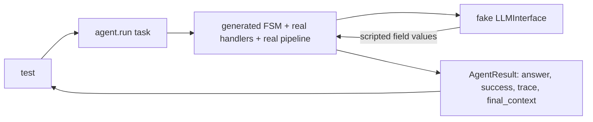

# test_fsm_llm_agents

The pytest suite for the agents package of FSM-LLM (`src/fsm_llm/agents`, imported as `fsm_llm.agents`). It lives at `tests/test_fsm_llm_agents/` and checks every agent pattern, the tool registry, human approval (HITL), memory, MCP, remote serving and the meta CLI, without calling a real LLM.

## What it is for

FSM-LLM builds each agent pattern (ReAct, Reflexion, Plan-Execute, Debate, and others) as a generated finite state machine (FSM) that an LLM drives turn by turn. Small or weak models often return missing, wrong or forged values, and many past bugs were loops that never ended, runs that reported success with no real work, or gated tools that ran without a human saying yes. These tests pin the fixes for those bugs. Most of them replace the LLM with a scripted fake, so the real FSM, handlers and pipeline run and the result is deterministic. A few also cover core, workflows and monitor code that the agent features depend on.

## How it works

There are three kinds of test:

- Unit tests call one class or function directly: models in `fsm_llm.agents.definitions`, `ToolRegistry`, the `build_*_fsm` builders, handler methods such as `_track_revisions` or `_execute_all_plans`.
- Structure tests build an FSM dict and check its states, transitions and priorities, or evaluate a transition's JsonLogic condition with `fsm_llm.expressions.evaluate_logic`.
- Loop tests run `agent.run(...)` end to end with a fake LLM passed as `llm_interface=`. The fake subclasses `fsm_llm.llm.LLMInterface` and answers `extract_field`, `extract_bulk_data` and `generate_response` from a script.



To see what happened inside a run, several files wrap agent internals: `_on_loop_iteration` to record the state before each turn, or `_run_conversation_loop` to count loop turns.

## Files

- `__init__.py` - empty; makes the folder a package so `test_forced_stop_flag.py` can import from `test_maker_checker.py`.
- `conftest.py` - autouse fixture `_offline_network`, which calls `block_network` from `tests/conftest.py`: for every test it patches `socket.socket.connect` and `connect_ex` (loopback included, because the default model is a local Ollama) so any IPv4/IPv6 connection raises `ConnectionRefusedError` at once, naming the address. Unix sockets (MCP stdio, asyncio self-pipes) stay open, and tests marked `real_llm` or `integration` are exempt. The patch is undone at teardown.
- `fixtures/native_fc_golden_requests.json` - recorded requests that `test_native_fc_golden.py` compares against.
- `mcp_fixture_server.py` - a real stdio MCP server used by `test_mcp_stdio.py` (not a test). Tools `add`, `slow`, `fail`; flag `--hang`.
- `test_advance_driver.py` - agents run on core's bounded loops (`run_until_terminal`) with no synthetic turn: loop hook, core budgets, HITL approval through `before_step`, VerifiedReact reflection and AutoMemory on the loop.
- `test_adapt.py` - ADaPTAgent, its FSM, `DecompositionResult`, JSON-envelope leak fix, assess/decompose fallback edges.
- `test_agent_config_passthrough.py` - newer `AgentConfig` fields and what `_create_api` forwards to `API.from_definition`.
- `test_auto_memory.py` - `augment_task_with_memories`, `remember_interaction`, `AutoMemoryReactAgent` recall and remember.
- `test_auto_memory_coherence.py` - the `respond` action, recall score threshold, conclude prompt wording.
- `test_base_agent.py` - `BaseAgent` budgets, answer extraction, trace building, context filtering, `create_agent`.
- `test_bug_fixes.py` - three regressions: Reflexion `evaluation_fn`, ReasoningReact `reason` interception, ADaPT subtask timing.
- `test_cli_entrypoints.py` - `fsm-llm-meta` (`meta_cli.main_cli`) and `python -m fsm_llm.agents`.
- `test_completion_guard.py` - `BaseAgent._completion_is_real` and `_has_execution_evidence`.
- `test_composition.py` - `react_worker_factory`, `default_llm_judge`, `_default_complete` error wrapping.
- `test_constants.py` - constants classes are strings, unique and format correctly.
- `test_debate.py` - DebateAgent, its FSM, typed `consensus_reached`, limiter boundary.
- `test_definitions.py` - pydantic models, including the tool name rule (ASCII, 1 to 64 chars).
- `test_evaluator_optimizer.py` - EvaluatorOptimizerAgent, its FSM, refine re-extraction, forced stop.
- `test_exceptions.py` - agent exception hierarchy.
- `test_forced_stop_flag.py` - a model cannot forge `max_iterations_reached`.
- `test_grounded_patterns.py` - each pattern run through the real `API` with `PromptGroundedLLM`, a fake that only answers when the prompt contains the evidence.
- `test_fsm_definitions.py` - ReAct FSM shape, required keys on planner states, typed `tool_name`/`tool_input`.
- `test_handlers.py` - `AgentHandlers.execute_tool`, `make_iteration_limiter`, empty-input recovery.
- `test_hitl.py` - `HumanInTheLoop` policy, callback, timeout and escalation.
- `test_hitl_security.py` - a gated tool runs only on a driver grant bound to that exact call.
- `test_integration_methods.py` - `to_classification_schema`, ReAct FSM used as a workflow step, reasoning key uniqueness.
- `test_maker_checker.py` - MakerCheckerAgent, its FSM, re-judging each round, forced pass only on a check turn.
- `test_mcp_stdio.py` - `MCPToolProvider` against the real fixture server (skipped without `mcp`).
- `test_memory_persistence.py` - `save_working_memory`/`load_working_memory`, `MemorySessionStore`, atomic saves.
- `test_memory_tools.py` - `create_memory_tools` over `WorkingMemory`.
- `test_native_fc.py` - `NativeFunctionCallingReactAgent` (an FSM run by core): loop, success signal, repair turn, forced final tool, Ollama gating, through a scripted `llm_interface=`.
- `test_native_fc_golden.py` - the exact requests native_fc sends, compared with a recorded fixture (`fixtures/native_fc_golden_requests.json`).
- `test_native_fc_fsm.py` - the native_fc FSM definition and its handlers.
- `test_one_engine.py` - every pattern sends all its model calls to an injected `LLMInterface`; nothing reaches litellm directly.
- `test_toolspec.py` - tool annotations, exact schemas, enforced tool timeouts, the `gated` keyword and retry rules.
- `test_review_fixes_tools_native.py`, `test_review_round2_callers.py`, `test_review_fixes_round2_agents.py` - regression tests from the reviews of that work.
- `test_orchestrator.py` - OrchestratorAgent, its FSM, delegation, typed `all_collected`.
- `test_parallel_react.py` - ParallelReactAgent dispatch, concurrency, conclude needs evidence.
- `test_plan_execute.py` - PlanExecuteAgent, its FSM, `PlanStep`, plan extraction, unplannable task.
- `test_plan_execute_evidence.py` - step results only count as success when a tool really ran.
- `test_premature_terminate_guard.py` - ReAct cannot conclude on turn 1 with no tool.
- `test_prompt_chain.py` - PromptChainAgent, `ChainStep`, its FSM, gate checker.
- `test_prompts.py` - prompt builder functions.
- `test_public_api.py` - `create_agent` (pattern first, `system_prompt=` keyword fills `instructions`), `AgentConfig` strict fields, `LLM_MODEL`, static `__all__`, core owning typed fields and key clearing, and `TestConfiguredAgentBuilder` (`ConfiguredAgentBuilder`: mutators return the same builder, a default build equals `create_agent`, config isolation and independent builds, shared callables, named-option refusal, tool registration).
- `test_removed_legacy.py` - absence pins for removed agents names: a positional system prompt now raises listing the patterns, shim helpers and unraised exceptions are gone, native_fc has no private loop, terminal agent states extract nothing, the meta builders are artifact builders.
- `test_review_round1_agents.py`, `test_review_round2_agents.py` - fixes from two review rounds of the step-driver plan: truthful `refused_actions` records in every order, run outputs that cannot be planted, a run ended from outside, budget errors of the run loops.
- `test_security_review_fixes.py` - security review findings: run outputs cannot be forged through `initial_context`, `AgentServer`, graph edges or swarm hand-offs; unapprovable `requires_approval` tools fail closed; `HumanInTheLoop` kwargs are checked; fallback logs are redacted.
- `test_react.py` - ReactAgent creation, HITL gating, concurrent runs, single-use approval.
- `test_reasoning_react.py` - ReasoningReactAgent export, `reason` tool, per-run handlers.
- `test_reflexion.py` - ReflexionAgent, its FSM, models, conclude needs evidence, every budget ends.
- `test_remote.py` - `AgentServer` API key and input size limit, `RemoteAgentTool` auth header.
- `test_review_fixes.py` - mixed review fixes: MCP results, stream auto-save, OTEL, swarm, SOP, remote timeout, session paths, agent graph.
- `test_rewoo.py` - REWOOAgent, its FSM, `#E1` evidence substitution, plan execution.
- `test_run_stream.py` - `run_stream` through the real `API`: model text only, no state markers, verified and memory streams.
- `test_self_consistency.py` - SelfConsistencyAgent, its FSM, `_majority_vote`.
- `test_secret_hygiene.py` - secret-looking tool arguments and memory values stay out of observations, traces, logs and listings.
- `test_self_consistency_parallel.py` - parallel sampling matches serial.
- `test_semantic_memory.py` - `SemanticMemoryStore` and its `remember`/`recall` tools.
- `test_semantic_memory_robustness.py` - thread safety, embedding model mismatch warning, `max_entries`, atomic save.
- `test_skills.py` - `SkillLoader.from_directory` dedupe.
- `test_strands_phase2.py` - MCP provider and timeouts, swarm, agent graph, OTEL, `DependencyResolver`, SOPs, semantic tools, A2A, exports.
- `test_structured_output.py` - `output_schema` parsing into `structured_output`.
- `test_summarization.py` - `make_observation_summarizer` and its handler wiring.
- `test_think_fallback.py` - `think` never BLOCKs; unknown tool names are not evidence.
- `test_tool_registries.py` - `get_json_schemas`, `CachingToolRegistry`, `RetryingToolRegistry`.
- `test_trust_boundary.py` - caller context cannot forge approval or a finished run (also through `AgentServer`), constructor kwargs checks, gated tools refused where there is no approval step.
- `test_tools.py` - `ToolRegistry`, `@tool`, thread safety, `normalize_tool_input`, list and dict parameters.
- `test_truncation.py` - `smart_truncate`.
- `test_verified_react.py` - VerifiedReactAgent retries and periodic reflection.

## How to use it

From the repo root, with the project virtualenv:

```bash
.venv/bin/python -m pytest tests/test_fsm_llm_agents/
.venv/bin/python -m pytest tests/test_fsm_llm_agents/test_hitl_security.py -v
.venv/bin/python -m pytest tests/test_fsm_llm_agents/ -k "think_fallback or premature"
.venv/bin/python -m pytest tests/test_fsm_llm_agents/ --collect-only -q | tail -1
```

The whole suite needs no network or API key; the `conftest.py` network block makes sure of it. A default run (about 20 seconds) collects 2,360 tests. If a new test must open a real connection, mark it `real_llm` or `integration`; otherwise it fails with `ConnectionRefusedError`.

## Things to know

- Some tests skip when an optional package is missing: `mcp` (all of `test_mcp_stdio.py`, which is a module-level skip), `fastapi` and `httpx` (`test_remote.py` and the `AgentServer` tests in other files), the opentelemetry SDK (OTEL tests), `fsm_llm.reasoning` and `fsm_llm.workflows` (a few tests that use them). In a venv without `mcp` a default run shows 1 skipped.
- The async tests in `test_strands_phase2.py` need `asyncio_mode = "auto"`, which `pyproject.toml` sets.
- Library logging is off by default. Tests that check a warning call `logger.enable("fsm_llm")`, add a sink, and disable logging again afterwards.
- Many docstrings cite `DECISION plan-.../D-NNN` ids. They record why a behaviour exists; do not weaken those assertions.
