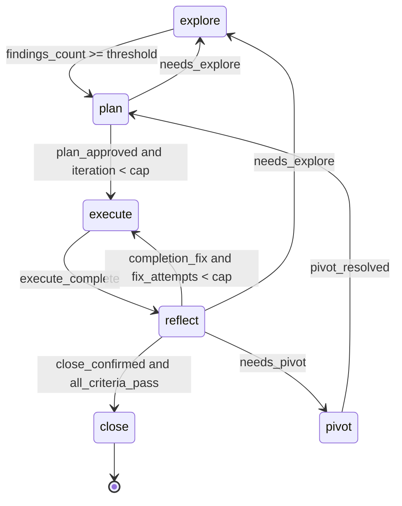
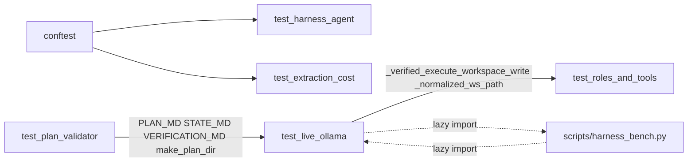

# test_fsm_llm_harness

Path: `tests/test_fsm_llm_harness`
Purpose: Falsifying pytest suite for `fsm_llm.harness` (`src/fsm_llm/harness/`): the iterative-planner protocol run as a 6-state FSM whose gates are derived from files on disk.

## Scope

- In: tests for `artifacts`, `hardening`, `fsm_definition`/`rules`, `harness` (the `HarnessAgent` driver), `plan_validator`, `roles`, `tools`, `storage`, `__main__` (CLI), plus the opt-in live suite and its offline guards.
- Out: the package source itself; the bench runner `scripts/harness_bench.py` (tested by `tests/test_harness_bench.py`); committed bench rows under `scripts/bench_data/`.
- Collection today: 2,021 tests; default run is 2,004 passed, 17 skipped (the 17 are the live-gated tests).

## Architecture

Offline tests drive the real driver with three substitutes: `MockLLM2Interface` (from `tests/conftest.py`) for the FSM's own Pass-1/Pass-2 calls, `RecordingWorker` for role dispatches, `ApprovalRecorder` for the human gates. Filesystem work happens under `tmp_path`.

FSM under test (edge set pinned as a literal `EXPECTED_EDGES` in `test_fsm_definition.py`, D-013):

Import graph between test modules (keep it acyclic):

## Key files

| File | Role | Notes |
| --- | --- | --- |
| `conftest.py` | Shared fixtures and recorders | D-056, D-057 anchors |
| `test_artifacts.py` | Artifact models: round-trip, grammar, fail-closed parse | 271 tests; fixtures copied from real `plans/` files |
| `test_cli.py` | `fsm_llm.harness.__main__` subcommands and exit codes | 108 tests; monkeypatches `harness_module.HarnessAgent` with `_RecordingAgent` |
| `test_extraction_cost.py` | Zero core Pass-1 LLM calls per turn (D-041) | 24 tests; `CountingLLM` owns `_make_llm_call` |
| `test_fsm_definition.py` | Graph shape, gates via real `TransitionEvaluator`, priority spacing, ownership | 87 tests |
| `test_hardening.py` | `strip_model_noise`, `parse_json_payload`, `parse_role_output`, coercers, `retry` | 258 tests; drives the real `_WORKER_WRITABLE` table |
| `test_harness_agent.py` | `HarnessAgent` behaviour end to end | 354 tests; class-to-decision map in module docstring |
| `test_live_ollama.py` | L1-L8 live criteria and their offline guards | 94 tests; 17 gated |
| `test_plan_validator.py` | `pre_step_gate`, `audit`, anchor scan | 191 tests; base fixture is audit-clean |
| `test_removed_legacy.py` | Removed harness names stay gone (`storage.PLAN_ID_RE`, unread `Defaults`, the legacy plan-id read path) | 11 tests |
| `test_roles_and_tools.py` | Role specs, prompts, tool scope, `PlanMemory`, `Workspace`, write evidence | 484 tests; D-057 says keep separate from agent tests |
| `test_storage.py` | `mint_plan_id`, `atomic_write_text` (imported from `fsm_llm.harness._atomic`), `evict_lessons`, `apply_sliding_window`, `PlanDirectory`, `RunState` | 115 tests |

## Public interface (fixtures and helpers)

From `conftest.py`:

- `make_harness(script=None, *, worker=_UNSET, approvals=None, extraction_data=None, roots=None, **agent_kwargs) -> HarnessUnderTest`. `worker=None` exercises the no-worker degrade path. Extra kwargs go to `HarnessAgent.__init__` (e.g. `max_fix_attempts`, `max_leash_grants`, `max_explore_redispatches`, `max_plan_redispatches`, `max_reflect_redispatches`, `max_close_denials`, `iteration_hard_cap`, `revert_callback`).
- `HarnessUnderTest(agent, worker, approvals, llm, default_context)`; `.run(goal="test goal", **kwargs)` merges `roots` under any explicit `initial_context`.
- `RecordingWorker(script)`: script maps state id to a reply spec (`success`, `ctx`, `answer`, `raises`) or a callable taking `RoleRequest`. Missing state -> successful empty reply (gate stays BLOCKED). Properties `requests`, `calls` (`(state, iteration, step_number, fix_attempts)`), `states`, `roles`; methods `calls_for(state)`, `count_for(state)`.
- `ApprovalRecorder(verdicts=None, *, default=True, raises=None)`: verdict per gate `tool_name` is a bool or `callable(index_for_that_gate) -> bool`. `raises` makes the callback fail (driver must treat as denied). `requests`, `names`, `count(gate)`.
- Constants: `APPROVAL_PLAN`, `APPROVAL_CLOSE`, `APPROVAL_LEASH`, `APPROVAL_REVERT`, `APPROVAL_GATES`, `FABRICATED_DRIVER_OWNED`, `ScriptEntry`.
- Fixtures: `harness_fsm_dict`, `harness_fsm`, `evaluator`, `plan_dir` (has `findings/` and `checkpoints/`), `workspace`, `roots`, `captured_logs` (loguru sink, enables `fsm_llm` logging for the test), autouse `_clear_dispatch_guard`.

Reusable helpers in test modules:

- `test_harness_agent.py`: `_traverse_script(total_steps=1, findings=3)`, `_failing_execute_script`, `_all_failing_script`, `_explore_script(counts)`, `_failing_plan_script`, `_stuck_reflect_script`, `_denied_close_script`, `_seed_plan_directory`, `_seed_findings(plan_dir, *names)`, `_state_md(...)`, `_gate_context(**overrides)`, `_PLAN_MD`, `_hollow_plan_doc()`, `_is_exactly`.
- `test_plan_validator.py`: `make_plan_dir(tmp_path, **overrides)` (slug -> content, `None` deletes), `BASE_FILES`, `state_with(state=, iteration=, attempts=)`, `tags`, `only`, `anchor(...)`, `ANCHOR_WORD`.
- `test_roles_and_tools.py`: `_role_request(state, *, plan_dir, ...)`, `_ScriptedAgent` (runs scripted tool calls through the REAL registry), `_PolicyAgent`, `_dispatch(...)` (real `build_default_worker_factory`), `_plan_registry`, `_call`.
- `test_live_ollama.py`: `ScriptedRoles`, `Approvals`, `DiskEvidenceApprovals`, `_PassThroughRecorder`, `content_matched_ast`, `classify_failed_dispatch`, `_one_e2e_run`, `_one_explore_dispatch`, `_one_explore_loop`.

## Data shapes

- Approval gate names: `harness.approve_plan`, `harness.confirm_close`, `harness.continue_after_leash`, `harness.revert_uncommitted` (revert only when `revert_callback` is supplied).
- Pre-step gate slugs, in `GateSlug.ORDER`: `no-plan`, `wrong-state`, `leash-cap`, `iteration-cap`. Driver halt slugs outside `ORDER`: `explore-cap`, `plan-cap`, `reflect-cap`, `close-cap`.
- CLI exit codes: `EXIT_PASS` (0), `EXIT_ERROR` (1), `EXIT_GATE` (2, only for a hard gate slug; argparse usage errors are remapped away from 2).
- Defaults pinned by tests: `MAX_FIX_ATTEMPTS == 2`, `FINDINGS_THRESHOLD == 3`, iteration cap fires at 6, `LESSONS_LINE_CAP == 200`, `SYSTEM_LINE_CAP == 300`, `SLIDING_WINDOW_PLANS == 4`, `LEASH_AUDIT_WARN_ATTEMPTS == 3`, `LEASH_AUDIT_ERROR_ATTEMPTS == 4`, `Defaults.MODEL == "ollama_chat/qwen3.5:4b"`, `Defaults.ENV_LIVE_TESTS == "FSM_LLM_HARNESS_LIVE"`.
- Context caps (`TestContextCaps`): dispatch ledger 64 entries, `role_results` 20 entries, each answer 400 chars.
- Ledger keys look like `dispatch:<state>:<iteration>:<step>` and `entry:<state>:...`.
- Observer records (live and `test_roles_and_tools.py`) carry `write_evidence`, `write_evidence_workspace`, `write_evidence_plan`, `write_evidence_paths` (labels `workspace:<rel>` / `plan:<rel>`), `failure_reason`, `elapsed_s`, and more; success and failure records have the same keys.

## Invariants and constraints

- Offline tests make no network call, no real sleep, no Ollama call. Retry tests inject `sleep`.
- Never assert logs with `caplog`; use `captured_logs` (D-057). loguru does not propagate to stdlib logging.
- `FABRICATED_DRIVER_OWNED` is derived from `DRIVER_OWNED_SEEDS` and `DRIVER_OWNED_UNSET`; do not replace with a literal dict, and do not make it `make_harness`'s default `extraction_data` (D-056). The default mock stays silent; the hostile axis is opt-in.
- Keep anti-vacuity controls (tests named or documented as "control", "ANTI-VACUITY", "red half"). Example: `test_seeding_is_what_holds_the_gate` patches `DRIVER_OWNED_SEEDS` to `{}` and expects the gate to OPEN; do not delete it or retarget it to the CONTEXT_UPDATE guard.
- `TestGateTypeGuardBoundary` expects `"3"`, `3.0`, `True` to OPEN the findings gate (soft JsonLogic comparison). Do not "fix" to BLOCKED (D-025); type enforcement lives in `_WORKER_WRITABLE`.
- Keep roles/tools tests in `test_roles_and_tools.py`, parametrised over all states/roles (D-057).
- `test_plan_validator.py`'s base fixture must stay audit-clean (`test_a_healthy_plan_directory_reports_nothing`); each audit test mutates exactly one thing. `test_live_ollama.py` imports this corpus.
- `ANCHOR_WORD` in `test_plan_validator.py` spells the anchor marker indirectly on purpose; never inline a literal anchor comment there.
- `_normalized_ws_path` and `_verified_execute_workspace_write` in `test_live_ollama.py` are frozen floor objects; `test_roles_and_tools.py` imports them. Do not re-implement or loosen (D-008, D-010, D-002).
- Write-nothing checks spy on `storage.atomic_write_text` rather than comparing bytes (`test_status_writes_nothing`, `test_dry_run_writes_nothing`).
- Driver-owned counters (`_explore_redispatches`, `_plan_redispatches`, `_reflect_redispatches`, `_close_denials`, `_assigned_topics`) must never become context keys; tests assert their spellings are absent from `ContextKeys` and `final_context`.
- Live gate order: env var checked first, Ollama probe second, joined with `or` so a default run never opens a socket.

## Dependencies

- Internal: `fsm_llm.harness.*`; core `fsm_llm.definitions`, `fsm_llm.transition_evaluator`, `fsm_llm.pipeline`, `fsm_llm.prompts`, `fsm_llm.handlers`, `fsm_llm.validator`, `fsm_llm.llm`, `fsm_llm.logging`, `fsm_llm.constants`; `fsm_llm.agents` (`AgentResult`, `ApprovalRequest`, `ToolCall`, `AgentTrace`, `ReactAgent`, `NativeFunctionCallingReactAgent`, `ToolRegistry`).
- `tests/conftest.py`: `MockLLM2Interface`, `ollama_available`.
- Files outside the folder: `pyproject.toml` (`test_cli.py`), `scripts/harness_bench.py` (`_bench_module()` in live file), `scripts/bench_data/l6-e2e/B5/artifacts/run-1/plan.md` (`TestProseExecuteTargetFallback`).
- External: pytest, pydantic, loguru. `test_roles_and_tools.py` runs `cat` in a subprocess; `test_cli.py` spawns `python -m fsm_llm.harness`.

## Failure modes

- Import errors if run from outside the repo root (`tests.` package imports).
- `-m "not slow"` drops all of `test_live_ollama.py`, including its ungated offline guards (module-level `pytestmark`).
- Armed live L6/L7/L8 blocks call `pytest.fail` when their rows file already exists (one run per pre-registered block). `l6-e2e/B8`, `l7-explore-coldstart/B0`, `l8-explore-loop/B1` already have rows. A new block needs new `L6_BLOCK`/`L7_BLOCK`/`L8_BLOCK` values and a decision entry.
- Live L6/L7/L8 write manifests and rows into `scripts/bench_data/` (tracked), and L6 also copies per-run artifacts there; running them changes the repo.
- A leaked `_DISPATCH_LOCAL.role` breaks later tests under random order; the autouse fixture clears it.

## Working here

- Run: `.venv/bin/python -m pytest tests/test_fsm_llm_harness -q` (about 50 s). Live: `FSM_LLM_HARNESS_LIVE=1 .venv/bin/python -m pytest tests/test_fsm_llm_harness/test_live_ollama.py -s` with Ollama and `qwen3.5:4b`.
- New driver behaviour: add a class to `test_harness_agent.py`, build the harness with `make_harness`, script workers per state, and pair every "stays shut" test with a control that opens.
- New artifact kind: add a realistic fixture to `ARTIFACT_CASES` in `test_artifacts.py` so round-trip and fail-closed tests pick it up.
- New gate key or driver-owned key: parametrised tests over `_WORKER_WRITABLE`, `DRIVER_OWNED_SEEDS`, `DRIVER_OWNED_UNSET` pick it up automatically; do not hand-list keys.
- New cap or budget: mirror the existing redispatch classes (exact bound incl. cap 0, per-run reset, worker cannot reach counter, counter not a context key, slug outside `GateSlug.ORDER`), and add the slug to `HONEST_HALT_SLUGS` in the same change if it is an honest halt.
- Read the `# DECISION` anchors before editing: `conftest.py` (D-056, D-057), `test_fsm_definition.py` (D-025), `test_cli.py` (D-007), `test_roles_and_tools.py` (D-057, D-058, D-002), `test_harness_agent.py` (D-056), `test_live_ollama.py` (D-006, D-048, D-013, D-001, D-008, D-010, D-003).
- After adding or removing tests, re-measure with `.venv/bin/python -m pytest --collect-only -q | tail -1`. `tests/test_packaging.py` (slow class) re-measures and checks count literals in the root docs and in `src/fsm_llm/harness/CLAUDE.md` (every "N tests" and "N test files" token); update them together.
- Lint: `make lint` (ruff over `src/` and `tests/`).
