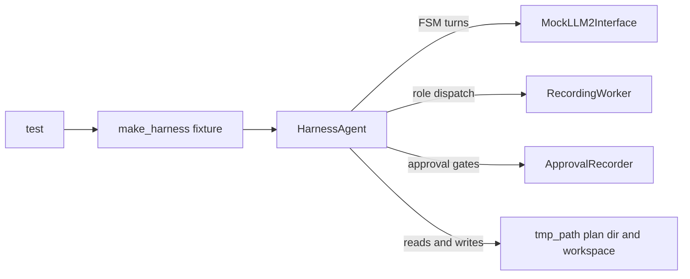

# test_fsm_llm_harness

The pytest suite for `fsm_llm.harness` (source in `src/fsm_llm/harness/`), the package that runs the "iterative planner" protocol as a 6-state finite state machine driven by an LLM. It lives at `tests/test_fsm_llm_harness/` in the FSM-LLM repository.

## What it is for

The harness moves a coding task through six states: explore, plan, execute, reflect, pivot and close. A driver class, `HarnessAgent`, hands each state to a "role worker" (an LLM agent with tools) and only lets the FSM advance when a gate opens. Gates are computed from files on disk, such as the number of non-empty `findings/*.md` files, not from what a model claims it did.

This suite checks that those gates cannot be opened by a lying or confused model, that every retry budget is bounded, that the plan-directory files ("artifacts") parse and round-trip, that writes stay inside their allowed folders, and that the command line tool returns the right exit codes. Almost all tests are offline and deterministic. One file holds optional live tests against a real local model.

## How it works

- The FSM's own LLM calls go to `MockLLM2Interface`, a 2-pass mock from `tests/conftest.py`. By default it extracts nothing.
- Role workers are replaced by recording stand-ins (`RecordingWorker` in `conftest.py`) that return scripted replies per state.
- Human approvals are replaced by `ApprovalRecorder`, which records each gate it was asked about and answers from a table.
- Files are written under pytest's `tmp_path` only.
- Many tests come in pairs: one proves a gate stays shut, and a "control" or "anti-vacuity" test proves the same setup does open when the evidence is real. The control stops a test from passing for the wrong reason.



## Files

- `__init__.py` - marks the folder as a package so tests can import each other.
- `conftest.py` - shared fixtures: the recording worker, the approval recorder, the `make_harness` factory, temp plan and workspace folders, a loguru log capture.
- `test_artifacts.py` - parsing, validation and round-trip of every protocol markdown file (`state.md`, `plan.md`, `decisions.md`, `changelog.md` and others).
- `test_cli.py` - the `fsm-llm-harness` command: subcommands, exit codes, `--model` precedence, dry-run `close`, the public `__all__`.
- `test_extraction_cost.py` - proves the harness FSM makes zero core data-extraction LLM calls per turn.
- `test_fsm_definition.py` - the FSM graph (6 states, 9 edges) and every JsonLogic gate, run through the real core transition evaluator.
- `test_hardening.py` - small-model helpers: stripping `<think>` blocks and code fences, JSON recovery, strict type coercion, retry with backoff.
- `test_harness_agent.py` - the driver: dispatch ledger, the 2-attempt fix leash, approvals, redispatch caps, disk-derived counts, `state.md` sync and resume.
- `test_live_ollama.py` - live tests against `ollama_chat/qwen3.5:4b` (skipped by default), plus offline checks of the bench helpers they use.
- `test_plan_validator.py` - `pre_step_gate` (four hard-stop slugs) and `audit` (advisory issues) over a realistic plan folder.
- `test_roles_and_tools.py` - role prompts, tool scopes, file ownership, path confinement, the shell allowlist, write-evidence checks.
- `test_storage.py` - plan id minting, atomic writes, `LESSONS.md` eviction, the 4-plan sliding window, `PlanDirectory`.

## How to use it

Run from the repository root with the project virtualenv:

```bash
.venv/bin/python -m pytest tests/test_fsm_llm_harness -q
.venv/bin/python -m pytest tests/test_fsm_llm_harness/test_storage.py -q
```

The full folder currently collects 1,987 tests: 1,970 pass and 17 are skipped because the live gate is closed.

To arm the live tests, set the switch and have Ollama running with the model pulled:

```bash
FSM_LLM_HARNESS_LIVE=1 .venv/bin/python -m pytest tests/test_fsm_llm_harness/test_live_ollama.py -s
```

## Things to know

- Run from the repo root: tests import `tests.conftest` and each other as packages.
- The live file is marked `slow`, `integration` and `real_llm` as a whole, so `-m "not slow"` also drops its offline checks.
- The live L6, L7 and L8 blocks append rows under `scripts/bench_data/` and refuse to run if that block's rows file already exists. The current blocks (`l6-e2e/B8`, `l7-explore-coldstart/B0`, `l8-explore-loop/B1`) already have rows, so those three fail on purpose if armed.
- `test_harness_agent.py` reads a real file, `scripts/bench_data/l6-e2e/B5/artifacts/run-1/plan.md`, and `test_cli.py` reads `pyproject.toml`.
- Assert on log messages with the `captured_logs` fixture, never with pytest's `caplog`: the package logs through loguru, which `caplog` cannot see.
