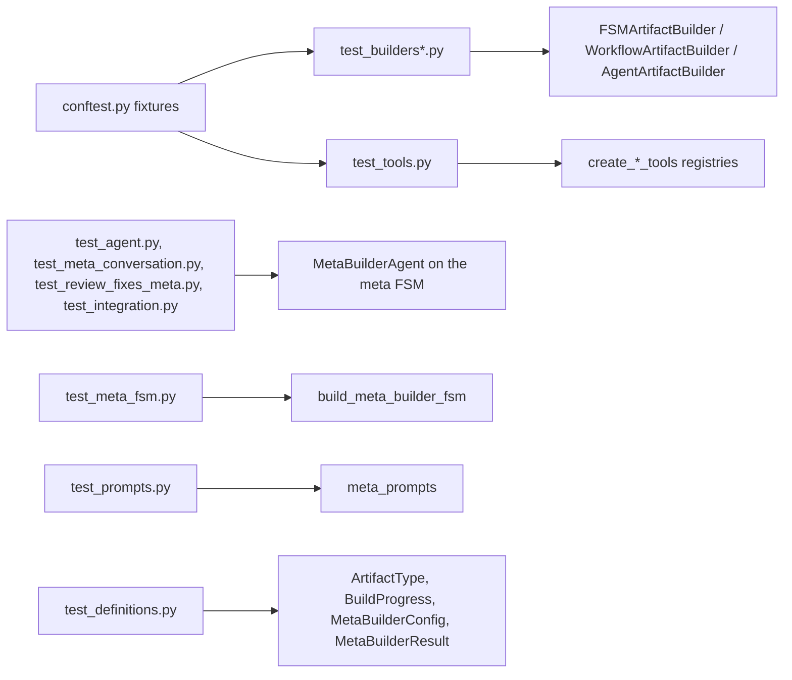

# test_fsm_llm_meta

Pytest suite for the meta-builder in the `fsm-llm` repository: the part of `fsm_llm.agents` that turns a conversation or a text spec into an FSM, workflow, or agent definition. It lives at `tests/test_fsm_llm_meta/` and holds 434 tests in 12 files.

## What it is for

The meta-builder (`MetaBuilderAgent`, CLI `fsm-llm-meta`) helps a user build one of three artifact types: an FSM (finite state machine, a JSON conversation definition), a workflow, or an agent. It collects requirements, fills a builder object, validates it, and emits JSON. This suite checks that each piece behaves as expected: the builder classes, the tools an LLM uses to edit a builder, the prompt text, the config and result models, the output helpers, and the agent's turn-by-turn lifecycle. It also pins several past bug fixes so they do not come back.

## How it works

Most tests work on plain builder objects with no LLM at all. The meta-builder itself is an FSM run by the core engine (classify the artifact type, collect requirements, build), so tests that touch the LLM give the agent a scripted LLM interface (`ScriptedMetaLLM` in `conftest.py`, passed as `llm_interface=`) that answers the classifier, the build call and the replies from prepared lists, or make core's one LLM call (`fsm_llm.llm.completion`) fail and check the agent's keyword and canned-text fallback.



## Files

- `conftest.py` - fixtures: empty `FSMArtifactBuilder`, `WorkflowArtifactBuilder`, `AgentArtifactBuilder`, a 3-state `populated_fsm_builder` ("GreetingBot"), a `meta_config`, and `offline_llm`, which makes every LLM call fail at once; the scripted interface `ScriptedMetaLLM`; and an autouse `_offline_network` fixture that calls `block_network` from `tests/conftest.py`, so any IPv4/IPv6 connect (loopback too) raises `ConnectionRefusedError` (`TestOfflineNetworkGuard` in `test_agent.py` pins this).
- `test_meta_fsm.py` - the meta FSM: structure, gates, the build request and its schemas, a run through the core engine (52 tests).
- `test_meta_conversation.py` - whole conversations by behaviour: each artifact kind, a type switch, a failed then fixed build, outages, `max_turns`, what the monitor reads (41 tests).
- `test_review_fixes_meta.py` - review fixes: malformed build replies, keyword hints and negation, the build prompt sentence (90 tests).
- `test_agent.py` - `MetaBuilderAgent`: config, start/send lifecycle, type detection, build triggers, result building, output helpers, schema-echo rejection, provider-failure handling, workflow `step_type` enum, runs through core (47 tests).
- `test_builders.py` - core behavior of the three builders: add, remove, update, transitions, `to_dict`, validation, summaries at three detail levels (89 tests).
- `test_builders_elaborate.py` - builder edge cases, config type checks, `VALID_STEP_TYPES`, exception attributes and hierarchy, `MetaBuilderConfig` range checks, summary content (44 tests).
- `test_tools.py` - tool registries from `create_fsm_tools`, `create_workflow_tools`, `create_agent_tools`, `create_builder_tools`, plus two newer classes (34 tests): `TestToolReplyText` pins the exact reply text of every meta tool as a golden script run on a fresh builder (so later replies depend on earlier calls), and `TestToolWarningIsolation` runs 8 threads against one registry and checks each call's reply carries only its own warnings, and that warnings left by direct builder mutators do not leak into a later reply.
- `test_integration.py` - reachability errors, workflow transitions, tool registries mutating a builder, `final_context` on the result, type alias ordering (11 tests).
- `test_definitions.py` - `ArtifactType`, `BuildProgress`, `MetaBuilderConfig`, `MetaBuilderResult` (16 tests).
- `test_prompts.py` - welcome, follow-up, review, and output messages from `fsm_llm.agents.meta_prompts` (8 tests).
- `test_handlers.py`, `test_handlers_elaborate.py` - one import check each: `MetaBuilderAgent` imports from `fsm_llm.agents.meta_builder`. The old handlers module no longer exists.
- `__init__.py` - empty package marker.

## How to use it

```bash
.venv/bin/python -m pytest tests/test_fsm_llm_meta/ -q
.venv/bin/python -m pytest tests/test_fsm_llm_meta/test_builders.py -q
```

## Things to know

- Run from the repo root with the project virtualenv.
- No test needs a live model or API key, and the autouse network guard enforces it. `TestStartSendFlow` and one test of `TestLlmCallProviderFailure` in `test_agent.py` use the `offline_llm` fixture: every LLM call raises at once, so the agent uses its keyword or canned-text fallback, which is what the assertions expect. The other agent tests use `ScriptedMetaLLM`.
- `test_enum_reaches_response_format_and_ollama_format` (`test_agent.py`) and `test_enums_reach_ollama_format` (`test_meta_fsm.py`) import `OllamaChatConfig` from `litellm.llms.ollama.chat.transformation`, so they depend on that litellm internal path.
- `test_save_artifact*` write only under pytest's `tmp_path`.
