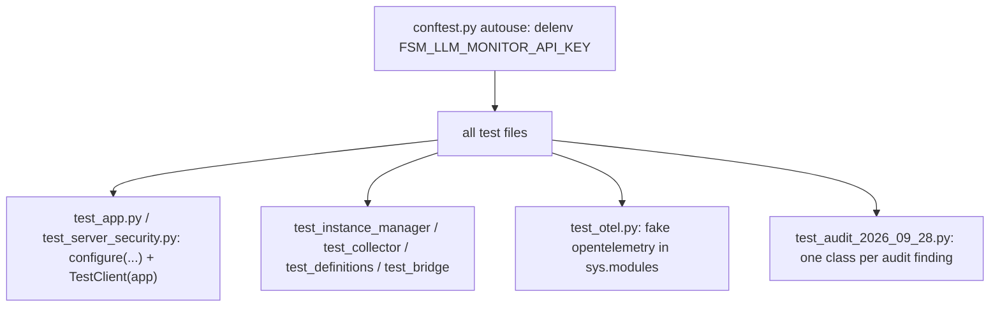

# test_fsm_llm_monitor

Path: `tests/test_fsm_llm_monitor`
Purpose: pytest suite (387 collected tests) for `fsm_llm.monitor`, the FastAPI dashboard package in `src/fsm_llm/monitor/`.

## Scope

- Unit and HTTP-level tests for `server.py`, `instance_manager.py`, `collector.py`, `definitions.py`, `bridge.py`, `otel.py`, `__main__.py` (`_browser_url` only) and the package `__init__.py` exports.
- No real LLM calls, no network, no browser. The FSM `API` is a `MagicMock` or a small fake; HTTP goes through `fastapi.testclient.TestClient`.
- Not here: the monitor source itself (`src/fsm_llm/monitor/`) and the JS SPA logic (only static file presence, HTTP 200, and the HTML/CSS limits in `TestUiMatchesServerLimits` are checked).

## Architecture

Server test pattern: `configure(MonitorBridge())` or `configure(manager=InstanceManager(), api_key=...)` then `TestClient(app)`. `test_server_security.py` wraps this in `_client(api_key=None)` using `InstanceManager(config=MonitorConfig(refresh_interval=0.5))`.

Manager test pattern: `InstanceManager(config=MonitorConfig())`, then `mgr.global_collector.cleanup()` to drop its loguru sink, then inject instances directly into `mgr._instances` / `mgr._collectors` (under `mgr._lock` in most tests).

## Key files

| File | Role | Notes |
| --- | --- | --- |
| `conftest.py` | autouse `_clear_monitor_api_key_env` | `monkeypatch.delenv("FSM_LLM_MONITOR_API_KEY", raising=False)`; without it an exported key makes about 22 `test_app.py` tests 401 |
| `test_app.py` | routes, static assets, exports, version, API-key gate, WS redaction, UI limits vs server constants | 113 tests; asserts `"0.11.0"` for `/api/info` `monitor_version` and `fsm_llm.monitor.__version__` |
| `test_server_security.py` | Origin/Host, body limit, headers, gated reads, WebSocket auth, error mapping, bounds, dashboard config, builder busy guard, `validate_preset_id` | 36 tests; autouse `_reset_key` reconfigures with env key `""` after each test |
| `test_instance_manager.py` | `Managed*` classes, `InstanceManager`, handlers, snapshots, workflow presets, agent types, stub tools | 60 tests; contains unmarked `async def` tests |
| `test_collector.py` | `EventCollector` | 45 tests |
| `test_definitions.py` | models, `normalize_message_history`, `model_to_dict` | 50 tests |
| `test_bridge.py` | `MonitorBridge`, `_fsm_dict_to_snapshot` | 25 tests |
| `test_otel.py` | `OTELExporter` | 22 tests; autouse `_mock_otel` fixture |
| `test_audit_2026_09_28.py` | regression tests for the 2026-09-28 audit (non-HTTP) | 36 tests; module-level `pytest.importorskip("fsm_llm.workflows")` (line 436) skips all 36 when workflows is missing |

## Public interface

Suite entry points (what a new test uses):

- Fixtures: `_clear_monitor_api_key_env` (autouse, `conftest.py`), `_reset_key` (autouse, `test_server_security.py`), `_mock_otel` (autouse, `test_otel.py`).
- Helpers: `_client(api_key=None) -> TestClient` (`test_server_security.py`); `_minimal_fsm_dict()` (separate copies in `test_app.py` and `test_bridge.py`); `_manager() -> InstanceManager`, `_fsm(mgr, iid, api=None) -> ManagedFSM`, `_fire(api, timing, current, target)`, `_snapshot_api(collected, extraction=None) -> MagicMock`, fakes `_FakeAPI`, `_FakeHandlerSystem`, `_Secretive` (`test_audit_2026_09_28.py`); `_build_otel_mocks()`, `_import_otel()`, `_make_event(event_type="conversation_start", conv_id="conv-1", **kwargs)` (`test_otel.py`).
- Test classes per file:
  - `test_app.py`: `TestWebServer`, `TestMonitorImports`, `TestUiMatchesServerLimits`, `TestServerFSMEndpoints`, `TestServerInstanceEndpoints`, `TestServerConfigEndpoints`, `TestDashboardConfigEndpoints`, `TestServerPresetEndpoints`, `TestServerErrorHandling`, `TestActivityEndpoint`, `TestServerHygieneAndWorkflow`, `TestApiKeyGate`, `TestDashboardWebsocketRedaction`.
  - `test_server_security.py`: `TestOriginAndHost`, `TestApiKeyGating`, `TestWebSocket`, `TestErrorMapping`, `TestRequestBounds`, `TestDashboardConfig`, `TestBuilderGuards`, `TestPresetValidation`.
  - `test_instance_manager.py`: `TestManagedClasses`, `TestInstanceManager`, `TestRegisterMonitorHandlers`, `TestSnapshotInternalKeyHiding`, `TestConversationCaching`, `TestInstanceManagerListFilter`, `TestDestroyInstance`, `TestActivitySnapshots`, `TestFindExamplesDir`, `TestWorkflowPresets`, `TestDisabledAgentTypes`, `TestAgentConcurrencyHardening`, `TestStubToolExecution`.
  - `test_audit_2026_09_28.py`: `TestTransitionStates`, `TestRedaction`, `TestStreamCursors`, `TestConfig`, `TestCancelAgent`, `TestHandlerLifecycle`, `TestFSMLifecycle`, `TestDefaults`, `TestWorkflowTracking`, `TestCliHelpers`.

Monitor surface the tests pin:

HTTP routes and statuses (`test_app.py`, `test_server_security.py`):
- `GET /` 200 containing "FSM-LLM Monitor"; `/static/style.css`, `/static/app.js`, `/static/flows.json` and 15 JS modules under `services/`, `utils/`, `pages/` serve 200. Files must exist in `src/fsm_llm/monitor/static/` and `templates/index.html`.
- `GET /health` returns `{"status": "ok"}`.
- `POST /api/fsm/load` and `POST /api/fsm/visualize` with non-JSON body: 400. Unknown conversation, instance, agent, builder session: 404. `GET /api/workflow/{id}/status` without the `workflow_instance_id` query parameter: 400. `DELETE /api/builder/{id}` for an unknown id: 200 with `deleted: false`.
- Preset traversal (`/api/preset/fsm/../../etc/passwd`): 400 or 404. `validate_preset_id` raises `ValueError` for `../`, absolute and escaping ids, `FileNotFoundError` for a missing file.
- Unexpected internal error: 500 with detail exactly `"Internal server error"`.
- `POST /api/agent/launch` with `EvaluatorOptimizerAgent`: 400 "Unknown agent type".
- Error mapping: `ConversationBusyError` -> 409, `MonitorCapacityError` -> 429, `NotImplementedError` -> 501, unknown FSM preset on launch -> 404, `POST /api/fsm/launch` with `{}` -> 400.
- Request bounds (422): config `refresh_interval: 0`, `max_events: -1`, `log_level: "LOUD"`; agent launch `max_iterations` 0 or 10,000, `timeout_seconds: 0`, empty `task`; converse `message` over 10,000 chars.
- Cross-origin POST (Origin `http://evil.example`): 403. Foreign `Host`: 400. A body of about 1.1 MB (`b"{" + b" " * 1_100_000 + b"}"`): 413. Responses carry CSP with `frame-ancestors 'none'` and `x-content-type-options: nosniff`.
- `POST /api/dashboard/config` accepts builder output both wrapped in `{"config": {...}}` and unwrapped; panels/alerts given as dicts become lists; `{"panels": [...list...]}` -> 400.
- Builder session in `server_module._builder_busy`: result reports `busy: true`, delete returns 409.

API-key gate (`TestApiKeyGate`, `TestApiKeyGating`, `TestWebSocket`):
- `configure(api_key=...)` gates mutating routes and sensitive reads. Accepted headers: `Authorization: Bearer <key>` or `X-API-Key: <key>`. Missing or wrong key: 401.
- Gated mutating routes listed in `test_all_named_mutating_routes_gated` plus `/api/fsm/{id}/start|converse|end`, `/api/workflow/{id}/advance|cancel|event`, `/api/agent/{id}/cancel`. With no key configured these never return 401.
- Gated reads: `/api/conversations`, `/api/activity`, `/api/events`, `/api/logs`, `/api/agent/{id}/status|result`, `/api/builder/result/{id}`, `/api/fsm/{id}/conversations`. Always open: `/health`, `GET /api/config`, `GET /api/instances`. `GET /api/auth` returns `{"auth_required": bool}`.
- Key comparison uses `hmac.compare_digest` on encoded bytes; non-ASCII header values give 401, not 500 (tested by calling `server_module._require_api_key` with a raw starlette `Request`).
- Empty or whitespace `api_key` passed to `configure` raises `ValueError` and keeps the old key. Env `FSM_LLM_MONITOR_API_KEY=""` means unset. The env key applies at import without `configure` (checked in a subprocess).
- Re-calling `configure` without `api_key` after one was set logs a WARNING containing "previously configured API key is being cleared"; the first call does not.
- Key changes take effect after the first request (read at request time).
- Reconfiguring the same manager keeps `global_collector._log_sink_id`.
- WebSocket `/ws`: client sends `{"type": "auth", "api_key": ...}`; right or unneeded key gets a `metrics` message; wrong key closes with 4401; cross-origin closes with 4403.
- `server.py` source must contain `default=redacting_json_default` and no `default=str` call site.

Collector (`test_collector.py`, audit file):
- `get_events`/`get_logs` newest first; bounded deques (`max_events`, `max_log_lines`) while `total_events` keeps counting.
- Metrics: `total_errors`, `total_transitions`, `states_visited`, `active_conversations`, `total_agent_iterations`, `total_tool_calls`, `total_workflow_steps`; `clear()` resets all; timestamps are UTC.
- `get_logs(level=...)` is case-insensitive, `SUCCESS` ranks above INFO, unknown level returns all.
- `get_events_since(after_total, limit)`; `events_after(cursor, limit)` / `logs_after(cursor, limit)` return `(items, cursor)` oldest first, skip dropped items and restart after `clear()`.
- `create_handler_callbacks()` returns 8 callbacks, all returning `{}`; `POST_TRANSITION` records nothing. `handler_name == "fsm_llm.monitor"`, `handler_priority == 9999`.
- The loguru sink records `LogRecord`s only (no `"log"` events), with tz-aware timestamps. `cleanup()` is idempotent and sets `_log_sink_id` to `None`.
- `snapshot_context` and `redact_context(data, drop_internal=True)` drop secret-looking keys (including nested) and replace objects with `"<redacted:ClassName>"` without calling `__str__`.

Instance manager and bridge:
- `register_monitor_handlers(api, collector)` registers 7 handlers (no POST_TRANSITION), is idempotent; `unregister_monitor_handlers` returns 7. `_MonitorHandler.execute` returns `{}`.
- Transition events carry the core's `current`/`target` states; END event `data["state"]` is the final state.
- `snapshot_from_api(api, conv_id, show_internal_keys=...)`: internal prefixes `_`, `system_`, `internal_`, `__` (case-insensitive) hidden when False; secret-looking keys hidden either way; `last_extraction` is redacted.
- `MonitorBridge(api=...)` registers 7 handlers; `connect(None)` leaves `connected` False; API exceptions yield `[]` or `None`; `get_conversation_snapshot` honours `config.show_internal_keys`. `_fsm_dict_to_snapshot` defaults transition priority to 100.
- `destroy_instance`: agent -> `cancelled` with `cancel_event` set, bounded join (under 5 s) and one `logger.warning` naming the id if the thread is still alive; workflow -> `completed`; unknown id -> `KeyError`.
- `_get_fsm`/`_get_workflow`/`_get_agent`: `KeyError` if missing, `TypeError` on wrong type. `launch_fsm()` without data: `ValueError` "Must provide". `_HAS_AGENTS`/`_HAS_WORKFLOWS` False: `RuntimeError` "not installed".
- `get_agent_status`: dead thread in `cancelling` -> `cancelled`; dead `running` without result -> `failed`. `cancel_agent` returns False on finished agents and emits `agent_cancelled` once.
- `_AGENT_CLASSES` excludes `EvaluatorOptimizerAgent` and `MakerCheckerAgent`; includes `ReactAgent`, `DebateAgent`.
- Workflow presets include `demo_linear` (3 steps) and `demo_branching` (`amount: 5000` -> `tier == "high"`). Completed instances leave `active_instance_ids`; advancing them is `KeyError`. `definition_json` -> `ValueError` "not supported". Status context hides secret and internal keys. Event delivery is not a step.
- FSM lifecycle: terminal reply ends the conversation and marks `completed`; `start_conversation` reopens to `running`; unknown conversation end is `KeyError`. `_make_room()` evicts oldest finished instance or raises `MonitorCapacityError` when `max_instances` are all active.
- Setting `mgr.config` resizes global buffers. `dashboard_config` assignment increments `dashboard_config_version`.
- `_find_examples_dir()` must equal the repo `examples/` directory.
- Stub tools from `StubToolConfig` run with any parameters and return `stub_response`.

OTEL (`test_otel.py`): constructing `OTELExporter` must not call `set_tracer_provider`; `enable(collector)` wraps `record_event`, idempotent, switching collectors restores the first; `disable()` restores and ends open spans; `_export_event` swallows exceptions and does nothing when disabled; trace id 32 chars, span id 16.

CLI: `_browser_url("0.0.0.0" or "::", port)` -> `http://127.0.0.1:<port>`, `"::1"` -> `http://[::1]:<port>`.

## Data shapes

Models (`test_definitions.py`): defaults for `MonitorConfig` (`refresh_interval=1.0`, `max_events=1000`, `max_log_lines=5000`, `log_level="INFO"`, `show_internal_keys=False`, `auto_scroll_logs=True`), `LaunchFSMRequest` (temperature 0.5), `LaunchAgentRequest` (`ReactAgent`, 10 iterations), `DashboardConfig` (30 s refresh, 24 h retention), `StubToolConfig` stub response; `BuilderStartRequest` temperature within 0.0..2.0 and `max_tokens >= 1`; `ApplyDashboardRequest` must not exist. Invalid `MonitorConfig` values (0, negative, NaN, inf, unknown level) raise `ValueError`; `log_level` is upper-cased.

Other models constructed and dumped in `test_definitions.py`: `MonitorEvent`, `LogRecord`, `MetricSnapshot`, `ConversationSnapshot`, `StateInfo`, `TransitionInfo`, `FSMSnapshot`, `InstanceInfo` (UTC `created_at`), `ActivityItem`, plus helpers `normalize_message_history` and `model_to_dict`.

Payloads and records pinned elsewhere in the suite:

- `GET /health`: `{"status": "ok"}`. `GET /api/auth`: `{"auth_required": bool}`. `GET /api/info` carries `monitor_version`.
- WebSocket `/ws` client auth message: `{"type": "auth", "api_key": ...}`; server stream messages include type `metrics`.
- Dashboard config body for `POST /api/dashboard/config`: either `{"config": {...}}` or the bare config; `panels`/`alerts` as dicts are turned into lists.
- Collector metrics fields: `total_events`, `total_errors`, `total_transitions`, `states_visited`, `active_conversations`, `total_agent_iterations`, `total_tool_calls`, `total_workflow_steps`, UTC timestamp.
- Redacted object placeholder: `"<redacted:ClassName>"`.

## Invariants and constraints

- Tests must be independent of the ambient environment; keep `conftest.py`'s delenv and reset server globals after tests that set a key.
- `server.py` holds module-level state (`_api_key`, `_builder_sessions`, `_builder_busy`). Any test that sets it must restore it (`try/finally`, `teardown_method`, or autouse fixture).
- Library logging is disabled by default; tests that assert log output call `logger.enable("fsm_llm")` and `logger.disable("fsm_llm")` around a temporary sink.
- `test_otel.py` must restore `sys.modules` entries it replaces; the fixture already does.
- Threads started in tests are daemon threads and are released before the test ends.

## Dependencies

- `fsm_llm.monitor.*` (under test), `fsm_llm.handlers.HandlerTiming`, `fsm_llm.definitions.ConversationBusyError`, `fsm_llm.utilities.redacting_json_default`, `fsm_llm.logging.logger`.
- Optional: `fsm_llm.workflows` (without it all of `test_audit_2026_09_28.py` is skipped), `fsm_llm.agents` (`TestStubToolExecution`, `ToolCall`).
- External: `pytest`, `fastapi` (`TestClient`, `HTTPException`), `starlette` (`Request`, `WebSocketDisconnect`), `loguru`. `opentelemetry` is not needed.
- pytest config in `pyproject.toml`: `asyncio_mode = "auto"` (needed for the unmarked async tests).

## Failure modes

- 401s across `test_app.py`: an API key leaked in (env var or a test that did not reset `configure`).
- Version assertion failures in `test_app.py` after a release: update the two `"0.11.0"` literals.
- Static file tests fail if a JS module under `src/fsm_llm/monitor/static/` is renamed or removed.
- `test_examples_dir_resolves_to_repo_examples` fails if `instance_manager.py` moves to another depth.
- Preset tests only assert when `/api/presets` finds FSM presets; they pass vacuously if none exist.
- `test_bridge.py::test_connect` has a stale comment saying 8 handlers; the assertion (7) is correct.

## Working here

- Run: `.venv/bin/python -m pytest tests/test_fsm_llm_monitor/`.
- Put tests for a source module in the matching `test_<module>.py`; audit regressions go in a dated file, one class per finding.
- Use the local `_minimal_fsm_dict()` helpers (defined separately in `test_app.py` and `test_bridge.py`) for FSM payloads.
- After adding or removing tests, re-measure with `.venv/bin/python -m pytest tests/test_fsm_llm_monitor --collect-only -q | tail -1` and update the monitor per-suite count in the repo-root `CLAUDE.md` Testing block and the totals there and in `README.md`; `tests/test_packaging.py` checks them against `--collect-only`.
- Do not change files under `examples/`; preset tests read them.
