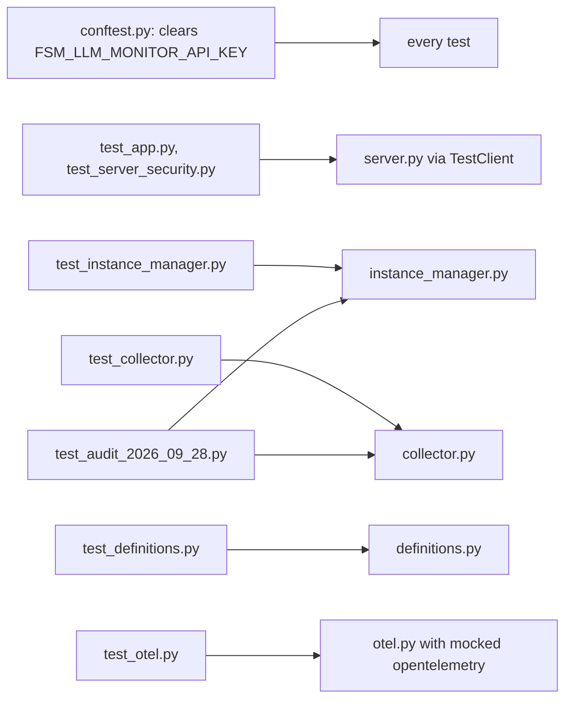

# test_fsm_llm_monitor

The pytest suite for `fsm_llm.monitor`, the web dashboard package of FSM-LLM (source in `src/fsm_llm/monitor/`). It lives at `tests/test_fsm_llm_monitor/` and collects 391 tests in 7 files.

## What it is for

The monitor is a FastAPI server (a Python web framework) with a browser dashboard. It watches FSM conversations, agents and workflows, lets you launch them, and streams metrics over a WebSocket. These tests check that the pieces behind it behave correctly: the event collector, the data models, the instance manager (including `attach_api` for an `API` you created) that launches and tracks FSMs, agents and workflows, the optional OpenTelemetry exporter, and the HTTP server itself, including its security checks. No test calls a real LLM.

## How it works

Each test file targets one source module in `src/fsm_llm/monitor/`. Server tests call `configure(...)` to install a fresh `InstanceManager`, then drive the FastAPI `app` through `fastapi.testclient.TestClient`. The other tests build objects directly and replace the FSM `API` with `unittest.mock.MagicMock` or small fake classes.



## Files

- `conftest.py` - autouse fixture that removes `FSM_LLM_MONITOR_API_KEY` from the environment for every test.
- `__init__.py` - empty package marker.
- `test_app.py` - HTTP routes, static files, public exports, version, API-key gate, WebSocket redaction hook, and that the UI log levels, Max Iterations limit and log CSS match the server constants (128 tests).
- `test_server_security.py` - Origin and Host checks, body size limit, security headers, key-gated reads, WebSocket auth, error-to-status mapping, request bounds, dashboard config parsing, builder guards, preset path validation (36 tests).
- `test_instance_manager.py` - `ManagedFSM`/`ManagedWorkflow`/`ManagedAgent`, `InstanceManager` lookups, destroy, activity, workflow presets, disabled agent types, agent status resolution, stub tools (73 tests).
- `test_collector.py` - `EventCollector` buffers, metrics, log filtering, handler callbacks, loguru sink, cursors, thread safety (45 tests).
- `test_definitions.py` - Pydantic models and helpers in `definitions.py` (50 tests).
- `test_otel.py` - `OTELExporter` enable, disable, shutdown and event routing (22 tests).
- `test_audit_2026_09_28.py` - one class per finding of the 2026-09-28 monitor audit (non-HTTP parts) (37 tests).

## How to use it

```bash
.venv/bin/python -m pytest tests/test_fsm_llm_monitor/
.venv/bin/python -m pytest tests/test_fsm_llm_monitor/test_server_security.py -v
.venv/bin/python -m pytest tests/test_fsm_llm_monitor --collect-only -q | tail -1
```

The monitor extra must be installed (`fastapi`, `uvicorn`, `jinja2`), for example through `make install-dev`.

## Things to know

- Any exported `FSM_LLM_MONITOR_API_KEY` is removed by `conftest.py`. Without it, many route tests would fail with 401.
- `server.py` keeps module-level state (`_api_key`, builder sessions). Tests reset it with `configure(...)` in `setup_method`, `teardown_method` or an autouse fixture.
- `test_otel.py` does not need `opentelemetry` installed. It puts fake modules into `sys.modules` and re-imports `fsm_llm.monitor.otel` for each test.
- `test_audit_2026_09_28.py` calls `pytest.importorskip("fsm_llm.workflows")` at module level, so when `fsm_llm.workflows` cannot be imported the whole file is skipped, including its non-workflow tests. `TestStubToolExecution` is skipped without `fsm_llm.agents`.
- Async tests have no marker. They rely on `asyncio_mode = "auto"` in `pyproject.toml`.
- `test_app.py` asserts the version string `"0.11.0"` in two places (`/api/info` `monitor_version` and `fsm_llm.monitor.__version__`). Update both on a version bump.
- The server test files import `fastapi.testclient` at module level, so they fail at collection (they do not skip) when the monitor extra is missing.
- `test_env_key_applies_without_configure` (in `test_server_security.py`) starts a Python subprocess (120 s timeout).
- Preset tests need the repo `examples/` directory. Some of them only assert when presets are found.
