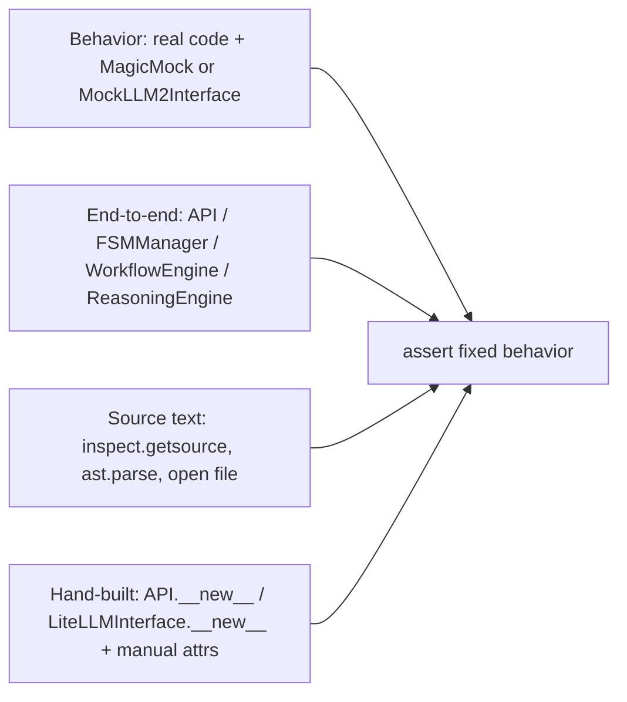

# test_fsm_llm_regression

Path: `tests/test_fsm_llm_regression/`
Purpose: pytest regression suite that pins fixed bugs in the `fsm_llm` package (core, reasoning, workflows, CLI, packaging files), one test class per bug id.

## Scope

- In scope: 14 test modules plus an empty `__init__.py`. 264 tests collected; 262 pass, 2 skip (as of this writing).
- Code under test: `fsm_llm` core modules (`api`, `fsm`, `pipeline` via `FSMManager._pipeline`, `transition_evaluator`, `expressions`, `definitions`, `llm`, `ollama`, `prompts`, `context`, `constants`, `handlers`, `logging`, `validator`, `visualizer`, `runner`, `utilities`, `__main__`), plus `fsm_llm.reasoning` and `fsm_llm.workflows` subpackages.
- Also reads repo files: `README.md`, `docs/quickstart.md`, `pyproject.toml`, `tox.ini`, `src/fsm_llm/__init__.py`, `src/fsm_llm/api.py`, `src/fsm_llm/py.typed`.
- Not in scope: live LLM calls (none here), agents, monitor, harness, eval. No fixtures or conftest live in this folder.

## Architecture

Each file groups tests from one review round. Class docstrings carry the bug id and the fixed behavior. Test styles:

## Key files

| File | Round and ids | Tests | Notes |
| --- | --- | --- | --- |
| `test_bugs.py` | B1-B8, B-NEW-1..6, CR3, plan 3 P3-B1..B11, C1 | 34 | Many source checks; `importlib.reload(fsm_llm.logging)` in a temp cwd; mutates and restores `OPENAI_API_KEY` |
| `test_engine_integration.py` | reasoning + workflow engine integration, iter-2 F-002 (`solve_problem` leaves the caller's context unchanged) | 16 | Reasoning solves run through core on `_ScriptedLLM` and `_VALID_SCRIPT` imported from `tests/test_fsm_llm_reasoning/test_engine_scripted.py` (the calls are asserted, not a vacuous `"Processing..."` stub); workflow tests use `@pytest.mark.asyncio` |
| `test_epistemic_fixes.py` | ED-001, ED-002, ED-003 | 30 | Unmarked `async def` tests (need `asyncio_mode = "auto"`); timer test sleeps 0.1 s |
| `test_functional.py` | functional lifecycle | 24 | Uses `mock_llm2_interface`, `sample_fsm_definition_v2`; local fixtures `greeting_fsm_dict`, `sub_fsm_dict` |
| `test_regression_cli_and_exports.py` | plan 13: H-1..3, M-1..3, M-5, L-3 | 15 | Reads `README.md`, `docs/quickstart.md`, `src/fsm_llm/py.typed` |
| `test_regression_core_bugs.py` | plan 6: VB1..VB25 | 28 | Imports `_GENERIC_FALLBACK_MESSAGE` from `fsm_llm.llm` |
| `test_regression_expressions_and_transitions.py` | plan 5: B1..B20 | 19 | `--version` exit code 0 via `fsm_llm.__main__.main_cli` |
| `test_regression_handlers_and_state.py` | plan 4: B1..B7 | 8 | Spies on `HandlerSystem.execute_handlers` |
| `test_regression_iter2.py` | iter-2: F-003..F-006 | 12 | F-001 is covered by `test_fsm_llm_workflows/test_workflows.py::TestStepDataInternalKeyFilter`, F-002 by `test_engine_integration.py` |
| `test_regression_jsonlogic_and_merge.py` | plan 9: VB1..VB15 | 31 | Helper `_frame_definition(name)`; scans `src/fsm_llm/*.py` for `"transition_decision"` |
| `test_regression_logic_and_visualizer.py` | plan 7: VB1..VB4 | 9 | `create_state_boxes` width checks |
| `test_regression_messages_and_operators.py` | plan 12: V1, V4, V5, V14, V15 | 10 | Reads `pyproject.toml` for `requires-python = ">=3.10"` |
| `test_regression_review.py` | review: C1..C3, H1, H2, H4, H5, M1, M3, M6 | 21 | Version pin `"0.12.0"`; 2 skipped `requirements.txt` tests; needs `packaging` and `tomllib`/`tomli` |
| `test_regression_transition_eval.py` | plan 8: B1..B6 | 7 | Replaces pipeline methods with `MagicMock` |

## Public interface

None. Entry points are pytest test classes named `Test<BugId><Feature>` or `Test<Feature>`.

Fixtures consumed from `tests/conftest.py`:

- `mock_llm2_interface`: `MockLLM2Interface` with `call_history` (list of `(call_name, request)` tuples; names `"generate_response"`, `"extract_field"`) and `extraction_data` (dict read by `extract_field` by `field_name`).
- `sample_fsm_definition_v2`: v4.1 `FSMDefinition` with states `greeting` (to `farewell`, gated on `user_name`) and `farewell`.

## Data shapes

Behaviors pinned, grouped by area (the assertion, not the history):

- Transition evaluation (`TransitionEvaluator`): a single passing transition is DETERMINISTIC at any priority (600, 900); among passing transitions the unique lowest `priority` wins (0 beats 500, 10 beats 500, 50 beats 100); no transitions means BLOCKED; with `strict_condition_matching=True` an exception in a condition stops evaluation after one call and gives `all_pass` False; `requires_context_keys` supports dot notation (`user.name`); `TransitionEvaluatorConfig` has no `early_termination`.
- Self-transition: `_execute_transition_evaluation_and_execution` returns `transition_occurred is True` when the target equals the current state.
- JsonLogic (`fsm_llm.expressions`): `{"var": ""}` returns the whole data; `and`/`or` return values, not bools; `{"and": []}` is `True`, `{"or": []}` is `False`; `>`/`>=` chain; two numeric strings compare numerically; `min`/`max` coerce strings to floats; `missing_some` treats a string arg as one var; `!` on `[0]` is `True`; comparisons with `None` return `False` or a bool, never raise; a dict with several operator keys raises `TransitionEvaluationError` matching `"multiple keys"`; `soft_equals(True, "true")` is true.
- LLM wrapper (`LiteLLMInterface`): `None` content raises `LLMResponseError`; missing, empty or reasoning-only `message` never returns the reasoning or raw JSON (reasoning-only yields `_GENERIC_FALLBACK_MESSAGE`); JSON arrays and dict content do not crash; default `timeout` 120.0, `None` omits `timeout` from `completion`; extra kwargs cannot override `model`/`temperature`; `get_supported_openai_params` returning `None` is handled; `response_format` is sent only for `data_extraction` and `field_extraction`; on `ollama_chat/...` models `reasoning_effort == "none"` always and `temperature == 0` only for structured calls; `build_ollama_response_format("transition_decision")` is `None`; `_configure_api_keys` does not set `os.environ`.
- Prompts: `_sanitize_text_for_prompt` escapes `<information_to_extract>`, `<user_message>`, `<response_instructions>`, `<extracted_data>`, `<system>`, `<instruction>`, `<role>`; `</response_format>` is its own list element; no `..` in the response task section; previous state appears in the final state context after a transition; `BasePromptConfig` has no `json_overhead_factor`.
- API and FSMManager: `end_conversation` removes `conversation_stacks` and `active_conversations` entries; `FSMError` is not double-wrapped by `start_conversation`/`converse`; `ValueError` messages propagate unchanged; terminal-state `process_message` raises; a failing START_CONVERSATION handler (`error_mode="raise"`) leaves no instance; `pop_fsm` on a single frame raises matching `"only one FSM remaining"`; `pop_fsm` pops the frame even when `end_conversation` fails and raises `FSMError`; `fsm_cache` is an `OrderedDict` with LRU eviction; POST_TRANSITION receives the new state as `current_state`; no CONTEXT_UPDATE handlers when extracted data is all `None`.
- Context: `get_user_visible_data` drops `system`; `clean_context_keys` keeps `api_key` but logs one warning via `logger.bind(...).warning`; `COMPILED_FORBIDDEN_CONTEXT_PATTERNS` match `api_key`, `key_api`, `api_key_value`, `my_api_key`, not `user_name`; `context.py` source contains `is_forbidden_context_entry`; `FSMContext` has no `has_keys`/`get_missing_keys`.
- Conversation: `max_history_size=0` keeps no exchanges; truncated messages end with `"... [truncated]"` and stay within `max_message_length`.
- Definitions and tools: `FSMDefinition` rejects unknown initial state, unknown targets, no terminal state, and `state.id` not matching its key (`"does not match"`); `FSMValidator` reports no `Orphaned` errors when the initial state is invalid and finds one cycle for A->B->C->A; `FSMValidationResult` text uses `[VALID]`, `[INVALID]`, `[ERROR]`, `[WARN]`; `HandlerSystem(error_mode="skip")` raises `ValueError` matching `"Invalid error_mode"`.
- Reasoning: `OutputFormatter.extract_final_solution` keeps `0` and `False`, skips `None` and `""`; `map_reasoning_type` aliases (math, logic, pattern, brainstorm, evaluate, hypothesis, compare, ...) are case and whitespace insensitive, unknown maps to analytical; `ContextManager.merge_reasoning_results` sets `<type>_reasoning_completed` for every `ReasoningType`; `ReasoningHandlers.prune_context` truncates lists to at most 10; every state in `ALL_REASONING_FSMS` has non-empty `extraction_instructions` and `response_instructions` and no bare `instructions` key.
- Workflows: waiting on `wait_event_step` auto-registers `engine.event_listeners[event_type]`; `event_mapping` maps `{local_key: payload_key}`; `timer_step` registers `engine.timers[f"{iid}_timer"]` and completes after the delay; `_waiting_info` is removed after the event; `get_statistics()["active_workflows"] == 0` after completion; `WorkflowDefinition._get_referenced_states` includes WaitForEventStep success and timeout states; `fsm_llm.workflows.cli` does not exist.
- Packaging text: `__version__ == "0.12.0"` in `fsm_llm.__version__`, `fsm_llm`, `fsm_llm.reasoning.__version__` and `fsm_llm.workflows`; README python badge has `3.10` and no `3.8`/`3.9`; README headings have no emoji; litellm spec in `pyproject.toml` excludes 1.82.7 and 1.82.8; `tox.ini` has no `sphinx` and no `[testenv:docs]`; `src/fsm_llm/__init__.py` has no `__all__.extend`/`__all__.append` and every `__all__` name resolves.

## Invariants and constraints

- No test may hit a real LLM or network. Patch `fsm_llm.llm.completion` and `fsm_llm.llm.get_supported_openai_params` when driving `_make_llm_call`.
- Hand-built `API.__new__(API)` objects must mirror `__init__` attributes the method reads: `_stack_lock` (a `threading.Lock`), `active_conversations`, `conversation_stacks`, `fsm_manager`, `_last_accessed`, `_temp_fsm_definitions`, `_pending_push_ids`, `_ended_conversations`, `_MAX_ENDED_CACHE`. `end_conversation` is called through `.__wrapped__` to skip its decorator.
- Tests that change global state restore it: cwd (`os.chdir` in `finally`), `OPENAI_API_KEY`, `fsm_llm.logging._file_handler_initialized`.
- Code comments cite decision ids (`D-003`, `D-010`, `D-013`, `D-019`, `D-039`, `D-041`, `D-050`); they explain why a test was re-baselined. Do not revert those re-baselines.

## Dependencies

- Internal: `fsm_llm` and its `reasoning` and `workflows` subpackages; `tests/conftest.py` fixtures.
- External: `pytest`, `pytest-asyncio` (`asyncio_mode = "auto"`), `unittest.mock`, `packaging` and `tomllib` (or `tomli` on 3.10) for the litellm spec test.

## Failure modes

- Version bump without editing `TestVersionAlignment` in `test_regression_review.py` fails 2 tests.
- Renaming private methods pinned here fails tests: `_determine_evaluation_result`, `_evaluate_single_condition`, `_evaluate_transition_conditions`, `_evaluate_single_transition`, `_make_llm_call`, `_parse_response_generation_response`, `_configure_api_keys`, `_sanitize_text_for_prompt`, `_build_enhanced_history_section`, `_build_response_format_section`, `_build_response_task_section`, `_build_final_state_context_section`, `_merge_context_with_strategy`, `_find_cycles`, `_get_referenced_states`, `_classify_problem`, `FSMDefinition._calculate_reachable_states`, `FSMManager._execute_handlers`, and pipeline methods `_execute_transition_evaluation_and_execution`, `_execute_state_transition`, `_execute_extraction_and_transition_pass`, `_execute_data_extraction`.
- Source checks fail on text: `md5` in `api.py`; `.pop(0)` or missing `deque` in `_calculate_reachable_states`; `error_mode == "skip"` in `HandlerSystem.execute_handlers`; `logger.info("evaluation_result` in `_evaluate_single_transition`; `max_history_messages * 2` in `_build_enhanced_history_section`; `\ndef extract_json_from_text` in `llm.py`; more than one `import re` in `llm.py`; `import asyncio` in `handlers.py`; `KeyError` in `_parse_response_generation_response`; a `logger.error` line directly followed by `logger.exception` in `runner.py`; a `"transition_decision"` literal in any `src/fsm_llm/*.py` other than `ollama.py`; `reasoning/engine.py` must contain `ContextMergeStrategy`, `from fsm_llm import` and a `from .constants import` line without `MergeStrategy`.
- `TestEndConversationStackOrder` runs a real `API` with two pushed frames and records `fsm_manager.end_conversation` calls; iterating the stack forward in `API.end_conversation` fails it.
- Some names are historical: `TestFloatingPointTiebreaker` and `TestTransitionSubstringMatching` describe removed mechanisms; the assertions now check the priority rule and `Classifier.classify` existence.

## Working here

- Run: `.venv/bin/python -m pytest tests/test_fsm_llm_regression/` (about 1 s). Single bug: `-k VB14b` or a class name.
- Add a regression as a new `Test<Id><Feature>` class with a docstring naming the id and fixed behavior, in the file for its review round, or a new `test_regression_<topic>.py`.
- Import code under test inside the test function when other tests in the file do; top-level imports are fine for stable modules.
- After adding or removing tests, re-measure with `.venv/bin/python -m pytest --collect-only -q | tail -1` and update pinned counts elsewhere in the repo (the root docs list a per-suite count for this folder, and `tests/test_packaging.py` checks those counts).
- When a fix changes pinned behavior on purpose, re-baseline the assertion and cite the decision id in the docstring, as existing tests do.
