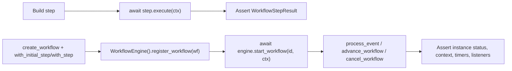

# test_fsm_llm_workflows

Path: `tests/test_fsm_llm_workflows`
Purpose: pytest suite (231 tests, 7 files) for `fsm_llm.workflows`, the in-memory async workflow engine in `src/fsm_llm/workflows/`.

## Scope

Unit and engine-level regression tests for the workflows subpackage: exceptions, models, definitions, DSL, step types, `WorkflowEngine`, `DependencyResolver`. No real LLM, no network, no filesystem fixtures. LLMs, agents and `fsm_llm.API` are fakes or `MagicMock`. Nothing here tests the core FSM pipeline, agents or monitor packages.

All imports are `fsm_llm.workflows...` (modules `definitions`, `dsl`, `engine`, `exceptions`, `models`, `steps`, plus the package `__init__`). There is no `fsm_llm_workflows` import path.

## Architecture

Two test shapes:

- Async tests rely on `asyncio_mode = "auto"` (repo `pyproject.toml`); some older files still add `@pytest.mark.asyncio`, which is harmless.
- Some engine tests bypass `start_workflow` and insert a `WorkflowInstance` straight into `engine.workflow_instances[...]`, then call private methods (`_execute_workflow_step`, `_handle_step_exception`, `_purge_oldest_terminal_instances`, `_handle_timer_expiration`, `_get_instance_lock`).
- Timing tests use real sleeps: 0.01 s and 0.05 s bodies that finish inside a timeout, 0.3 s and 0.5 s `_SlowStep`/mock delays, a 1 s step against a 0.05 s `workflow_timeout`, and 5.0 s bodies in the 8 `slow` tests (cut off by `timeout=0.1`). `_settle(seconds=0.05)` in `test_audit_2026_09_27.py` is the wait helper.

## Key files

| File | Tests | What it pins |
| --- | --- | --- |
| `test_workflows.py` | 41 | Exception attributes and hierarchy under `WorkflowError`; `WorkflowStatus` values; `WorkflowEvent` UUID and ISO timestamp dump; `WorkflowStepResult.success_result`/`failure_result`, exception-to-string `error`; `WorkflowInstance` lifecycle and history; `EventListener.is_expired`; `WaitEventConfig` positive timeout; `WorkflowDefinition.validate` errors; step data filter (`TestStepDataInternalKeyFilter`); `""` route completes (`TestSwitchStepTerminalRoute`, `TestWideTerminalPredicateAfterD020Revert`); Timer/Wait reach `WAITING`; `serialize()` of nested `RetryStep.step` and `ParallelStep.steps`; `__all__`, `__version__` equals `fsm_llm.__version__` |
| `test_dsl.py` | 36 | Factories `create_workflow`, `auto_step`, `api_step`, `condition_step`, `llm_step`, `wait_event_step`, `timer_step`, `parallel_step`; `workflow_builder(...).add_step/set_initial_step/add_metadata/build`; `linear_workflow` (empty list raises `ValueError` "at least one step"), `conditional_workflow`, `event_driven_workflow` |
| `test_steps.py` | 25 | `AutoTransitionStep` (sync/async action, action error raises `WorkflowStepError`), `ConditionStep`, `APICallStep` (exception gives failure to `failure_state`), `WaitForEventStep` `_waiting_info`, `TimerStep` `_timer_info`, `ParallelStep` (default `step_<i>_<key>` aggregation, custom aggregation, context isolation), `ConversationStep` (needs exactly one of `fsm_file`/`fsm_definition`, mappings, `max_turns`) |
| `test_new_steps.py` | 22 | `SwitchStep` (case, default, missing key, numeric value stringified, no default fails); `RetryStep` (retries failures and bare exceptions, re-raises original exception type on exhaustion); `AgentStep`; DSL `agent_step`, `retry_step`, `switch_step`; `remove_instance`, `max_completed_instances` purge |
| `test_step_timeouts.py` | 21 (8 `slow`) | `timeout` default `None`; async actions/conditions over timeout raise `WorkflowStepError` whose `.cause` says "timed out"; sync actions are not wrapped; `APICallStep` and `ParallelStep` return failure instead; `_with_timeout` direct calls |
| `test_audit_fixes.py` | 21 | F-001 parallel failure without `error_state`; F-002 `process_event` uses `.pop(` not `del self.event_listeners` (source inspection); F-004 `end_conversation` called on exception; F-007 missing template var gives failure; F-010 no `conversation_map`; F4 per-instance lock (no double execution, lock dropped on remove/purge); F5 terminal guards on `_handle_step_exception` and `cancel_workflow`; F7 sub-second `workflow_timeout` reported as float |
| `test_audit_2026_09_27.py` | 74 | 2026-09-27 audit: 21 classes grouped by finding id (H, M and L series) plus `TestReviewFollowUp` |
| `__init__.py` | 0 | Empty |

## Public interface

This directory exports nothing; its surface is the pytest entry points and the module-level helpers that tests share.

- Run: `.venv/bin/python -m pytest tests/test_fsm_llm_workflows/` (231 tests); `-m "not slow"` skips the 8 `slow` tests in `test_step_timeouts.py`.
- Helpers in `test_audit_2026_09_27.py`:
  - `_wait_then_done(workflow_id: str, event_type: str = "go", **wait_kwargs) -> WorkflowDefinition`: a `wait_event_step("wait", ...)` routed to a terminal `auto_step("done", ..., next_state="")`.
  - `async _settle(seconds: float = 0.05) -> None`: `asyncio.sleep` wrapper used to let background work finish.
  - `_two_waits_workflow() -> WorkflowDefinition`: `wa` (event `A`, `timeout_seconds=0.1`, `timeout_state="wb"`) -> `slow` (`_SlowStep`) -> `wb` (event `B`) -> `got_b` (terminal).
- Class-local helpers: `TestConversationStep._mock_api(collected_data=None, responses=None)` in `test_steps.py` returns a `MagicMock` API (`start_conversation` gives `("conv-1", "Hello!")`, `converse` side effects, `has_conversation_ended` False, `get_data` default `{"name": "Alice"}`); `TestSwitchStep.switch` in `test_new_steps.py` is the only `@pytest.fixture` in the directory. `test_audit_fixes.py` builds counting and raising steps inside test classes (`_build_counting_terminal_step`, `_build_counting_waiting_step`, `_make_instance`).
- Library surface exercised: `WorkflowEngine` (`register_workflow`, `start_workflow`, `process_event`, `advance_workflow`, `cancel_workflow`, `remove_instance`, `get_workflow_context`, `add_hook`, `shutdown`), step classes in `fsm_llm.workflows.steps`, DSL factories in `fsm_llm.workflows.dsl`, models in `fsm_llm.workflows.models`, exceptions in `fsm_llm.workflows.exceptions`.

## Data shapes

Fakes defined at module level in `test_audit_2026_09_27.py` (`_SlowStep` sits just above `TestReviewFollowUp`, the rest at the top):

| Name | Shape |
| --- | --- |
| `_DynamicLoopStep(WorkflowStep)` | `execute` returns `success_result(next_state=self.step_id)` (runtime self-loop the static graph cannot see) |
| `_TerminalStep(WorkflowStep)` | `execute` returns `success_result()` |
| `_SlowStep(WorkflowStep)` | fields `next_state: str = ""`, `delay: float = 0.3`; sleeps `delay` then succeeds to `next_state` |
| `_FakeLLMResponse` | `.message: str` |
| `_CoreLikeLLM` | `reply`, `requests: list`; sync `generate_response(request)` records the request and returns `_FakeLLMResponse(reply)` (shape of core `LLMInterface`) |
| `_AgentResult` | `answer`, `success=True`, `final_context` (defaults to `{}`), `structured_output=None` |
| `_RecordingAgent` | `result`, `calls: list[tuple[str, dict]]`; sync `run(task, **kwargs)` records and returns `result` |

Assertions read `WorkflowStepResult` fields `success`, `next_state`, `data`, `error`, and `WorkflowInstance` fields `status`, `context`, `history`, `current_step_id`.

## Invariants and constraints

- Internal context keys (prefixes `_`, `system_`, `internal_`, `__`, case-insensitive) are stripped from step results; `_waiting_info` survives via `STEP_INTERNAL_WHITELIST` in `src/fsm_llm/workflows/constants.py`. `TestStepDataInternalKeyFilter` asserts both directions.
- `next_state == ""` on any successful result means terminal (D-013, D-020), including when a `RetryStep` returns an inner `SwitchStep` result. `TimerStep`/`WaitForEventStep` return `next_state=None` and go `WAITING`.
- Concurrency tests loop 5 or 20 times and accept either race winner but require: step body ran at most once, no call raised, final status consistent (`COMPLETED` implies `cancel_workflow` returned `False`).
- Cancelling an already `COMPLETED`, `CANCELLED` or `FAILED` instance returns `False` without raising.

Behaviour pinned by `test_audit_2026_09_27.py` (2026-09-27 audit findings in the H, M and L series):

- Event delivery: one instance's expired deadline or non-`WAITING` status does not stop delivery to others; skipped instances are not mutated. `correlation_key` routes by payload value; `WorkflowEvent(instance_id=...)` targets one instance; an early targeted event is buffered until the wait is reached. An event never moves an instance that has moved to a different wait. Cancelling `process_event` mid-delivery restores undelivered listeners.
- Waits: a follow-up wait on the same event keeps its timeout; timeout without `timeout_state` fails the instance and leaves `engine.timers == {}`; `success_state=""` completes; `WaitEventConfig` rejects `timeout_state` without `timeout_seconds` ("timeout_state requires") and empty `event_type`.
- `LLMProcessingStep`: accepts an object with sync `generate_response(request)` (core `LLMInterface` shape; request has `user_message` and `system_prompt`) or sync `generate(prompt)` returning `str`; output regex with one group extracts, `""` maps the raw text, a miss leaves the key unset; invalid regex raises `ValueError` "valid regex" at construction; a prompt of 12000 chars keeps `user_message` at or under 10000 and puts the full text in `system_prompt`.
- Fail-closed routing: a failed step with no `error_state` has `next_state is None` and the instance ends `FAILED` at that step. `AgentStep` with a result `success=False` fails the step.
- `ParallelStep`: a child raising `RuntimeError()` or returning `success=False` with no message still counts as failure; internal-prefix keys (`_secret`, `system_x`) are dropped; `TimerStep` children rejected ("cannot run inside a ParallelStep"); partial data kept on failure; uncopyable context (a `threading.Lock`) falls back to shallow copy.
- Callables returning awaitables (lambda wrapping a coroutine, async `__call__`) are awaited.
- Instance ids: cancelling `order` does not touch `order_2_timer`; a duplicate `instance_id` raises `WorkflowInstanceError` "already in use".
- Deadlines: `workflow_timeout` fails a `WAITING` instance and clears its listener; a timeout during a step raises `WorkflowTimeoutError` with `.instance_id` set.
- Loops: a 30-step acyclic chain completes; a loop through a `TimerStep` is allowed (`has_cycles()` True, `has_synchronous_cycles()` False); a synchronous cycle fails `validate()` ("synchronous cycle"); a runtime self-loop hits `WorkflowEngine(max_steps_per_run=5)` ("Step budget exceeded"). A `RetryStep` wrapping a `TimerStep` counts as pausing.
- `switch_step` DSL with no default fails on an unmatched value; outputs `switch_<step_id>_matched` and `switch_<step_id>_target` reach context.
- `AgentStep`: maps `answer` even with empty `final_context`, also writes `agent_<step_id>_answer` and `agent_answer`; `input_mapping` passes `initial_context=` to `agent.run`; a plain `str` return works; an agent with no `run` is rejected at construction.
- `ConversationStep`: base `timeout` honoured; `require_completion=True` fails when not ended and writes `conversation_<step_id>_ended`; `use_user_input=True` sends `_user_input` via `converse(user_message=..., conversation_id=...)`; accepts an object with `model_dump()`.
- Resources: default `max_completed_instances` is not `None`; `FAILED` instances are purged too; `max_history_entries` caps history (keeps newest).
- Definition pinning: re-registering or mutating a workflow after `register_workflow` does not affect the registered copy or running instances.
- Engine API: `add_hook(fn(name, instance, data))` sees `step_started`, `step_completed`, `status_changed`; a raising hook is ignored. `_user_input` is removed after `advance_workflow`. `start_workflow(..., wait=False)` runs in the background and skips an instance cancelled before it runs. `get_workflow_context` returns a copy; the caller's initial context is not mutated. `shutdown()` clears timers and listeners, then `start_workflow` raises `WorkflowResourceError`. `WorkflowEngine(executor=pool)` runs sync callables on that executor.
- Smaller fixes: `error_state` on `AutoTransitionStep`/`ConditionStep`; non-dict action result gives "must return a dict"; history records the `SwitchStep` error ("No matching case") with a single "Status changed to running" entry; `DependencyResolver` unknown dependency is not a cycle but `resolve()` raises "unknown"; exception `details` dicts are not mutated; empty event type in `register_event_listener` raises `WorkflowEventError`; duplicate step id raises `WorkflowDefinitionError` "Duplicate"; `APICallStep` dotted output paths and `""` for whole result (dict or list); float delays; `serialize()` drops custom callable fields.
- Logging: a subprocess checks "Executing step" logs are 0 before and 1 after `fsm_llm.logging.enable_library_logging()`.

## Dependencies

- `pytest`, `pytest-asyncio` (auto mode), `unittest.mock`, `loguru` (subprocess logging test), stdlib `asyncio`, `threading`, `concurrent.futures`, `subprocess`.
- `fsm_llm.workflows` has no extra dependencies, so nothing skips it; the files import it at module top.

## Failure modes

- Timing-sensitive tests (`_settle(0.2)` after 0.05 s timeouts, 0.3 s slow steps) can flake on a heavily loaded machine.
- `TestEventListenerRaceCondition.test_pop_instead_of_del_in_process_event` inspects `WorkflowEngine.process_event` source text; renaming or restructuring that method can break it without a behaviour change.
- `TestLoggingOffByDefault` fails if the subprocess cannot import `fsm_llm` with `sys.executable`.

## Working here

- Run: `.venv/bin/python -m pytest tests/test_fsm_llm_workflows/` (about 10 s); `-m "not slow"` runs 223.
- New audit regressions: add a class per finding in the matching audit file, or a new `test_audit_<date>.py`; put helpers at module top with a `_` prefix (`_wait_then_done`, `_settle`, `_CoreLikeLLM`, `_RecordingAgent`).
- Mark any test that sleeps near a second or more with `@pytest.mark.slow`.
- Custom steps subclass `WorkflowStep` and implement `async def execute(self, context)`; extra pydantic fields are declared as class attributes (see `_SlowStep`).
- Docstrings and comments cite `# DECISION` ids (D-003, D-005, D-010, D-011, D-013, D-015, D-018, D-020). D-018 is cited only as history: it narrowed the terminal check to `isinstance(step, SwitchStep)` and D-020 reverted it (`TestWideTerminalPredicateAfterD020Revert`). Read the matching anchors in `src/fsm_llm/workflows/` before changing a pinned behaviour.
- After adding or removing tests, re-measure with `.venv/bin/python -m pytest --collect-only -q | tail -1`. `tests/test_packaging.py` measures the full collection and checks count literals written in repository docs, so update the per-suite count for this directory (currently 231) wherever it is stated.
